# 信令服务器API文档

<cite>
**本文档中引用的文件**
- [server/src/main.rs](file://server/src/main.rs)
- [server/src/controller/ws_controller.rs](file://server/src/controller/ws_controller.rs)
- [server/src/config/state.rs](file://server/src/config/state.rs)
- [server/src/config/init.rs](file://server/src/config/init.rs)
- [server/src/config/scheduler.rs](file://server/src/config/scheduler.rs)
- [server/src/config/error.rs](file://server/src/config/error.rs)
- [server/src/util/ip.rs](file://server/src/util/ip.rs)
- [core/src/webrtc/signaling.rs](file://core/src/webrtc/signaling.rs)
- [server/Cargo.toml](file://server/Cargo.toml)
</cite>

## 目录
1. [简介](#简介)
2. [项目结构](#项目结构)
3. [WebSocket连接建立](#websocket连接建立)
4. [消息类型定义](#消息类型定义)
5. [服务器架构](#服务器架构)
6. [会话管理](#会话管理)
7. [错误处理](#错误处理)
8. [性能优化](#性能优化)
9. [使用示例](#使用示例)
10. [故障排除](#故障排除)

## 简介

LocalSend信令服务器是一个基于WebSocket的实时通信服务，专门设计用于支持WebRTC对等连接的信令交换。该服务器实现了高效的IP分组连接管理、DDoS防护和并发处理能力，为设备间的安全文件传输提供可靠的信令基础设施。

### 核心特性
- **IP分组连接管理**：基于IPv4/v6地址进行连接分组
- **DDoS防护**：请求频率限制和连接数控制
- **并发处理**：基于Tokio异步运行时的高性能处理
- **安全认证**：基于客户端令牌的身份验证机制
- **自动清理**：定时任务自动清理过期连接和请求计数

## 项目结构

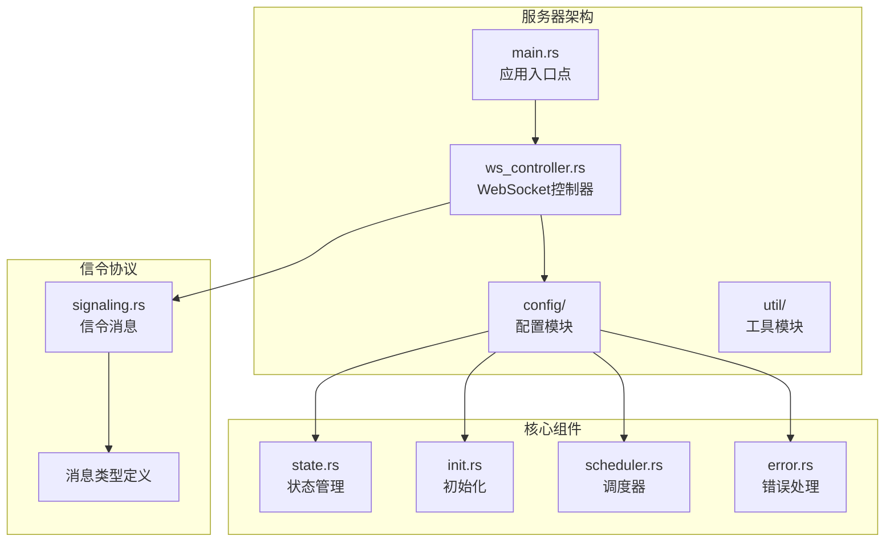

**图表来源**
- [server/src/main.rs](file://server/src/main.rs#L1-L34)
- [server/src/controller/ws_controller.rs](file://server/src/controller/ws_controller.rs#L1-L50)
- [server/src/config/state.rs](file://server/src/config/state.rs#L1-L34)

**章节来源**
- [server/src/main.rs](file://server/src/main.rs#L1-L34)
- [server/Cargo.toml](file://server/Cargo.toml#L1-L19)

## WebSocket连接建立

### 连接URL模式

信令服务器提供单一的WebSocket端点：
- **端点路径**：`/v1/ws`
- **HTTP方法**：GET
- **协议**：WebSocket (RFC 6455)

### 握手协议

#### 客户端握手流程

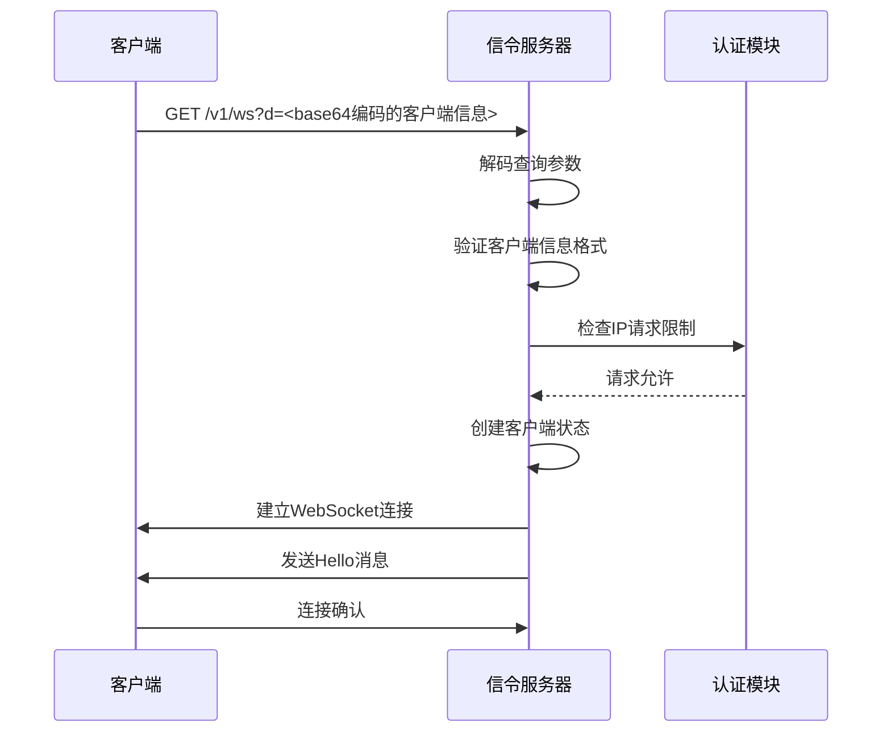

**图表来源**
- [server/src/controller/ws_controller.rs](file://server/src/controller/ws_controller.rs#L48-L85)

#### 查询参数格式

客户端必须在查询字符串中提供经过base64编码的客户端信息：

| 参数名 | 类型 | 必需 | 描述 |
|--------|------|------|------|
| d | String | 是 | Base64编码的ClientInfoWithoutId JSON对象 |

#### 客户端信息结构

```json
{
  "alias": "设备名称",
  "version": "版本号",
  "deviceModel": "设备型号",
  "deviceType": "设备类型",
  "token": "认证令牌"
}
```

### 认证机制

#### IP地址分组

服务器根据客户端IP地址进行分组管理：

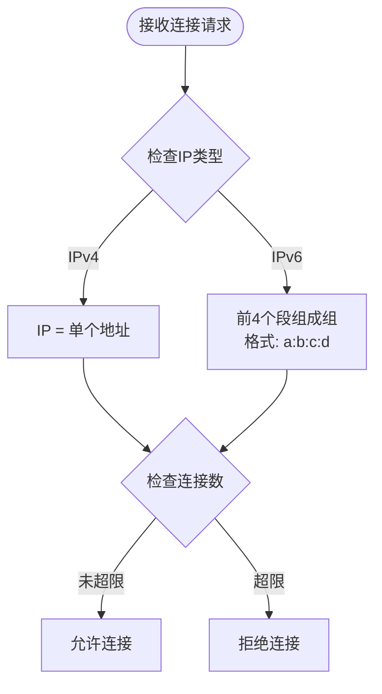

**图表来源**
- [server/src/util/ip.rs](file://server/src/util/ip.rs#L3-L20)

#### 连接限制配置

| 环境变量 | 默认值 | 描述 |
|----------|--------|------|
| MAX_CONNECTIONS_PER_IP | 10 | 每个IP的最大连接数 |
| MAX_REQUESTS_PER_IP_PER_HOUR | 1000 | 每小时最大请求数 |

**章节来源**
- [server/src/controller/ws_controller.rs](file://server/src/controller/ws_controller.rs#L23-L35)
- [server/src/util/ip.rs](file://server/src/util/ip.rs#L1-L41)

## 消息类型定义

### 服务器消息类型

#### Hello消息
初始连接后发送给新加入的客户端。

| 字段 | 类型 | 描述 |
|------|------|------|
| type | String | "HELLO" |
| client | ClientInfo | 新客户端信息 |
| peers | Array<ClientInfo> | 同IP组其他客户端列表 |

#### Join消息
当有新客户端加入IP组时发送。

| 字段 | 类型 | 描述 |
|------|------|------|
| type | String | "JOIN" |
| peer | ClientInfo | 加入的客户端信息 |

#### Update消息
当客户端更新其信息时发送。

| 字段 | 类型 | 描述 |
|------|------|------|
| type | String | "UPDATE" |
| peer | ClientInfo | 更新的客户端信息 |

#### Left消息
当客户端离开IP组时发送。

| 字段 | 类型 | 描述 |
|------|------|------|
| type | String | "LEFT" |
| peerId | UUID | 离开的客户端ID |

#### Offer消息
SDP Offer消息，用于建立新的WebRTC连接。

| 字段 | 类型 | 描述 |
|------|------|------|
| type | String | "OFFER" |
| peer | ClientInfo | 发起Offer的客户端 |
| sessionId | String | 会话标识符 |
| sdp | String | Base64编码的SDP内容 |

#### Answer消息
SDP Answer消息，用于响应Offer。

| 字段 | 类型 | 描述 |
|------|------|------|
| type | String | "ANSWER" |
| peer | ClientInfo | 发起Answer的客户端 |
| sessionId | String | 关联的会话标识符 |
| sdp | String | Base64编码的SDP内容 |

#### Error消息
错误通知消息。

| 字段 | 类型 | 描述 |
|------|------|------|
| type | String | "ERROR" |
| code | Number | HTTP状态码 |

### 客户端消息类型

#### Update消息
更新客户端信息。

| 字段 | 类型 | 描述 |
|------|------|------|
| type | String | "UPDATE" |
| info | ClientInfoWithoutId | 更新后的客户端信息 |

#### Offer消息
发起SDP Offer。

| 字段 | 类型 | 描述 |
|------|------|------|
| type | String | "OFFER" |
| session_id | String | 会话标识符 |
| target | UUID | 目标客户端ID |
| sdp | String | Base64编码的SDP内容 |

#### Answer消息
响应SDP Offer。

| 字段 | 类型 | 描述 |
|------|------|------|
| type | String | "ANSWER" |
| session_id | String | 关联的会话标识符 |
| target | UUID | 目标客户端ID |
| sdp | String | Base64编码的SDP内容 |

**章节来源**
- [core/src/webrtc/signaling.rs](file://core/src/webrtc/signaling.rs#L20-L120)

## 服务器架构

### 整体架构图

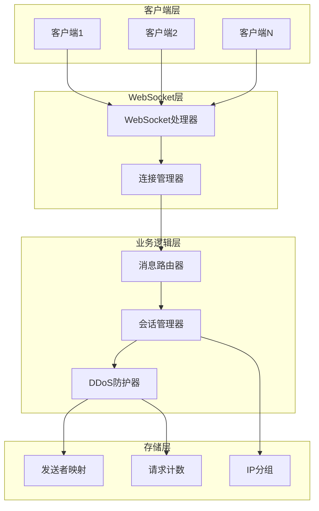

**图表来源**
- [server/src/controller/ws_controller.rs](file://server/src/controller/ws_controller.rs#L87-L140)
- [server/src/config/state.rs](file://server/src/config/state.rs#L1-L34)

### 消息路由机制

#### 广播策略

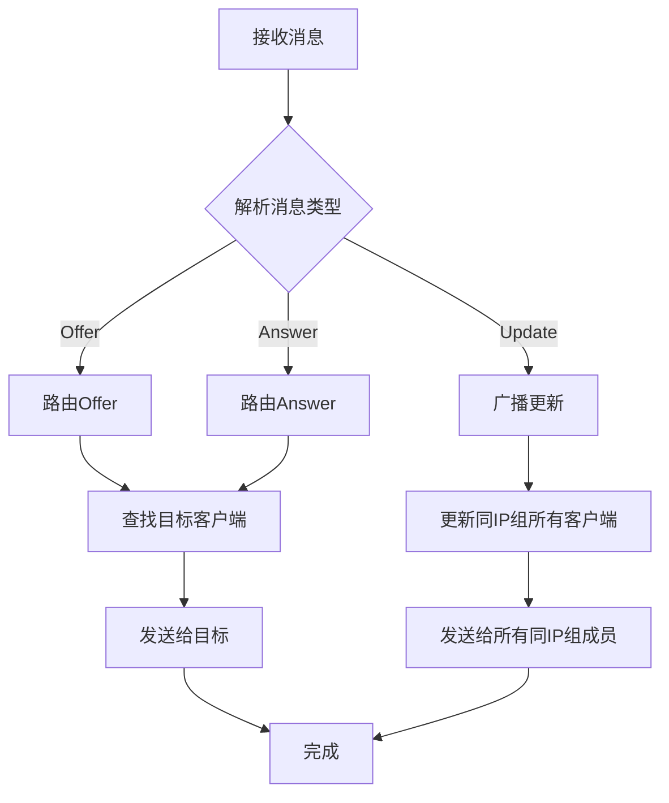

**图表来源**
- [server/src/controller/ws_controller.rs](file://server/src/controller/ws_controller.rs#L200-L250)

### 会话状态管理

#### 连接生命周期

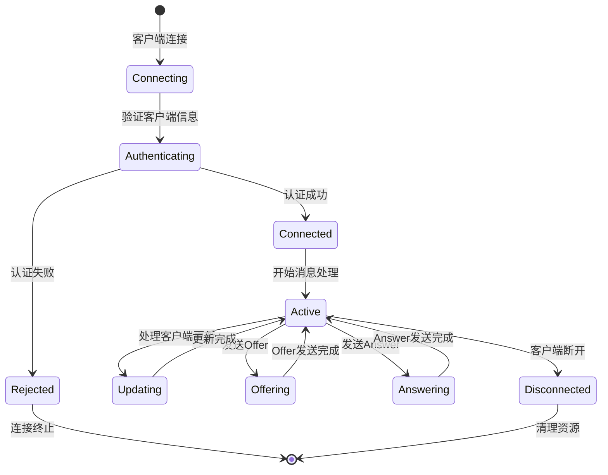

**图表来源**
- [server/src/controller/ws_controller.rs](file://server/src/controller/ws_controller.rs#L87-L280)

**章节来源**
- [server/src/controller/ws_controller.rs](file://server/src/controller/ws_controller.rs#L87-L280)
- [server/src/config/state.rs](file://server/src/config/state.rs#L1-L34)

## 会话管理

### 连接池管理

#### IP分组策略

服务器按以下规则对客户端进行分组：

| IP类型 | 分组方式 | 示例 |
|--------|----------|------|
| IPv4 | 单个IP地址 | 192.168.1.100 |
| IPv6 | 前4个段 | fe80::1%eth0 → fe80:1:0:1 |

#### 连接状态跟踪

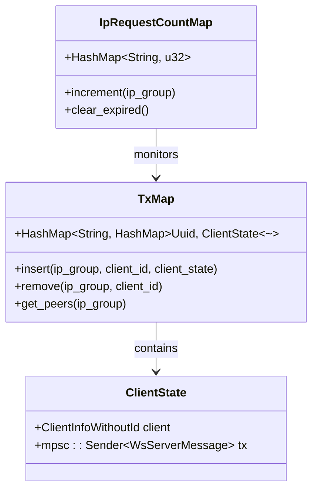

**图表来源**
- [server/src/config/state.rs](file://server/src/config/state.rs#L6-L15)

### 并发处理模型

#### 异步任务架构

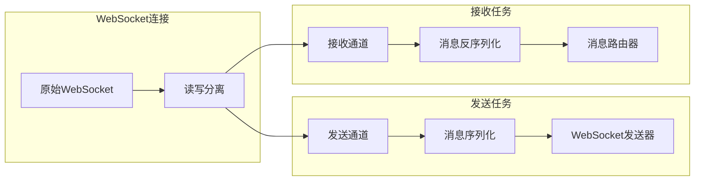

**图表来源**
- [server/src/controller/ws_controller.rs](file://server/src/controller/ws_controller.rs#L165-L230)

**章节来源**
- [server/src/controller/ws_controller.rs](file://server/src/controller/ws_controller.rs#L87-L280)
- [server/src/config/state.rs](file://server/src/config/state.rs#L1-L34)

## 错误处理

### 错误代码表

| HTTP状态码 | 错误类型 | 描述 | 解决方案 |
|------------|----------|------|----------|
| 400 | Bad Request | 请求格式错误 | 检查查询参数格式和base64编码 |
| 429 | Too Many Requests | 请求频率过高 | 等待一段时间后重试 |
| 431 | Request Header Fields Too Large | 请求头过大 | 减少请求头大小 |
| 500 | Internal Server Error | 服务器内部错误 | 联系管理员或重试 |

### 错误处理流程

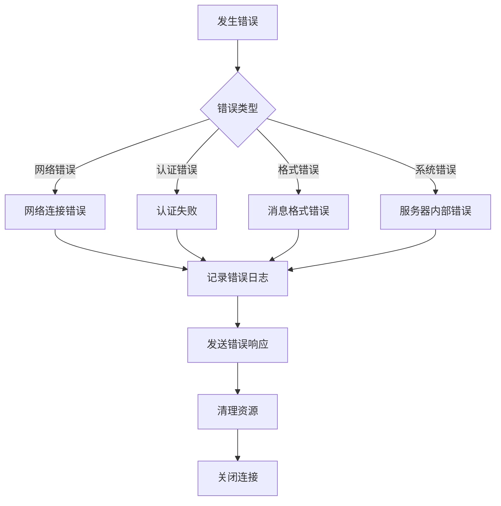

**图表来源**
- [server/src/config/error.rs](file://server/src/config/error.rs#L1-L58)

### DDoS防护机制

#### 请求频率限制

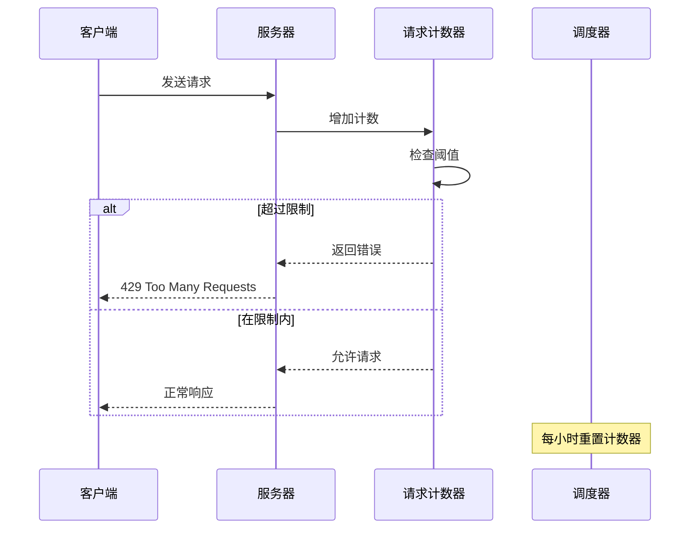

**图表来源**
- [server/src/config/scheduler.rs](file://server/src/config/scheduler.rs#L1-L25)

**章节来源**
- [server/src/config/error.rs](file://server/src/config/error.rs#L1-L58)
- [server/src/config/scheduler.rs](file://server/src/config/scheduler.rs#L1-L25)

## 性能优化

### 并发处理能力

#### 连接限制策略

| 配置项 | 默认值 | 最大值 | 说明 |
|--------|--------|--------|------|
| MAX_CONNECTIONS_PER_IP | 10 | 可配置 | 每个IP地址的最大并发连接 |
| MAX_REQUESTS_PER_IP_PER_HOUR | 1000 | 可配置 | 每小时最大请求次数 |
| WebSocket缓冲区大小 | 4 | 固定 | 每个连接的消息缓冲队列 |

#### 内存管理优化

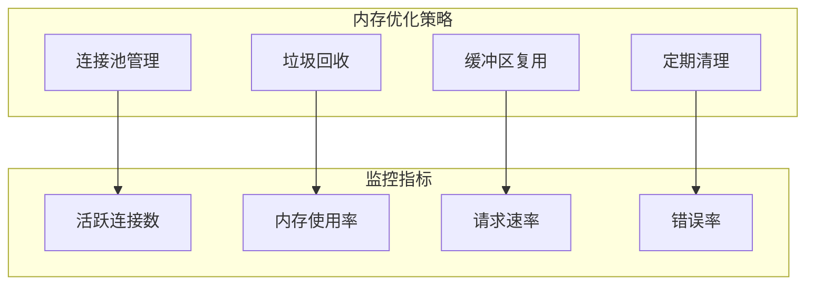

**图表来源**
- [server/src/controller/ws_controller.rs](file://server/src/controller/ws_controller.rs#L23-L35)

### 自动清理机制

#### 定时任务配置

服务器配置了自动清理任务来维护系统健康：

- **任务间隔**：每小时执行一次
- **清理内容**：IP请求计数器
- **触发条件**：定时器到期

**章节来源**
- [server/src/config/scheduler.rs](file://server/src/config/scheduler.rs#L1-L25)
- [server/src/controller/ws_controller.rs](file://server/src/controller/ws_controller.rs#L23-L35)

## 使用示例

### 基本连接示例

#### JavaScript客户端

```javascript
// 创建客户端信息
const clientInfo = {
    alias: "我的设备",
    version: "2.3",
    deviceModel: "iPhone 14",
    deviceType: "mobile",
    token: "unique-device-token"
};

// 编码并创建WebSocket连接
const encodedInfo = btoa(JSON.stringify(clientInfo));
const ws = new WebSocket(`ws://localhost:3000/v1/ws?d=${encodedInfo}`);

ws.onopen = () => {
    console.log("已连接到信令服务器");
};

ws.onmessage = (event) => {
    const message = JSON.parse(event.data);
    console.log("收到消息:", message);
    
    switch (message.type) {
        case "HELLO":
            console.log("欢迎消息:", message);
            break;
        case "JOIN":
            console.log("新用户加入:", message.peer.alias);
            break;
        case "OFFER":
            console.log("收到Offer:", message);
            // 处理SDP Offer
            break;
        case "ANSWER":
            console.log("收到Answer:", message);
            // 处理SDP Answer
            break;
    }
};

ws.onerror = (error) => {
    console.error("WebSocket错误:", error);
};

ws.onclose = () => {
    console.log("连接已关闭");
};
```

#### Rust客户端

```rust
use localsend::webrtc::signaling::{ClientInfoWithoutId, SignalingConnection};
use uuid::Uuid;

#[tokio::main]
async fn main() {
    // 创建客户端信息
    let client_info = ClientInfoWithoutId {
        alias: "Rust客户端".to_string(),
        version: "1.0".to_string(),
        device_model: Some("PC".to_string()),
        device_type: Some(DeviceType::Desktop),
        token: Uuid::new_v4().to_string(),
    };
    
    // 连接到信令服务器
    let connection = SignalingConnection::connect("ws://localhost:3000/v1/ws", &client_info)
        .await
        .expect("无法连接到信令服务器");
    
    println!("已连接到信令服务器，客户端ID: {}", connection.client.id);
    
    // 启动消息监听
    let (managed_conn, mut message_rx) = connection.start_listener();
    
    // 发送客户端更新
    managed_conn.send_update(ClientInfoWithoutId {
        alias: "更新后的设备名".to_string(),
        ..client_info
    }).await.unwrap();
    
    // 处理收到的消息
    while let Some(message) = message_rx.recv().await {
        match message {
            WsServerMessage::Hello { client, peers } => {
                println!("收到欢迎消息，客户端ID: {}", client.id);
            }
            WsServerMessage::Join { peer } => {
                println!("{} 加入了房间", peer.alias);
            }
            WsServerMessage::Offer(sdp_msg) => {
                println!("收到Offer from {}: {}", sdp_msg.peer.alias, sdp_msg.session_id);
                // 处理SDP Offer
            }
            WsServerMessage::Answer(sdp_msg) => {
                println!("收到Answer from {}: {}", sdp_msg.peer.alias, sdp_msg.session_id);
                // 处理SDP Answer
            }
            _ => {}
        }
    }
}
```

### SDP消息交换示例

#### 发起WebRTC连接

```javascript
// 发送SDP Offer
function sendOffer(targetId, sdp) {
    const offerMessage = {
        type: "OFFER",
        session_id: generateSessionId(),
        target: targetId,
        sdp: sdp
    };
    
    ws.send(JSON.stringify(offerMessage));
}

// 接收SDP Offer并发送Answer
ws.onmessage = (event) => {
    const message = JSON.parse(event.data);
    
    if (message.type === "OFFER") {
        // 处理收到的Offer
        const remoteSdp = message.sdp;
        
        // 创建Answer SDP
        const answerSdp = createAnswer(remoteSdp);
        
        // 发送Answer
        const answerMessage = {
            type: "ANSWER",
            session_id: message.session_id,
            target: message.peer.id,
            sdp: answerSdp
        };
        
        ws.send(JSON.stringify(answerMessage));
    }
};
```

### 错误处理示例

```javascript
// 完整的错误处理和重连机制
class SignalingClient {
    constructor(url, clientInfo) {
        this.url = url;
        this.clientInfo = clientInfo;
        this.ws = null;
        this.reconnectAttempts = 0;
        this.maxReconnectAttempts = 5;
    }
    
    connect() {
        const encodedInfo = btoa(JSON.stringify(this.clientInfo));
        this.ws = new WebSocket(`${this.url}?d=${encodedInfo}`);
        
        this.ws.onopen = () => {
            console.log("连接成功");
            this.reconnectAttempts = 0;
        };
        
        this.ws.onmessage = (event) => {
            try {
                const message = JSON.parse(event.data);
                this.handleMessage(message);
            } catch (error) {
                console.error("解析消息失败:", error);
            }
        };
        
        this.ws.onerror = (error) => {
            console.error("WebSocket错误:", error);
            this.handleConnectionError();
        };
        
        this.ws.onclose = () => {
            console.log("连接关闭");
            this.handleConnectionError();
        };
    }
    
    handleMessage(message) {
        switch (message.type) {
            case "ERROR":
                console.error("服务器错误:", message.code);
                // 根据错误类型采取相应措施
                break;
            default:
                // 处理正常消息
                break;
        }
    }
    
    handleConnectionError() {
        if (this.reconnectAttempts < this.maxReconnectAttempts) {
            this.reconnectAttempts++;
            const delay = Math.pow(2, this.reconnectAttempts) * 1000;
            console.log(`将在 ${delay}ms 后重试连接，尝试 ${this.reconnectAttempts}/${this.maxReconnectAttempts}`);
            
            setTimeout(() => {
                this.connect();
            }, delay);
        }
    }
}
```

## 故障排除

### 常见问题及解决方案

#### 连接问题

| 问题症状 | 可能原因 | 解决方案 |
|----------|----------|----------|
| 连接被拒绝 | 达到连接限制 | 等待现有连接释放或增加限制 |
| 认证失败 | 查询参数格式错误 | 检查base64编码和JSON格式 |
| 请求超时 | 服务器负载过高 | 检查服务器状态和网络连接 |
| 消息丢失 | 网络不稳定 | 实现消息确认机制 |

#### 性能问题

| 问题症状 | 可能原因 | 解决方案 |
|----------|----------|----------|
| 响应缓慢 | 连接数过多 | 调整MAX_CONNECTIONS_PER_IP |
| 内存占用高 | 连接泄漏 | 检查连接清理逻辑 |
| CPU使用率高 | 消息处理效率低 | 优化消息路由算法 |
| 错误率高 | DDoS攻击 | 增加请求频率限制 |

#### 配置问题

```bash
# 设置环境变量
export SERVER_IP="0.0.0.0"
export SERVER_PORT="3000"
export MAX_CONNECTIONS_PER_IP="20"
export MAX_REQUESTS_PER_IP_PER_HOUR="2000"

# 启动服务器
cargo run --bin server
```

### 监控和调试

#### 日志配置

服务器使用tracing日志框架，支持以下级别：

- **INFO**：连接建立、断开、状态变更
- **WARN**：异常情况、性能警告
- **ERROR**：严重错误、系统故障

#### 性能监控指标

```rust
// 关键性能指标收集
struct Metrics {
    active_connections: usize,
    total_messages_sent: u64,
    error_count: u64,
    average_response_time: Duration,
}

// 指标更新示例
tracing::info!(
    "Connect: {} / {} (active: {}, total active: {})",
    ip_group,
    peer_id,
    debug_active_connections,
    debug_total_active_connections
);
```

**章节来源**
- [server/src/config/init.rs](file://server/src/config/init.rs#L1-L21)
- [server/src/controller/ws_controller.rs](file://server/src/controller/ws_controller.rs#L165-L230)