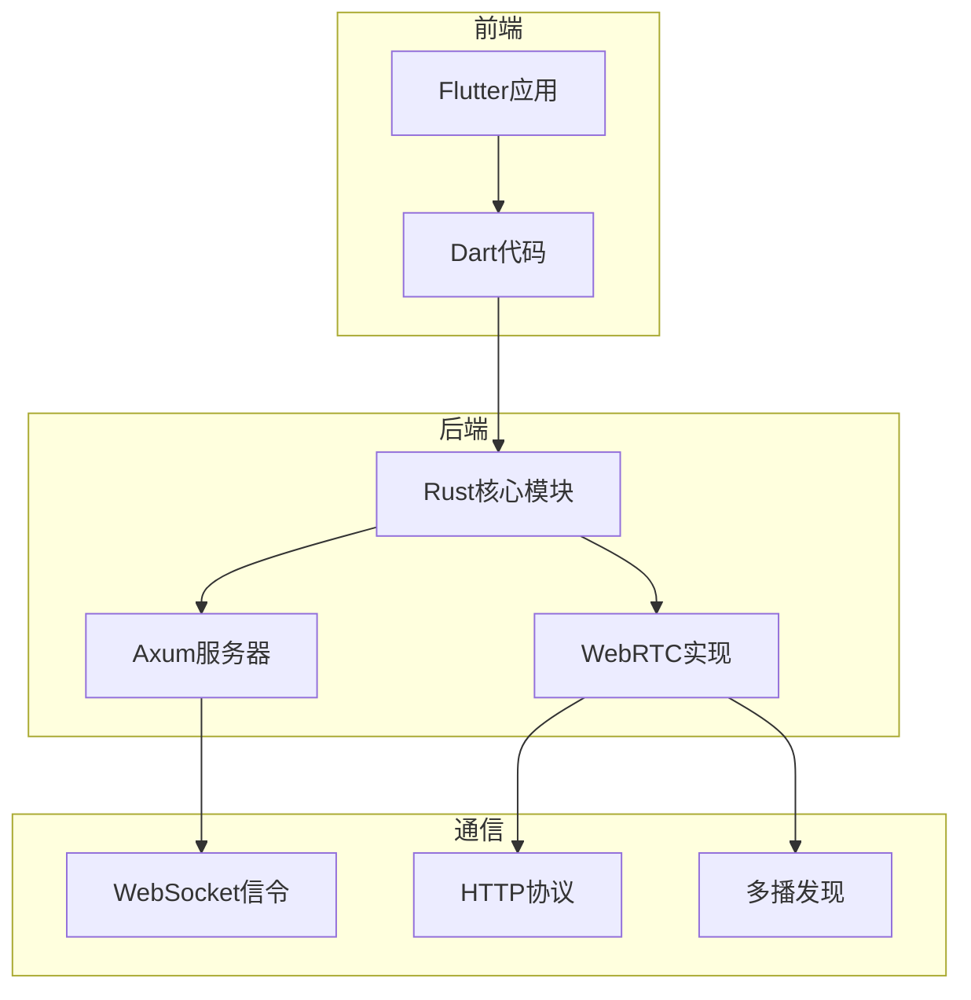
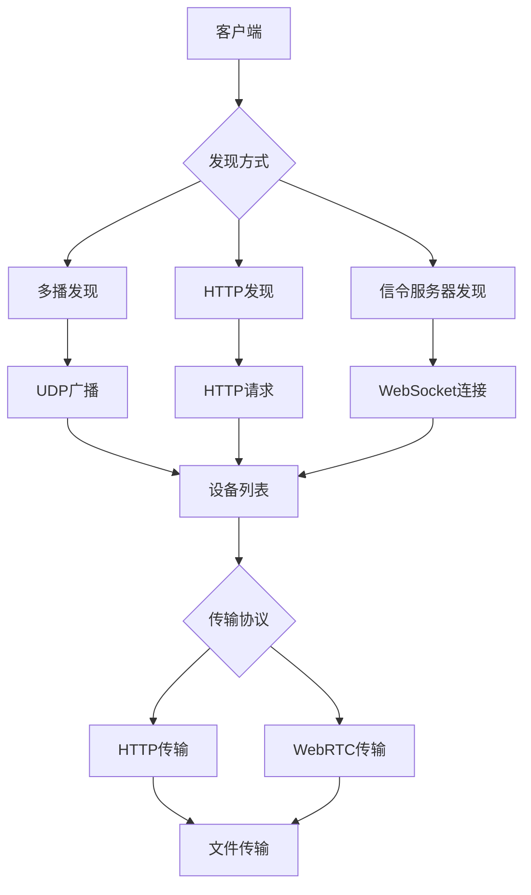
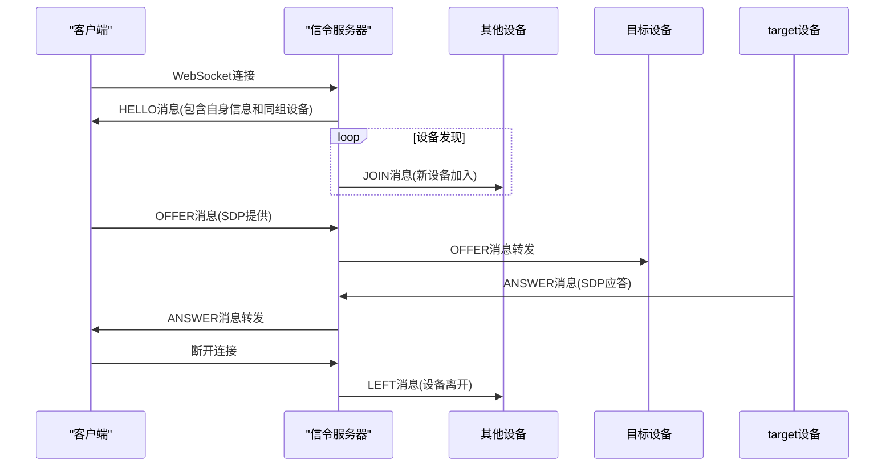
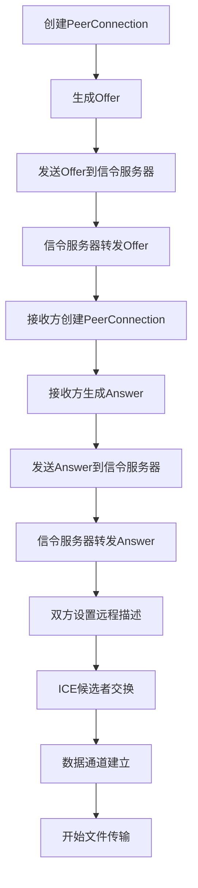
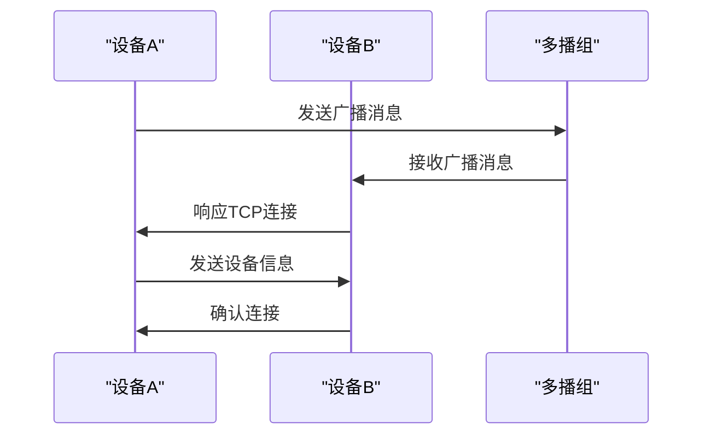
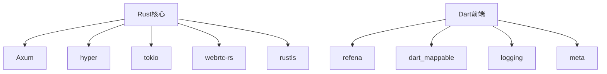

# 网络通信模块

<cite>
**本文档中引用的文件**   
- [main.rs](file://server/src/main.rs)
- [ws_controller.rs](file://server/src/controller/ws_controller.rs)
- [signaling.rs](file://core/src/webrtc/signaling.rs)
- [webrtc.rs](file://core/src/webrtc/webrtc.rs)
- [init.rs](file://server/src/config/init.rs)
- [state.rs](file://server/src/config/state.rs)
- [mod.rs](file://core/src/http/mod.rs)
- [server/mod.rs](file://core/src/http/server/mod.rs)
- [client/mod.rs](file://core/src/http/client/mod.rs)
- [discovery.rs](file://core/src/model/discovery.rs)
- [multicast_discovery.dart](file://common/lib/src/task/discovery/multicast_discovery.dart)
- [network_interfaces.dart](file://common/lib/util/network_interfaces.dart)
- [device.dart](file://common/lib/model/device.dart)
</cite>

## 目录
1. [引言](#引言)
2. [项目结构](#项目结构)
3. [核心组件](#核心组件)
4. [架构概述](#架构概述)
5. [详细组件分析](#详细组件分析)
6. [依赖分析](#依赖分析)
7. [性能考虑](#性能考虑)
8. [故障排除指南](#故障排除指南)
9. [结论](#结论)

## 引言
本项目实现了一个基于Axum框架的网络通信模块，支持HTTP和WebRTC两种传输协议。系统通过多播发现、HTTP发现和信令服务器发现三种方式实现设备发现，采用WebSocket作为信令通道，通过STUN服务器实现NAT穿透。模块设计考虑了安全性、可靠性和跨平台兼容性，支持在本地网络中高效传输文件。

## 项目结构
项目采用分层架构，核心功能分布在多个模块中。Rust代码主要负责网络通信和安全加密，Dart代码处理应用逻辑和UI交互。系统通过Flutter Rust Bridge实现跨语言调用，确保高性能的同时保持良好的用户体验。

**Diagram sources**
- [main.rs](file://server/src/main.rs#L1-L34)
- [mod.rs](file://core/src/http/mod.rs#L1-L14)

## 核心组件
系统核心组件包括HTTP服务器、WebSocket信令服务器、WebRTC连接管理、多播发现和设备管理。这些组件协同工作，实现设备发现、连接建立和文件传输功能。HTTP服务器处理设备注册和文件传输请求，WebSocket信令服务器管理WebRTC连接的信令交换，多播发现机制实现局域网内的设备自动发现。

**Section sources**
- [main.rs](file://server/src/main.rs#L1-L34)
- [ws_controller.rs](file://server/src/controller/ws_controller.rs#L1-L370)
- [signaling.rs](file://core/src/webrtc/signaling.rs#L1-L529)

## 架构概述
系统采用微服务架构，将不同功能模块解耦。HTTP服务器和WebSocket信令服务器运行在同一进程中，通过Axum框架的路由机制分发请求。WebRTC连接通过STUN服务器实现NAT穿透，确保在复杂网络环境下的连接可靠性。多播发现机制使用UDP协议，在局域网内广播设备信息，实现快速设备发现。

**Diagram sources**
- [main.rs](file://server/src/main.rs#L1-L34)
- [ws_controller.rs](file://server/src/controller/ws_controller.rs#L1-L370)

## 详细组件分析

### HTTP服务器实现
HTTP服务器基于Axum框架构建，处理设备注册、nonce交换等REST API请求。服务器支持HTTPS，使用rustls实现TLS加密。通过LruCache缓存nonce值，防止重放攻击。服务器监听IPv4和IPv6地址，确保在不同网络环境下的兼容性。

**Section sources**
- [server/mod.rs](file://core/src/http/server/mod.rs#L1-L366)
- [client/mod.rs](file://core/src/http/client/mod.rs#L1-L295)

### WebSocket信令服务器
WebSocket信令服务器是WebRTC连接的核心组件，负责SDP信令交换。服务器维护每个IP组的连接状态，限制单个IP的连接数防止DDoS攻击。通过MPSC通道实现消息广播，当新设备连接时通知同IP组的其他设备。信令消息使用JSON格式，包含HELLO、JOIN、OFFER、ANSWER等类型。

**Diagram sources**
- [ws_controller.rs](file://server/src/controller/ws_controller.rs#L1-L370)
- [signaling.rs](file://core/src/webrtc/signaling.rs#L1-L529)

### WebRTC连接建立
WebRTC连接建立过程包括nonce交换、token验证、PIN验证和文件传输四个阶段。发送方首先生成nonce并发送给接收方，双方使用nonce和公钥生成token进行身份验证。如果需要PIN码验证，则通过数据通道交换PIN码。验证通过后，发送方发送文件列表，开始文件传输。

**Diagram sources**
- [webrtc.rs](file://core/src/webrtc/webrtc.rs#L1-L1402)
- [signaling.rs](file://core/src/webrtc/signaling.rs#L1-L529)

### 多播发现机制
多播发现机制使用UDP协议在局域网内广播设备信息。系统绑定特定端口监听多播组，当收到广播消息时解析设备信息并添加到设备列表。为防止网络环路，系统会忽略自身发送的广播消息。发现过程包括主动广播和被动监听两种模式，确保设备能够及时发现彼此。

**Diagram sources**
- [multicast_discovery.dart](file://common/lib/src/task/discovery/multicast_discovery.dart#L1-L226)
- [network_interfaces.dart](file://common/lib/util/network_interfaces.dart#L1-L69)

## 依赖分析
系统依赖多个Rust和Dart库，包括Axum、hyper、tokio、webrtc-rs等。Axum框架提供HTTP路由和WebSocket支持，hyper实现HTTP协议栈，tokio提供异步运行时，webrtc-rs实现WebRTC协议。Dart端依赖refena状态管理、dart_mappable序列化等库。这些依赖通过Cargo.toml和pubspec.yaml管理，确保版本兼容性。

**Diagram sources**
- [Cargo.toml](file://server/Cargo.toml#L1-L20)
- [pubspec.yaml](file://app/pubspec.yaml#L1-L10)

## 性能考虑
系统在设计时充分考虑了性能优化。HTTP服务器使用LruCache缓存nonce值，减少重复计算。WebSocket信令服务器采用MPSC通道实现高效消息广播，避免锁竞争。WebRTC连接使用二进制消息传输文件数据，提高传输效率。多播发现机制采用UDP协议，减少网络开销。系统还实现了连接限制和请求频率限制，防止资源耗尽。

## 故障排除指南
常见问题包括设备无法发现、连接失败、文件传输中断等。设备无法发现可能是防火墙阻止了UDP多播或HTTP请求，需要检查网络设置。连接失败可能是STUN服务器不可达或证书验证失败，需要检查网络连接和证书配置。文件传输中断可能是网络不稳定或内存不足，建议检查网络状况和系统资源。

**Section sources**
- [ws_controller.rs](file://server/src/controller/ws_controller.rs#L1-L370)
- [webrtc.rs](file://core/src/webrtc/webrtc.rs#L1-L1402)

## 结论
本网络通信模块实现了高效、安全的文件传输功能。通过多种发现机制和传输协议，系统能够在不同网络环境下稳定工作。模块设计考虑了安全性、可靠性和性能，采用现代Rust异步编程模型，确保高并发下的稳定性。未来可以进一步优化NAT穿透算法，支持更多STUN/TURN服务器，提高在复杂网络环境下的连接成功率。