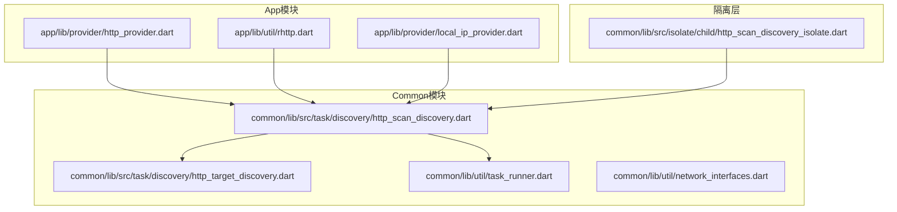
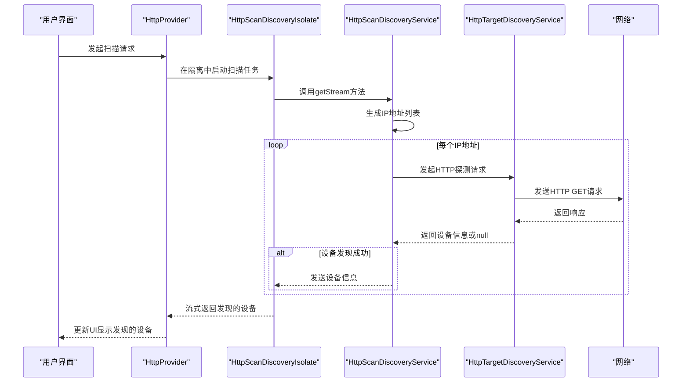
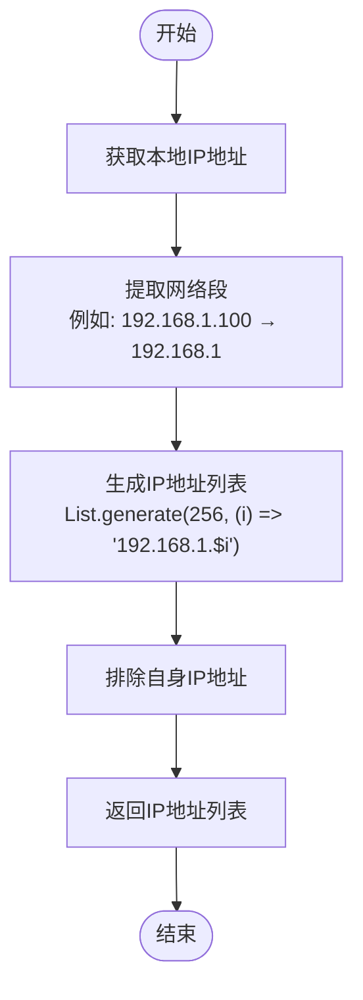
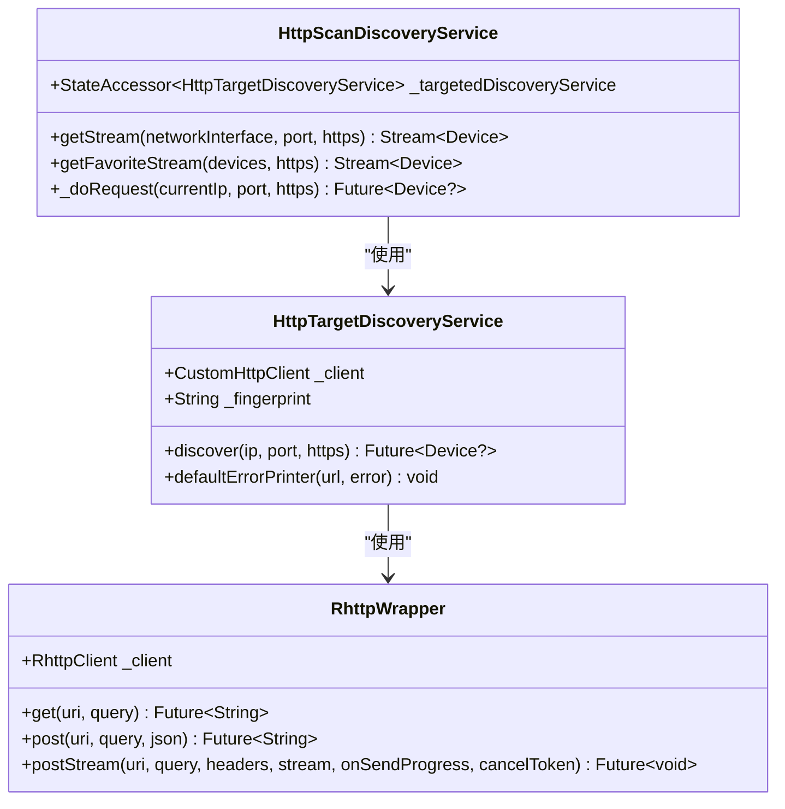
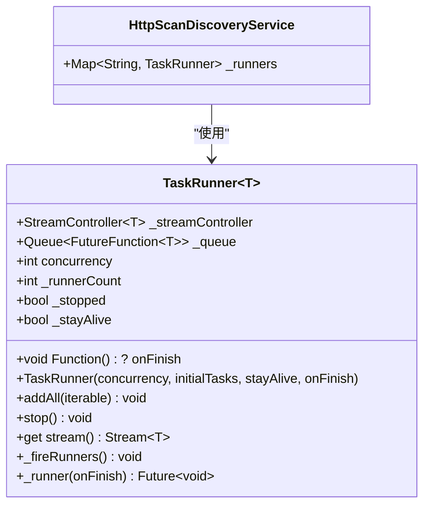
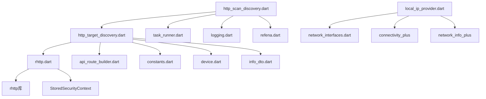
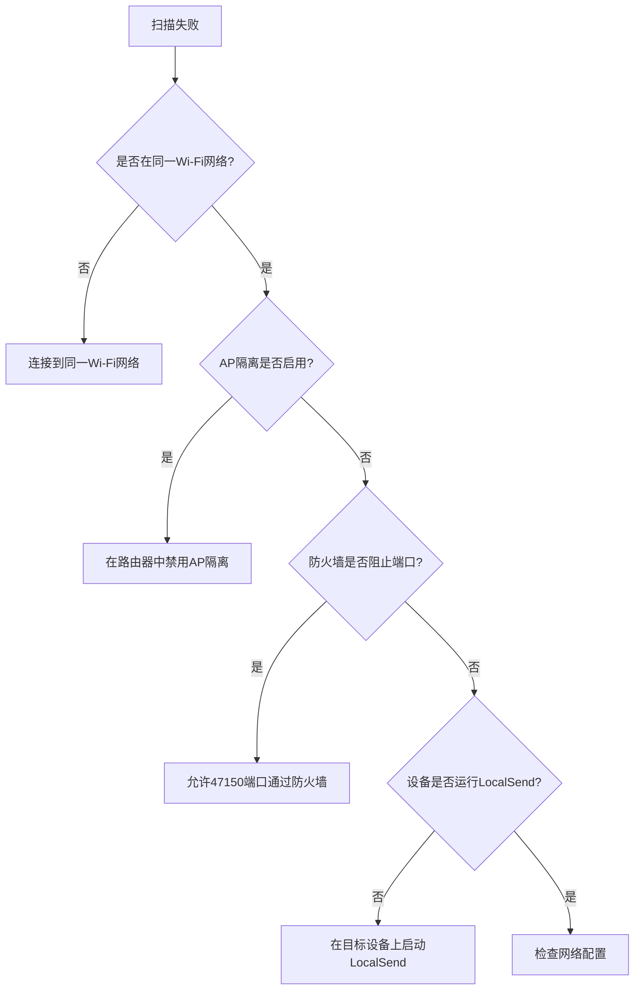

# HTTP扫描发现

<cite>
**本文档引用的文件**
- [http_scan_discovery.dart](file://common/lib/src/task/discovery/http_scan_discovery.dart)
- [http_target_discovery.dart](file://common/lib/src/task/discovery/http_target_discovery.dart)
- [rhttp.dart](file://app/lib/util/rhttp.dart)
- [task_runner.dart](file://common/lib/util/task_runner.dart)
- [network_interfaces.dart](file://common/lib/util/network_interfaces.dart)
- [local_ip_provider.dart](file://app/lib/provider/local_ip_provider.dart)
- [http_scan_discovery_isolate.dart](file://common/lib/src/isolate/child/http_scan_discovery_isolate.dart)
</cite>

## 目录
1. [简介](#简介)
2. [项目结构](#项目结构)
3. [核心组件](#核心组件)
4. [架构概述](#架构概述)
5. [详细组件分析](#详细组件分析)
6. [依赖分析](#依赖分析)
7. [性能考虑](#性能考虑)
8. [故障排除指南](#故障排除指南)
9. [结论](#结论)

## 简介
HTTP扫描发现机制是LocalSend应用中的关键功能，用于在本地网络中发现其他设备。该机制通过遍历本地网络IP地址段，向每个IP的指定端口发送HTTP GET请求来探测设备。本文档将深入解释该机制的工作原理，包括IP地址生成算法、HTTP请求的超时设置、并发控制策略以及响应验证机制。

## 项目结构
LocalSend项目的HTTP扫描发现功能分布在多个模块中，主要涉及common、app和server模块。该功能的核心实现位于common模块的task/discovery目录下，而UI相关的逻辑则位于app模块的provider和util目录中。

**Diagram sources**
- [http_scan_discovery.dart](file://common/lib/src/task/discovery/http_scan_discovery.dart)
- [http_target_discovery.dart](file://common/lib/src/task/discovery/http_target_discovery.dart)
- [rhttp.dart](file://app/lib/util/rhttp.dart)
- [local_ip_provider.dart](file://app/lib/provider/local_ip_provider.dart)

**Section sources**
- [http_scan_discovery.dart](file://common/lib/src/task/discovery/http_scan_discovery.dart)
- [http_target_discovery.dart](file://common/lib/src/task/discovery/http_target_discovery.dart)
- [rhttp.dart](file://app/lib/util/rhttp.dart)
- [task_runner.dart](file://common/lib/util/task_runner.dart)
- [network_interfaces.dart](file://common/lib/util/network_interfaces.dart)
- [local_ip_provider.dart](file://app/lib/provider/local_ip_provider.dart)

## 核心组件
HTTP扫描发现机制的核心组件包括IP地址生成、HTTP请求执行、并发控制和响应验证。这些组件协同工作，确保在本地网络中高效地发现其他设备。

**Section sources**
- [http_scan_discovery.dart](file://common/lib/src/task/discovery/http_scan_discovery.dart#L1-L67)
- [http_target_discovery.dart](file://common/lib/src/task/discovery/http_target_discovery.dart#L1-L48)
- [task_runner.dart](file://common/lib/util/task_runner.dart#L1-L70)

## 架构概述
HTTP扫描发现机制的架构基于隔离(Isolate)模式，将网络扫描任务与UI线程分离，避免阻塞用户界面。该机制使用任务运行器(TaskRunner)来管理并发HTTP请求，确保在高并发情况下仍能保持稳定性能。

**Diagram sources**
- [http_scan_discovery_isolate.dart](file://common/lib/src/isolate/child/http_scan_discovery_isolate.dart#L1-L67)
- [http_scan_discovery.dart](file://common/lib/src/task/discovery/http_scan_discovery.dart#L1-L67)
- [http_target_discovery.dart](file://common/lib/src/task/discovery/http_target_discovery.dart#L1-L48)

## 详细组件分析

### IP地址生成算法
IP地址生成算法是HTTP扫描发现机制的基础。该算法从本地IP地址推导出网络段，然后生成该网络段内的所有可能IP地址。

**Diagram sources**
- [http_scan_discovery.dart](file://common/lib/src/task/discovery/http_scan_discovery.dart#L20-L22)

**Section sources**
- [http_scan_discovery.dart](file://common/lib/src/task/discovery/http_scan_discovery.dart#L20-L25)

### HTTP请求执行与验证
HTTP请求执行与验证机制负责向每个IP地址发送HTTP GET请求，并验证响应以确认设备的存在。

**Diagram sources**
- [http_target_discovery.dart](file://common/lib/src/task/discovery/http_target_discovery.dart#L1-L48)
- [http_scan_discovery.dart](file://common/lib/src/task/discovery/http_scan_discovery.dart#L1-L67)
- [rhttp.dart](file://app/lib/util/rhttp.dart#L1-L86)

**Section sources**
- [http_target_discovery.dart](file://common/lib/src/task/discovery/http_target_discovery.dart#L1-L48)
- [http_scan_discovery.dart](file://common/lib/src/task/discovery/http_scan_discovery.dart#L1-L67)
- [rhttp.dart](file://app/lib/util/rhttp.dart#L1-L86)

### 并发控制策略
并发控制策略通过TaskRunner实现，确保HTTP请求的并发执行不会超出系统承受能力。

**Diagram sources**
- [task_runner.dart](file://common/lib/util/task_runner.dart#L1-L70)
- [http_scan_discovery.dart](file://common/lib/src/task/discovery/http_scan_discovery.dart#L1-L67)

**Section sources**
- [task_runner.dart](file://common/lib/util/task_runner.dart#L1-L70)
- [http_scan_discovery.dart](file://common/lib/src/task/discovery/http_scan_discovery.dart#L1-L67)

## 依赖分析
HTTP扫描发现机制依赖于多个组件和库，这些依赖关系确保了功能的完整性和稳定性。

**Diagram sources**
- [http_scan_discovery.dart](file://common/lib/src/task/discovery/http_scan_discovery.dart)
- [http_target_discovery.dart](file://common/lib/src/task/discovery/http_target_discovery.dart)
- [rhttp.dart](file://app/lib/util/rhttp.dart)
- [local_ip_provider.dart](file://app/lib/provider/local_ip_provider.dart)
- [network_interfaces.dart](file://common/lib/util/network_interfaces.dart)

**Section sources**
- [http_scan_discovery.dart](file://common/lib/src/task/discovery/http_scan_discovery.dart)
- [http_target_discovery.dart](file://common/lib/src/task/discovery/http_target_discovery.dart)
- [rhttp.dart](file://app/lib/util/rhttp.dart)
- [local_ip_provider.dart](file://app/lib/provider/local_ip_provider.dart)
- [network_interfaces.dart](file://common/lib/util/network_interfaces.dart)

## 性能考虑
HTTP扫描发现机制在设计时充分考虑了性能因素。通过并发控制和流式处理，该机制能够在短时间内扫描整个网络段，同时避免对系统资源造成过大压力。

- **并发控制**：使用TaskRunner限制并发请求数量，默认为50个并发请求，避免网络拥塞和系统过载。
- **流式处理**：使用Stream返回发现的设备，而不是等待所有扫描完成，提高了响应速度。
- **缓存机制**：通过_map<String, TaskRunner>_缓存每个网络接口的扫描任务，避免重复扫描。
- **超时设置**：HTTP请求具有可配置的超时时间，防止因网络延迟导致的长时间等待。

**Section sources**
- [http_scan_discovery.dart](file://common/lib/src/task/discovery/http_scan_discovery.dart)
- [task_runner.dart](file://common/lib/util/task_runner.dart)
- [rhttp.dart](file://app/lib/util/rhttp.dart)

## 故障排除指南
在使用HTTP扫描发现机制时，可能会遇到各种网络和配置问题。以下是一些常见问题及其解决方案：

**Diagram sources**
- [local_ip_provider.dart](file://app/lib/provider/local_ip_provider.dart)
- [network_interfaces.dart](file://common/lib/util/network_interfaces.dart)

**Section sources**
- [local_ip_provider.dart](file://app/lib/provider/local_ip_provider.dart)
- [network_interfaces.dart](file://common/lib/util/network_interfaces.dart)

## 结论
HTTP扫描发现机制是LocalSend应用的核心功能之一，它通过高效的网络扫描算法和稳健的错误处理机制，在本地网络中发现其他设备。该机制的设计充分考虑了性能、可靠性和用户体验，通过并发控制、流式处理和隔离模式，确保了在各种网络环境下的稳定运行。未来可以进一步优化IP地址生成算法，支持IPv6网络，并增加更智能的网络探测策略。