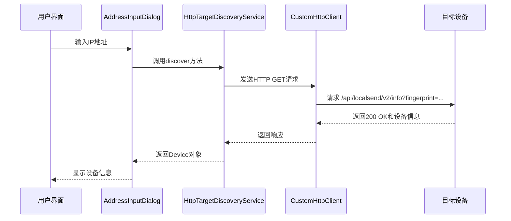
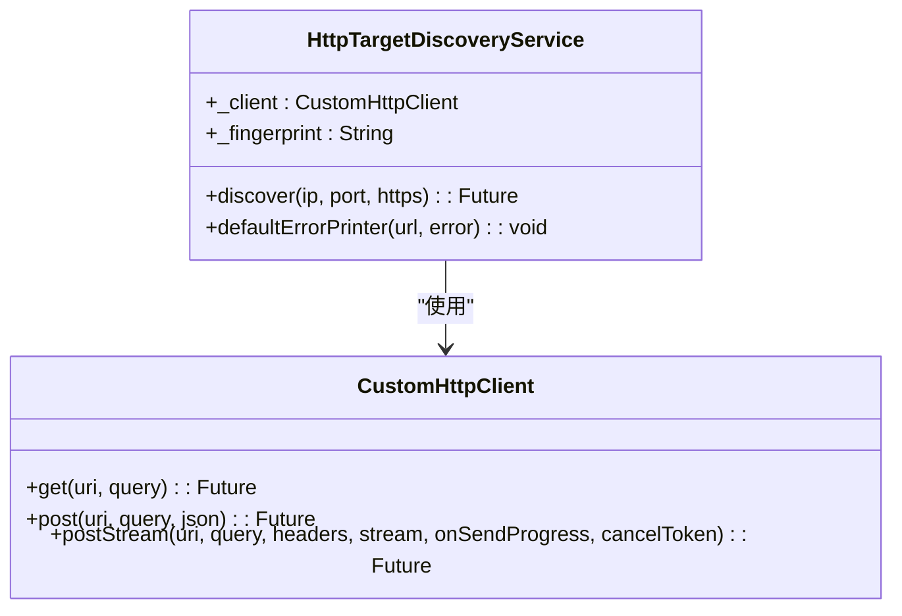
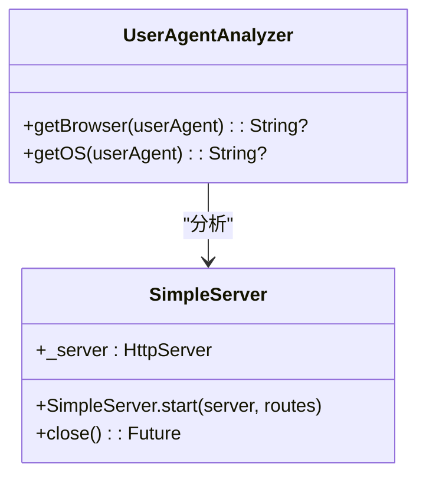
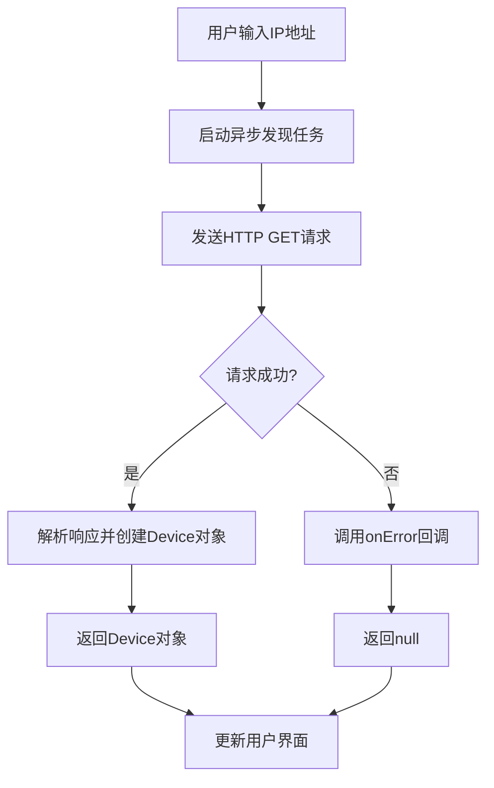
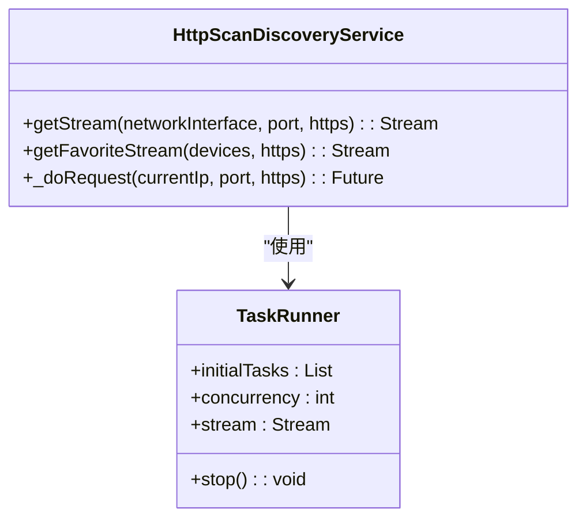
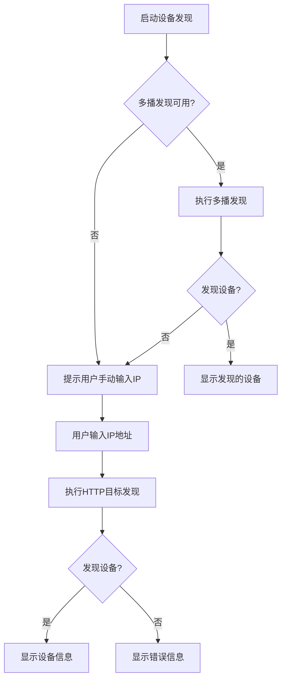
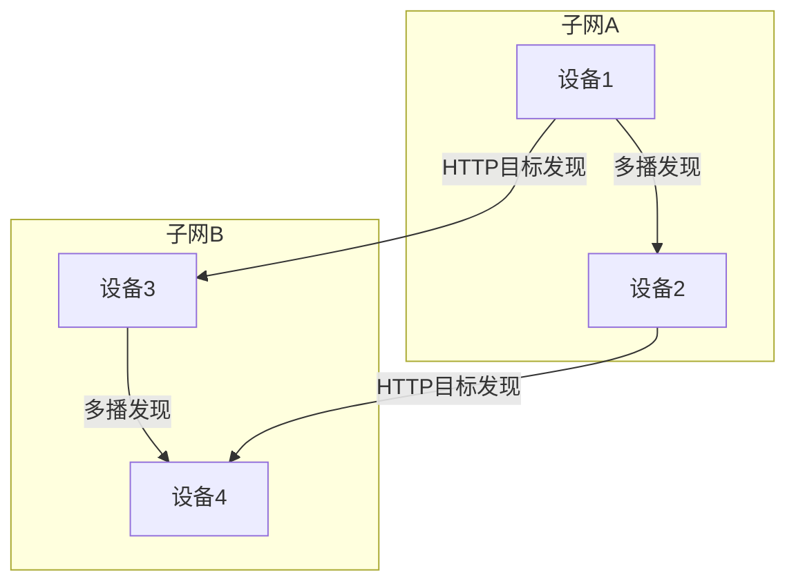

# HTTP目标发现

<cite>
**本文档中引用的文件**  
- [http_target_discovery.dart](file://common/lib/src/task/discovery/http_target_discovery.dart)
- [http_scan_discovery.dart](file://common/lib/src/task/discovery/http_scan_discovery.dart)
- [http_target_discovery_isolate.dart](file://common/lib/src/isolate/child/http_target_discovery_isolate.dart)
- [actions.dart](file://common/lib/src/isolate/parent/actions.dart)
- [api_route_builder.dart](file://common/lib/api_route_builder.dart)
- [http_provider.dart](file://common/lib/src/isolate/child/http_provider.dart)
- [multicast_discovery.dart](file://common/lib/src/task/discovery/multicast_discovery.dart)
- [info_dto.dart](file://common/lib/model/dto/info_dto.dart)
- [device.dart](file://common/lib/model/device.dart)
- [user_agent_analyzer.dart](file://app/lib/util/user_agent_analyzer.dart)
- [task_runner.dart](file://common/lib/util/task_runner.dart)
</cite>

## 目录
1. [介绍](#介绍)
2. [HTTP目标发现机制](#http目标发现机制)
3. [核心组件分析](#核心组件分析)
4. [异步处理与错误重试](#异步处理与错误重试)
5. [与多播发现的协同工作](#与多播发现的协同工作)
6. [复杂网络拓扑中的优势](#复杂网络拓扑中的优势)
7. [结论](#结论)

## 介绍

HTTP目标发现是LocalSend应用中用于设备发现的核心机制之一。该机制允许用户通过手动输入IP地址或从历史记录中选择设备来建立连接。当用户输入目标设备的IP地址时，系统会向该设备的47150端口发送HTTP GET请求，以验证设备的可用性和获取设备信息。这种发现方式特别适用于跨子网通信或当多播发现因网络配置限制而不可用的情况。

**Section sources**
- [http_target_discovery.dart](file://common/lib/src/task/discovery/http_target_discovery.dart#L1-L48)
- [http_scan_discovery.dart](file://common/lib/src/task/discovery/http_scan_discovery.dart#L1-L68)

## HTTP目标发现机制

HTTP目标发现机制通过向已知目标设备的IP地址和端口发送HTTP GET请求来建立连接。该机制主要用于用户手动输入IP地址或从历史记录中选择设备的场景。系统会使用`HttpTargetDiscoveryService`类来执行发现过程，该类通过`CustomHttpClient`发送HTTP请求，并处理响应。

发现过程首先构建目标URL，该URL指向目标设备的`/api/localsend/v2/info`端点。请求中包含一个查询参数`fingerprint`，该参数是本地设备的证书哈希值，用于身份验证。如果目标设备响应成功，系统会解析响应数据并创建一个`Device`对象，该对象包含目标设备的详细信息，如别名、版本、设备型号等。

**Diagram sources**
- [http_target_discovery.dart](file://common/lib/src/task/discovery/http_target_discovery.dart#L1-L48)
- [address_input_dialog.dart](file://app/lib/widget/dialogs/address_input_dialog.dart#L44-L96)

**Section sources**
- [http_target_discovery.dart](file://common/lib/src/task/discovery/http_target_discovery.dart#L1-L48)
- [address_input_dialog.dart](file://app/lib/widget/dialogs/address_input_dialog.dart#L44-L96)

## 核心组件分析

### HttpTargetDiscoveryService

`HttpTargetDiscoveryService`是HTTP目标发现的核心服务类。它负责执行发现过程，包括构建请求、发送请求和处理响应。该服务使用`CustomHttpClient`来发送HTTP请求，并通过`fingerprint`参数进行身份验证。

**Diagram sources**
- [http_target_discovery.dart](file://common/lib/src/task/discovery/http_target_discovery.dart#L1-L48)

**Section sources**
- [http_target_discovery.dart](file://common/lib/src/task/discovery/http_target_discovery.dart#L1-L48)

### 请求头构造

HTTP请求头的构造是确保通信安全和正确性的关键步骤。在LocalSend中，请求头的构造由`CustomHttpClient`实现。请求头中最重要的字段是`fingerprint`，它用于验证设备的身份。此外，请求头还包括`User-Agent`字段，该字段包含客户端的信息，如浏览器和操作系统。

`User-Agent`字段的格式遵循标准的HTTP规范，包含客户端的名称、版本和操作系统信息。例如，`User-Agent: LocalSend/1.0 (Windows)`表示使用Windows操作系统的LocalSend客户端。`User-Agent`字段的必要性在于它允许服务器识别客户端的类型和版本，从而提供适当的响应。

**Diagram sources**
- [user_agent_analyzer.dart](file://app/lib/util/user_agent_analyzer.dart#L1-L36)
- [simple_server.dart](file://app/lib/util/simple_server.dart#L1-L63)

**Section sources**
- [user_agent_analyzer.dart](file://app/lib/util/user_agent_analyzer.dart#L1-L36)
- [simple_server.dart](file://app/lib/util/simple_server.dart#L1-L63)

## 异步处理与错误重试

### 异步处理流程

HTTP目标发现采用异步处理流程，以确保用户界面的响应性。当用户输入IP地址并提交时，系统会启动一个异步任务来执行发现过程。该任务在后台线程中运行，不会阻塞用户界面。一旦发现过程完成，系统会通过回调函数通知用户界面更新状态。

异步处理流程的关键在于使用`Future`和`Stream`来管理异步操作。`HttpTargetDiscoveryService`的`discover`方法返回一个`Future<Device?>`，表示发现过程的结果。用户界面可以通过`await`关键字等待该`Future`完成，或者使用`then`方法注册回调函数。

**Diagram sources**
- [http_target_discovery.dart](file://common/lib/src/task/discovery/http_target_discovery.dart#L1-L48)
- [http_target_discovery_isolate.dart](file://common/lib/src/isolate/child/http_target_discovery_isolate.dart#L1-L54)

**Section sources**
- [http_target_discovery.dart](file://common/lib/src/task/discovery/http_target_discovery.dart#L1-L48)
- [http_target_discovery_isolate.dart](file://common/lib/src/isolate/child/http_target_discovery_isolate.dart#L1-L54)

### 连接超时处理和错误重试策略

连接超时处理和错误重试策略是确保发现过程可靠性的关键。在LocalSend中，连接超时由`discoveryTimeout`参数控制，该参数在`httpProvider`中设置。如果在指定时间内未收到响应，请求将被取消，并调用`onError`回调函数。

错误重试策略通过`TaskRunner`类实现。`TaskRunner`允许并发执行多个任务，并在任务失败时自动重试。在HTTP扫描发现中，`TaskRunner`用于并发扫描整个子网的IP地址，每个IP地址的发现任务都是独立的，如果某个任务失败，不会影响其他任务的执行。

**Diagram sources**
- [task_runner.dart](file://common/lib/util/task_runner.dart#L1-L100)
- [http_scan_discovery.dart](file://common/lib/src/task/discovery/http_scan_discovery.dart#L1-L68)

**Section sources**
- [task_runner.dart](file://common/lib/util/task_runner.dart#L1-L100)
- [http_scan_discovery.dart](file://common/lib/src/task/discovery/http_scan_discovery.dart#L1-L68)

## 与多播发现的协同工作

HTTP目标发现与多播发现协同工作，以提供更全面的设备发现能力。多播发现通过UDP广播在本地网络中发现设备，而HTTP目标发现则允许用户手动指定目标设备。这两种发现方式可以互补，多播发现用于自动发现本地网络中的设备，而HTTP目标发现用于跨子网或手动指定设备。

当多播发现失败时，系统会自动回退到HTTP目标发现。例如，当用户尝试连接到一个不在同一子网的设备时，多播发现无法发现该设备，此时用户可以手动输入设备的IP地址，系统将使用HTTP目标发现来建立连接。

**Diagram sources**
- [multicast_discovery.dart](file://common/lib/src/task/discovery/multicast_discovery.dart#L1-L225)
- [http_scan_discovery.dart](file://common/lib/src/task/discovery/http_scan_discovery.dart#L1-L68)

**Section sources**
- [multicast_discovery.dart](file://common/lib/src/task/discovery/multicast_discovery.dart#L1-L225)
- [http_scan_discovery.dart](file://common/lib/src/task/discovery/http_scan_discovery.dart#L1-L68)

## 复杂网络拓扑中的优势

在复杂网络拓扑中，HTTP目标发现具有显著优势。多播发现依赖于UDP广播，而UDP广播通常被路由器阻止，无法跨子网传播。这意味着在跨子网的网络环境中，多播发现无法发现其他子网中的设备。HTTP目标发现通过直接向目标设备的IP地址发送HTTP请求，克服了这一限制，允许跨子网通信。

此外，HTTP目标发现还支持HTTPS协议，提供加密通信，确保数据传输的安全性。在企业网络或公共网络中，安全性是至关重要的，HTTPS协议可以防止数据被窃听或篡改。

**Diagram sources**
- [http_target_discovery.dart](file://common/lib/src/task/discovery/http_target_discovery.dart#L1-L48)
- [multicast_discovery.dart](file://common/lib/src/task/discovery/multicast_discovery.dart#L1-L225)

**Section sources**
- [http_target_discovery.dart](file://common/lib/src/task/discovery/http_target_discovery.dart#L1-L48)
- [multicast_discovery.dart](file://common/lib/src/task/discovery/multicast_discovery.dart#L1-L225)

## 结论

HTTP目标发现是LocalSend应用中一个关键的设备发现机制，它通过向已知目标设备的IP地址发送HTTP GET请求来建立连接。该机制支持手动输入IP地址和从历史记录中选择设备，适用于跨子网通信和多播发现不可用的场景。通过异步处理、连接超时处理和错误重试策略，HTTP目标发现确保了发现过程的可靠性和用户界面的响应性。与多播发现协同工作，HTTP目标发现提供了更全面的设备发现能力，在复杂网络拓扑中具有显著优势。