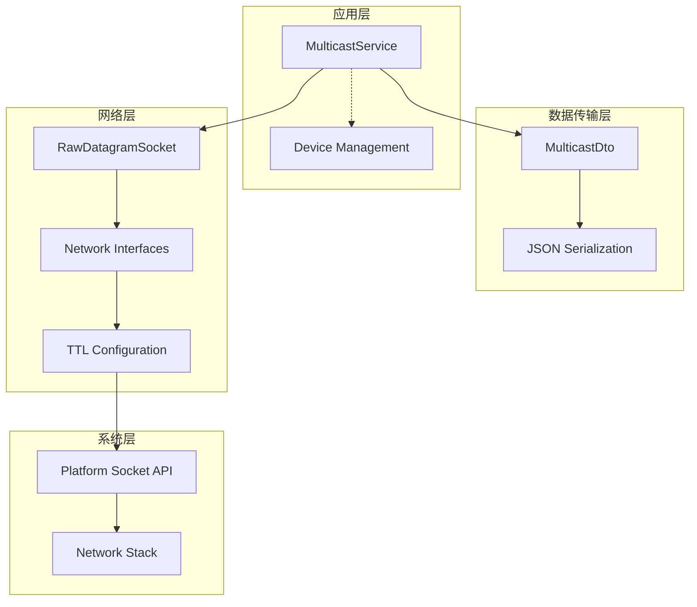
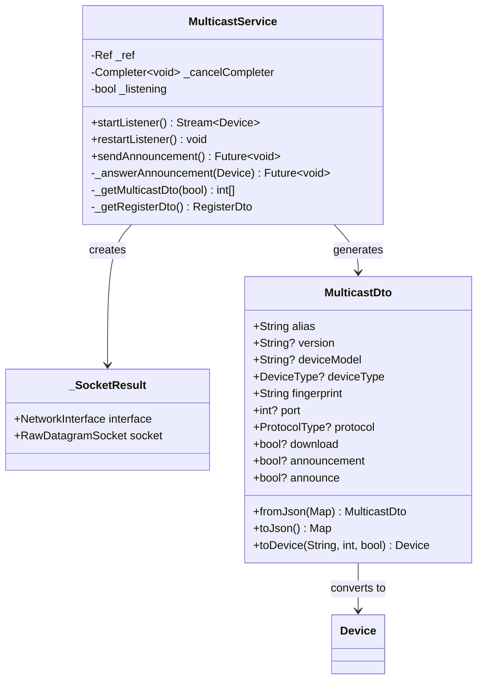
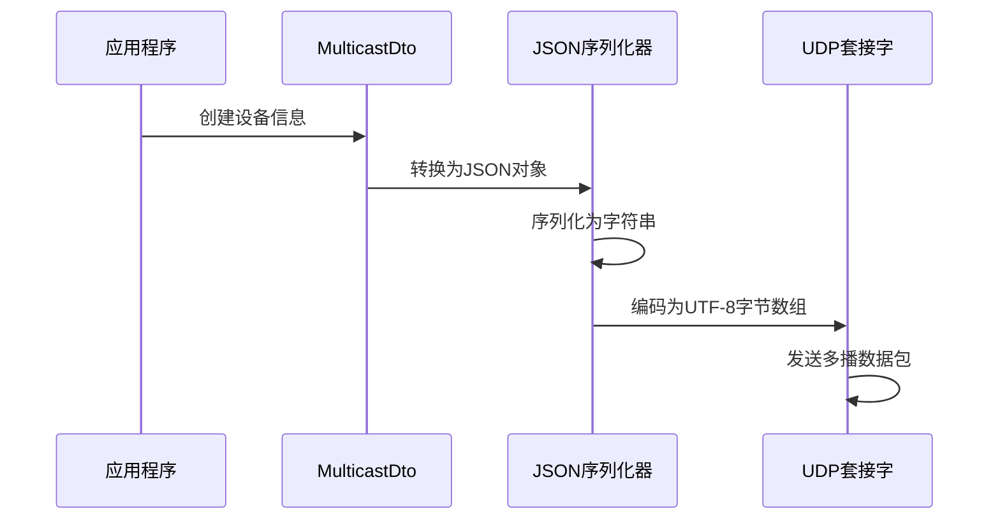
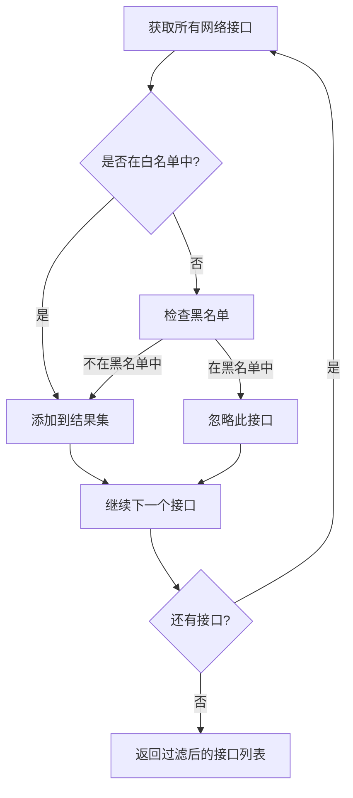
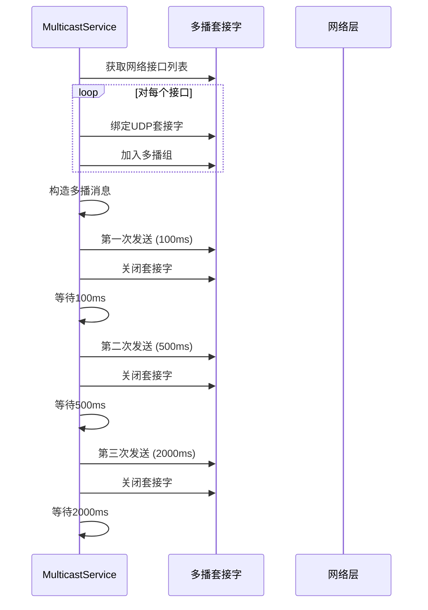
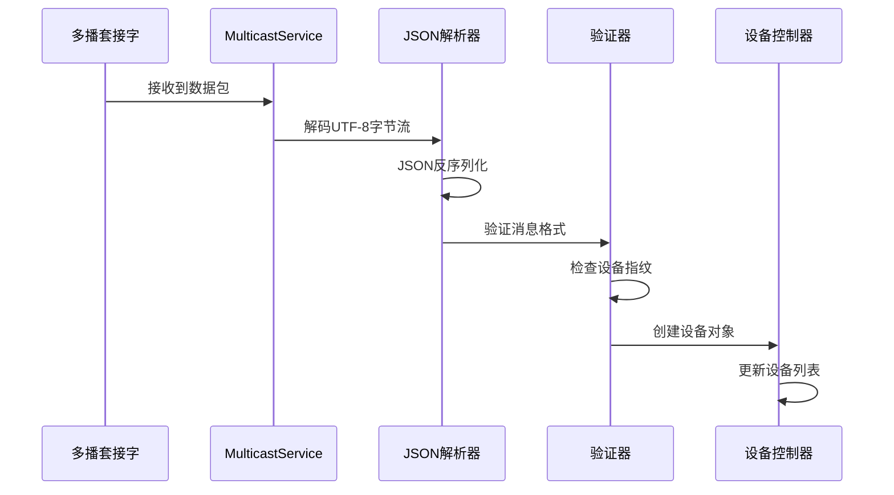
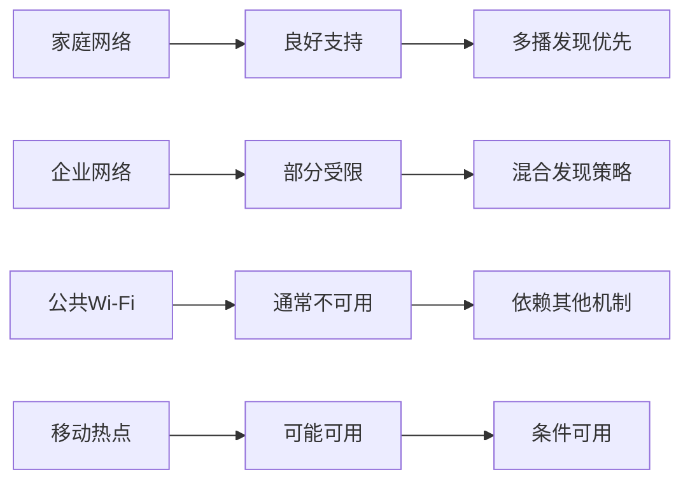

# 多播发现机制详细文档

<cite>
**本文档中引用的文件**
- [multicast_discovery.dart](file://common/lib/src/task/discovery/multicast_discovery.dart)
- [multicast_dto.dart](file://common/lib/model/dto/multicast_dto.dart)
- [multicast_dto.mapper.dart](file://common/lib/model/dto/multicast_dto.mapper.dart)
- [network_interfaces.dart](file://common/lib/util/network_interfaces.dart)
- [constants.dart](file://common/lib/constants.dart)
- [settings_provider.dart](file://app/lib/provider/settings_provider.dart)
- [init.dart](file://app/lib/config/init.dart)
</cite>

## 目录
1. [简介](#简介)
2. [系统架构概述](#系统架构概述)
3. [核心组件分析](#核心组件分析)
4. [多播地址与端口配置](#多播地址与端口配置)
5. [数据包构造与序列化](#数据包构造与序列化)
6. [网络接口管理](#网络接口管理)
7. [消息处理流程](#消息处理流程)
8. [错误处理与容错机制](#错误处理与容错机制)
9. [性能优化考虑](#性能优化考虑)
10. [局限性与解决方案](#局限性与解决方案)
11. [故障排除指南](#故障排除指南)
12. [总结](#总结)

## 简介

LocalSend的多播发现机制是一种基于UDP协议的本地网络设备发现技术，它利用IPv4多播地址224.0.0.1和端口47150实现设备间的自动发现和通信。该机制通过发送和接收JSON格式的设备信息包，在局域网内建立设备连接，为用户提供便捷的文件传输体验。

多播发现机制的核心优势在于其自动化程度高、部署简单且对网络拓扑变化具有良好的适应性。它特别适用于家庭网络和小型办公环境，能够有效减少用户手动输入IP地址的需求。

## 系统架构概述

多播发现机制采用分层架构设计，包含以下主要层次：



**图表来源**
- [multicast_discovery.dart](file://common/lib/src/task/discovery/multicast_discovery.dart#L25-L50)
- [multicast_dto.dart](file://common/lib/model/dto/multicast_dto.dart#L10-L30)

**章节来源**
- [multicast_discovery.dart](file://common/lib/src/task/discovery/multicast_discovery.dart#L1-L50)
- [constants.dart](file://common/lib/constants.dart#L20-L32)

## 核心组件分析

### MulticastService类

MulticastService是多播发现机制的核心控制器，负责管理整个发现流程：



**图表来源**
- [multicast_discovery.dart](file://common/lib/src/task/discovery/multicast_discovery.dart#L25-L100)
- [multicast_dto.dart](file://common/lib/model/dto/multicast_dto.dart#L10-L55)

### 数据传输对象

MulticastDto定义了多播消息的数据结构，支持版本兼容性和向后兼容：

| 字段名 | 类型 | 描述 | 版本支持 |
|--------|------|------|----------|
| alias | String | 设备别名 | v1, v2 |
| version | String? | 协议版本 | v2+ |
| deviceModel | String? | 设备型号 | v2+ |
| deviceType | DeviceType? | 设备类型 | v2+ |
| fingerprint | String | 设备指纹标识 | v1, v2 |
| port | int? | 服务端口 | v2+ |
| protocol | ProtocolType? | 传输协议 | v2+ |
| download | bool? | 下载功能支持 | v2+ |
| announcement | bool? | 旧版公告标志 | v1 |
| announce | bool? | 新版公告标志 | v2+ |

**章节来源**
- [multicast_dto.dart](file://common/lib/model/dto/multicast_dto.dart#L10-L55)
- [multicast_dto.mapper.dart](file://common/lib/model/dto/multicast_dto.mapper.dart#L70-L89)

## 多播地址与端口配置

### 默认配置参数

LocalSend使用标准化的多播配置参数：

| 参数 | 值 | 说明 |
|------|-----|------|
| 多播组地址 | 224.0.0.167 | IPv4多播地址范围：224.0.0.0 - 224.0.0.255 |
| 默认端口 | 53317 | UDP监听端口 |
| TTL值 | 1 | 跳数限制，确保仅限本地网络 |
| 广播频率 | 3次重试 | 每次间隔100ms、500ms、2000ms |

### 地址选择原理

224.0.0.167地址的选择基于以下考虑：
- **Android兼容性**：某些Android设备只支持224.0.0.0/24子网内的多播
- **网络隔离**：避免与其他网络服务冲突
- **安全性**：限制在本地网络范围内

### 端口绑定策略

端口绑定采用动态分配机制：
- **监听端口**：使用settings.port（默认53317）
- **临时端口**：bind时指定port为0，由系统自动分配
- **资源清理**：每次发送后立即关闭socket连接

**章节来源**
- [constants.dart](file://common/lib/constants.dart#L20-L32)
- [multicast_discovery.dart](file://common/lib/src/task/discovery/multicast_discovery.dart#L192-L224)

## 数据包构造与序列化

### JSON消息体结构

多播数据包采用JSON格式进行序列化，确保跨平台兼容性：



**图表来源**
- [multicast_discovery.dart](file://common/lib/src/task/discovery/multicast_discovery.dart#L160-L180)
- [multicast_dto.mapper.dart](file://common/lib/model/dto/multicast_dto.mapper.dart#L180-L221)

### 设备信息序列化方法

序列化过程包含以下步骤：

1. **字段映射**：将设备属性映射到JSON键值对
2. **类型转换**：处理枚举类型和可选字段
3. **编码处理**：使用UTF-8编码确保字符兼容性
4. **压缩优化**：移除不必要的空白字符

### 消息体示例

典型的多播消息内容如下：

```json
{
  "alias": "我的手机",
  "version": "2.1",
  "deviceModel": "Pixel 7 Pro",
  "deviceType": "mobile",
  "fingerprint": "abc123def456...",
  "port": 53317,
  "protocol": "https",
  "download": true,
  "announce": true
}
```

**章节来源**
- [multicast_dto.dart](file://common/lib/model/dto/multicast_dto.dart#L10-L55)
- [multicast_dto.mapper.dart](file://common/lib/model/dto/multicast_dto.mapper.dart#L180-L221)

## 网络接口管理

### 接口过滤机制

网络接口管理采用白名单和黑名单双重过滤：



**图表来源**
- [network_interfaces.dart](file://common/lib/util/network_interfaces.dart#L8-L28)

### 过滤规则详解

| 规则类型 | 格式示例 | 匹配规则 |
|----------|----------|----------|
| 精确匹配 | 192.168.1.100 | 完全匹配特定IP |
| 子网匹配 | 192.168.1.* | 匹配同一子网的所有设备 |
| IPv6通配符 | 2001:db8::1:* | 支持IPv6地址模式 |
| 反向匹配 | !192.168.1.1 | 排除特定设备 |

### 接口绑定过程

每个网络接口都需要单独绑定多播套接字：

1. **接口扫描**：获取所有可用网络接口
2. **权限检查**：验证对每个接口的访问权限
3. **套接字创建**：为每个接口创建独立的UDP套接字
4. **多播加入**：将套接字加入指定的多播组
5. **监听启动**：开始监听传入的多播数据包

**章节来源**
- [network_interfaces.dart](file://common/lib/util/network_interfaces.dart#L8-L68)
- [multicast_discovery.dart](file://common/lib/src/task/discovery/multicast_discovery.dart#L192-L224)

## 消息处理流程

### 发送流程

多播消息发送采用三阶段重试机制：



**图表来源**
- [multicast_discovery.dart](file://common/lib/src/task/discovery/multicast_discovery.dart#L90-L120)

### 接收流程

多播消息接收采用事件驱动模式：



**图表来源**
- [multicast_discovery.dart](file://common/lib/src/task/discovery/multicast_discovery.dart#L40-L80)

### 设备识别机制

设备识别基于多重验证：

1. **指纹验证**：防止自发现循环
2. **协议协商**：确定最佳通信协议
3. **版本兼容**：确保协议版本兼容性
4. **功能检测**：识别设备能力

**章节来源**
- [multicast_discovery.dart](file://common/lib/src/task/discovery/multicast_discovery.dart#L40-L80)
- [multicast_dto.dart](file://common/lib/model/dto/multicast_dto.dart#L35-L55)

## 错误处理与容错机制

### 异常处理策略

多播发现机制实现了多层次的错误处理：

| 错误类型 | 处理策略 | 恢复机制 |
|----------|----------|----------|
| 套接字绑定失败 | 记录警告日志 | 跳过当前接口继续 |
| 多播加入失败 | 继续下一个接口 | 不影响整体功能 |
| JSON解析错误 | 忽略损坏消息 | 记录解析失败 |
| 网络接口不可用 | 自动过滤 | 动态重新扫描 |
| 权限不足 | 降级处理 | 使用备用方案 |

### 容错设计原则

1. **优雅降级**：单个接口失败不影响整体功能
2. **状态恢复**：异常后能自动恢复正常运行
3. **资源清理**：确保异常情况下正确释放资源
4. **日志记录**：详细记录错误信息便于调试

### 网络变化适应

系统能够适应网络拓扑的变化：

- **接口新增**：自动发现新加入的网络接口
- **接口移除**：自动停止对已断开接口的监听
- **IP地址变更**：及时更新设备信息
- **网络重组**：在网络重新配置后自动恢复

**章节来源**
- [multicast_discovery.dart](file://common/lib/src/task/discovery/multicast_discovery.dart#L192-L224)
- [network_interfaces.dart](file://common/lib/util/network_interfaces.dart#L8-L28)

## 性能优化考虑

### 资源使用优化

多播发现机制在资源使用方面进行了多项优化：

1. **内存管理**：及时释放不再使用的套接字资源
2. **CPU优化**：采用异步处理避免阻塞主线程
3. **网络效率**：合理设置TTL值避免网络拥塞
4. **并发控制**：限制同时活跃的套接字数量

### 广播频率控制

广播频率经过精心调优：

- **初始发送**：快速确认设备存在（100ms）
- **重试机制**：确保消息可靠到达（500ms、2000ms）
- **资源释放**：每次发送后立即关闭套接字
- **等待间隔**：避免过于频繁的网络活动

### 内存使用监控

系统持续监控内存使用情况：

- **套接字池管理**：避免创建过多并发套接字
- **消息缓冲区**：合理设置缓冲区大小
- **垃圾回收**：及时清理无用的对象引用

## 局限性与解决方案

### 跨子网不可达问题

多播发现机制的主要局限性之一是跨子网通信能力有限：

#### 问题描述
- **路由器限制**：大多数家用路由器不支持多播转发
- **防火墙阻隔**：网络安全策略可能阻止多播流量
- **VLAN隔离**：企业网络中的VLAN配置会隔离多播

#### 解决方案

| 场景 | 解决方案 | 实现方式 |
|------|----------|----------|
| 路由器不支持 | 启用IGMP Snooping | 在路由器上启用IGMP代理 |
| 防火墙阻隔 | 手动配置防火墙规则 | 开放224.0.0.167:53317端口 |
| VLAN隔离 | 配置多播VLAN | 设置专用多播VLAN |
| 企业网络 | 使用替代发现机制 | 结合HTTP发现和WebRTC信令 |

### 网络环境适应性

不同网络环境下的表现差异：



### 兼容性考虑

为了提高兼容性，系统提供了多种发现机制的互补：

1. **HTTP发现**：作为多播的补充方案
2. **WebRTC信令**：用于复杂网络环境
3. **手动输入**：最可靠的备用方案
4. **历史记录**：保存已知设备信息

**章节来源**
- [constants.dart](file://common/lib/constants.dart#L25-L32)

## 故障排除指南

### 常见问题诊断

#### 多播发现无法正常工作

**症状**：设备无法发现其他LocalSend实例

**诊断步骤**：
1. 检查网络连接状态
2. 验证防火墙设置
3. 确认路由器多播支持
4. 测试端口连通性

**解决方案**：
- 开启路由器的IGMP代理功能
- 在防火墙中开放相关端口
- 尝试使用不同的多播地址
- 检查网络接口过滤设置

#### 设备重复出现

**症状**：同一设备在列表中显示多次

**原因分析**：
- 多播消息重复发送
- 网络接口绑定多个地址
- 设备重启导致指纹变化

**解决方法**：
- 调整广播频率设置
- 优化网络接口过滤规则
- 实现设备指纹缓存机制

### 调试工具和技巧

#### 日志分析

启用详细日志记录：
```bash
# 启动应用时添加-v参数
flutter run -v
```

关键日志信息：
- 套接字绑定成功/失败
- 多播加入操作结果
- 接收到的设备信息
- 错误处理和异常信息

#### 网络抓包分析

使用网络分析工具：
- **Wireshark**：分析UDP多播流量
- **tcpdump**：命令行网络抓包
- **本地网络监控**：观察网络接口状态

**章节来源**
- [multicast_discovery.dart](file://common/lib/src/task/discovery/multicast_discovery.dart#L40-L80)
- [network_interfaces.dart](file://common/lib/util/network_interfaces.dart#L8-L28)

## 总结

LocalSend的多播发现机制是一个设计精良的本地网络设备发现系统，它通过以下特性实现了高效可靠的设备发现：

### 核心优势

1. **自动化程度高**：无需用户手动配置即可自动发现网络中的设备
2. **跨平台兼容**：统一的多播协议支持多种操作系统
3. **容错能力强**：完善的错误处理和恢复机制
4. **资源使用高效**：合理的资源管理和性能优化

### 技术特点

- **标准化配置**：使用224.0.0.167多播地址和53317端口
- **JSON数据格式**：确保跨平台兼容性和扩展性
- **TTL限制**：跳数限制确保仅在本地网络内传播
- **异步处理**：非阻塞的事件驱动架构

### 应用价值

多播发现机制显著提升了LocalSend的用户体验：
- 减少了用户配置负担
- 提高了设备发现的成功率
- 增强了系统的易用性
- 为复杂的网络环境提供了灵活的解决方案

该机制作为LocalSend发现系统的重要组成部分，为用户提供了稳定可靠的设备发现服务，是现代P2P应用中多播技术应用的优秀范例。