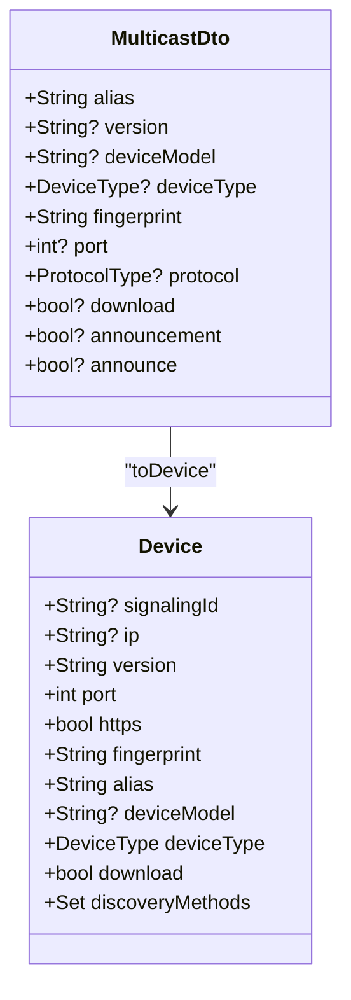
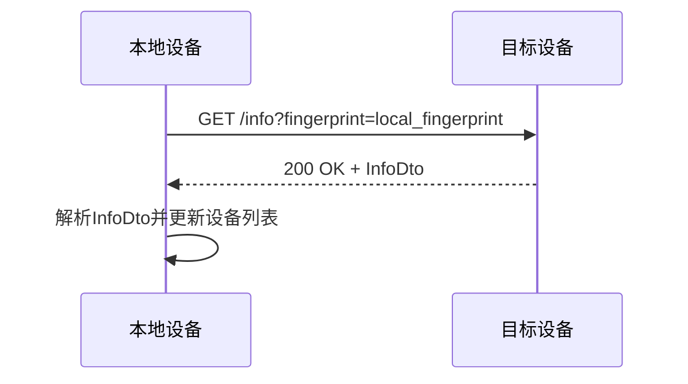
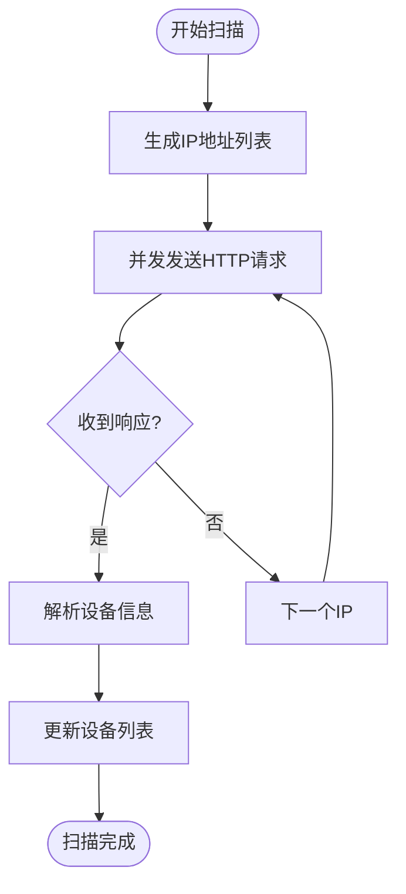
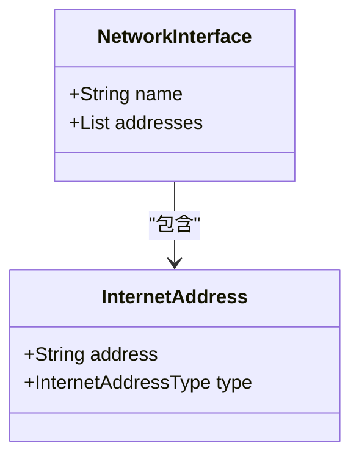
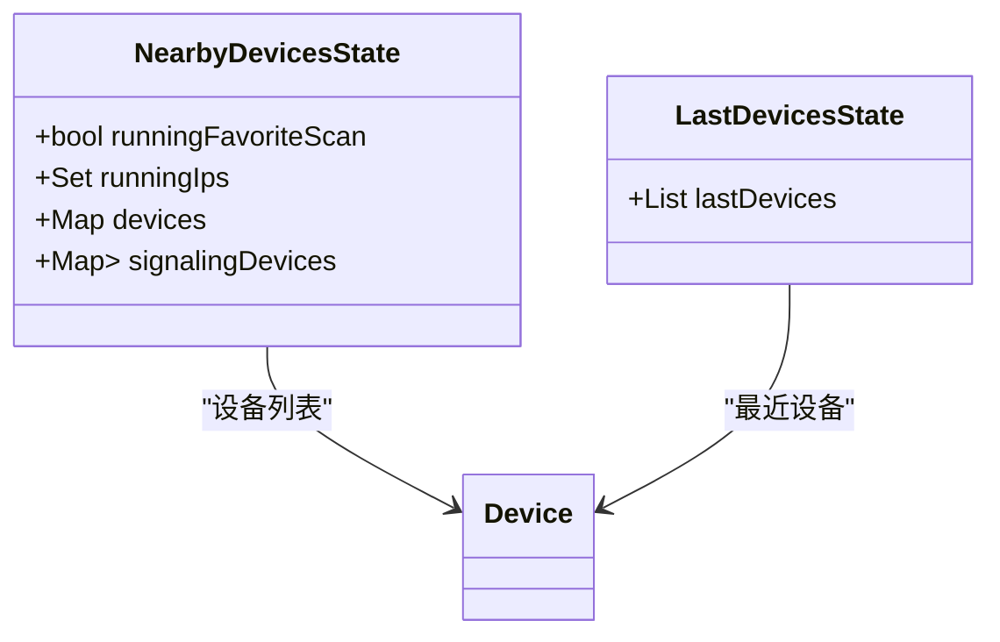
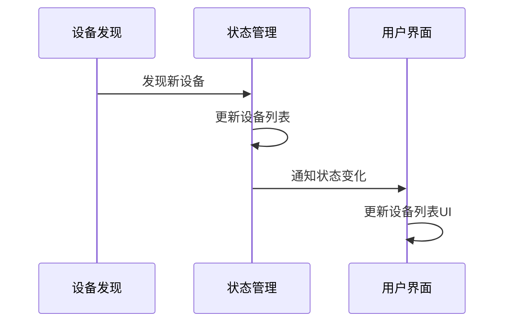

# 设备发现

<cite>
**本文档中引用的文件**  
- [multicast_discovery.dart](file://common/lib/src/task/discovery/multicast_discovery.dart)
- [http_scan_discovery.dart](file://common/lib/src/task/discovery/http_scan_discovery.dart)
- [http_target_discovery.dart](file://common/lib/src/task/discovery/http_target_discovery.dart)
- [device.dart](file://common/lib/model/device.dart)
- [multicast_dto.dart](file://common/lib/model/dto/multicast_dto.dart)
- [register_dto.dart](file://common/lib/model/dto/register_dto.dart)
- [network_interfaces.dart](file://common/lib/util/network_interfaces.dart)
- [nearby_devices_provider.dart](file://app/lib/provider/network/nearby_devices_provider.dart)
- [favorites_provider.dart](file://app/lib/provider/favorites_provider.dart)
- [last_devices.provider.dart](file://app/lib/provider/last_devices.provider.dart)
</cite>

## 目录
1. [引言](#引言)
2. [设备发现机制概述](#设备发现机制概述)
3. [多播发现](#多播发现)
4. [HTTP目标发现](#http目标发现)
5. [HTTP扫描发现](#http扫描发现)
6. [网络接口与IP地址管理](#网络接口与ip地址管理)
7. [设备缓存与最近使用设备列表](#设备缓存与最近使用设备列表)
8. [UI层协同工作](#ui层协同工作)
9. [设备存活检测与网络变化响应](#设备存活检测与网络变化响应)
10. [IPv4/IPv6双栈环境支持](#ipv4ipv6双栈环境支持)

## 引言
本文档详细阐述了LocalSend应用中的设备发现机制。该机制允许用户在局域网中发现其他设备，从而实现文件的快速传输。文档将深入分析三种主要的设备发现方式：多播发现、HTTP目标发现和HTTP扫描发现，并详细描述其工作原理、适用场景以及实现细节。

## 设备发现机制概述
LocalSend应用采用多种设备发现机制来确保在不同网络环境下都能有效发现设备。这些机制包括多播发现、HTTP目标发现和HTTP扫描发现。每种机制都有其特定的应用场景和优势，共同构成了一个健壮的设备发现系统。

## 多播发现
多播发现是LocalSend应用中最主要的设备发现方式。它通过UDP多播协议在局域网内广播设备信息，实现设备间的相互发现。

### 多播数据包构造与解析
多播数据包的构造基于`MulticastDto`类，该类包含了设备的别名、版本、设备型号、设备类型、指纹、端口、协议、下载权限等信息。数据包的解析通过`MulticastDto.fromJson`方法实现，将接收到的JSON数据转换为`MulticastDto`对象。

**Diagram sources**
- [multicast_dto.dart](file://common/lib/model/dto/multicast_dto.dart#L1-L55)
- [device.dart](file://common/lib/model/device.dart#L1-L118)

### TTL设置与端口选择
多播发现使用默认的TTL（Time To Live）值，确保数据包在局域网内有效传播。端口选择由应用配置决定，通常使用默认端口，但用户也可以自定义端口。

### 消息格式定义
多播消息采用JSON格式，包含设备的基本信息。消息通过UDP协议发送，确保低延迟和高效率。

**Section sources**
- [multicast_discovery.dart](file://common/lib/src/task/discovery/multicast_discovery.dart#L1-L225)

## HTTP目标发现
HTTP目标发现用于在已知设备IP地址的情况下，通过HTTP请求获取设备信息。

### 工作原理
HTTP目标发现通过向目标设备的特定端口发送HTTP GET请求，获取设备的详细信息。请求中包含本地设备的指纹，用于身份验证。

### 适用场景
HTTP目标发现适用于用户手动输入设备IP地址的场景，或在特定网络环境下无法使用多播发现时。

**Diagram sources**
- [http_target_discovery.dart](file://common/lib/src/task/discovery/http_target_discovery.dart#L1-L48)
- [register_dto.dart](file://common/lib/model/dto/register_dto.dart#L1-L49)

**Section sources**
- [http_target_discovery.dart](file://common/lib/src/task/discovery/http_target_discovery.dart#L1-L48)

## HTTP扫描发现
HTTP扫描发现用于在局域网内扫描所有可能的IP地址，以发现在线设备。

### 工作原理
HTTP扫描发现通过生成局域网内的所有IP地址列表，然后对每个IP地址发起HTTP请求，尝试获取设备信息。为了提高效率，请求是并发执行的。

### 适用场景
HTTP扫描发现适用于需要全面扫描局域网内所有设备的场景，尤其是在多播发现失效时。

**Diagram sources**
- [http_scan_discovery.dart](file://common/lib/src/task/discovery/http_scan_discovery.dart#L1-L67)

**Section sources**
- [http_scan_discovery.dart](file://common/lib/src/task/discovery/http_scan_discovery.dart#L1-L67)

## 网络接口与IP地址管理
LocalSend应用通过`network_interfaces.dart`文件管理网络接口和IP地址，确保在多网卡环境下正确选择网络接口。

### 网络接口选择
应用通过`getNetworkInterfaces`函数获取所有网络接口，并根据白名单和黑名单过滤接口。白名单和黑名单支持通配符，如`192.168.*.*`。

### IP地址过滤
IP地址过滤通过正则表达式实现，确保只处理符合条件的IP地址。例如，`192.168.1.*`匹配所有以`192.168.1.`开头的IP地址。

**Diagram sources**
- [network_interfaces.dart](file://common/lib/util/network_interfaces.dart#L1-L68)

**Section sources**
- [network_interfaces.dart](file://common/lib/util/network_interfaces.dart#L1-L68)

## 设备缓存与最近使用设备列表
LocalSend应用通过设备缓存和最近使用设备列表提高用户体验。

### 设备缓存机制
设备缓存通过`nearby_devices_provider.dart`实现，将发现的设备信息存储在内存中，避免重复发现。

### 最近使用设备列表
最近使用设备列表通过`last_devices.provider.dart`实现，记录用户最近连接的设备，方便快速访问。

**Diagram sources**
- [nearby_devices_provider.dart](file://app/lib/provider/network/nearby_devices_provider.dart#L1-L192)
- [last_devices.provider.dart](file://app/lib/provider/last_devices.provider.dart#L1-L50)

**Section sources**
- [nearby_devices_provider.dart](file://app/lib/provider/network/nearby_devices_provider.dart#L1-L192)
- [last_devices.provider.dart](file://app/lib/provider/last_devices.provider.dart#L1-L50)

## UI层协同工作
设备发现机制与UI层紧密协作，实现实时设备列表更新。

### 实时设备列表更新
当发现新设备时，`nearby_devices_provider.dart`会触发状态更新，UI层通过监听状态变化实时更新设备列表。

### 用户界面展示
设备列表通过`DeviceListTile`组件展示，显示设备的图标、别名、IP地址等信息。用户可以通过点击设备进行文件传输。

**Diagram sources**
- [nearby_devices_provider.dart](file://app/lib/provider/network/nearby_devices_provider.dart#L1-L192)
- [device_list_tile.dart](file://app/lib/widget/list_tile/device_list_tile.dart#L1-L66)

**Section sources**
- [nearby_devices_provider.dart](file://app/lib/provider/network/nearby_devices_provider.dart#L1-L192)
- [device_list_tile.dart](file://app/lib/widget/list_tile/device_list_tile.dart#L1-L66)

## 设备存活检测与网络变化响应
LocalSend应用通过定期发送多播公告和响应其他设备的公告，实现设备存活检测。

### 存活检测机制
设备通过定期发送多播公告（`sendAnnouncement`）来宣告自己的在线状态。其他设备收到公告后，会通过TCP或UDP响应，确认设备的在线状态。

### 网络变化响应
当网络接口发生变化时，应用会重新扫描网络，更新设备列表。这通过监听网络连接变化事件实现。

**Section sources**
- [multicast_discovery.dart](file://common/lib/src/task/discovery/multicast_discovery.dart#L1-L225)
- [local_ip_provider.dart](file://app/lib/provider/local_ip_provider.dart#L1-L100)

## IPv4/IPv6双栈环境支持
LocalSend应用支持IPv4和IPv6双栈环境，确保在不同网络环境下都能正常工作。

### 双栈环境处理
应用通过`network_interfaces.dart`获取所有网络接口，包括IPv4和IPv6地址。在多播发现中，优先使用IPv4地址，但也可以配置为使用IPv6地址。

### 兼容性考虑
为了确保兼容性，多播发现使用IPv4多播地址，但HTTP发现支持IPv6地址。这确保了在纯IPv6网络环境下也能进行设备发现。

**Section sources**
- [network_interfaces.dart](file://common/lib/util/network_interfaces.dart#L1-L68)
- [multicast_discovery.dart](file://common/lib/src/task/discovery/multicast_discovery.dart#L1-L225)