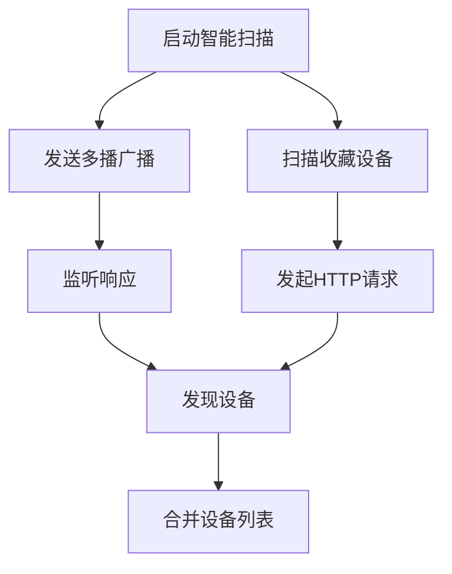
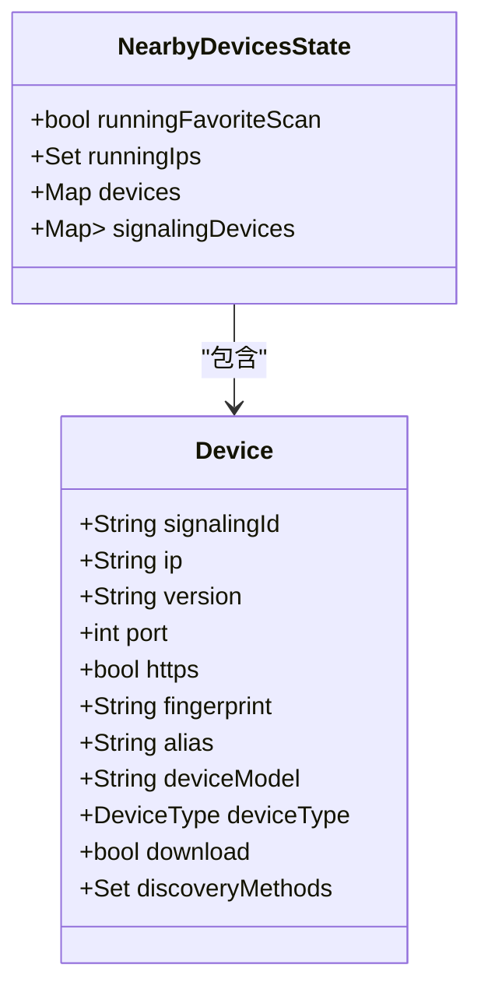
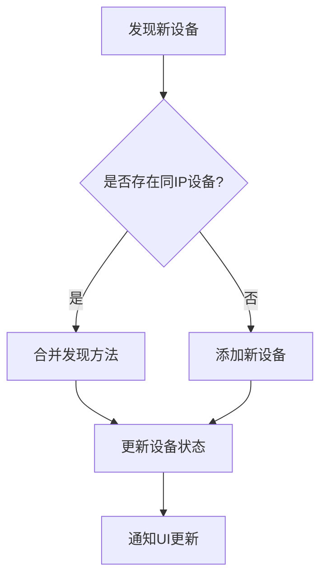
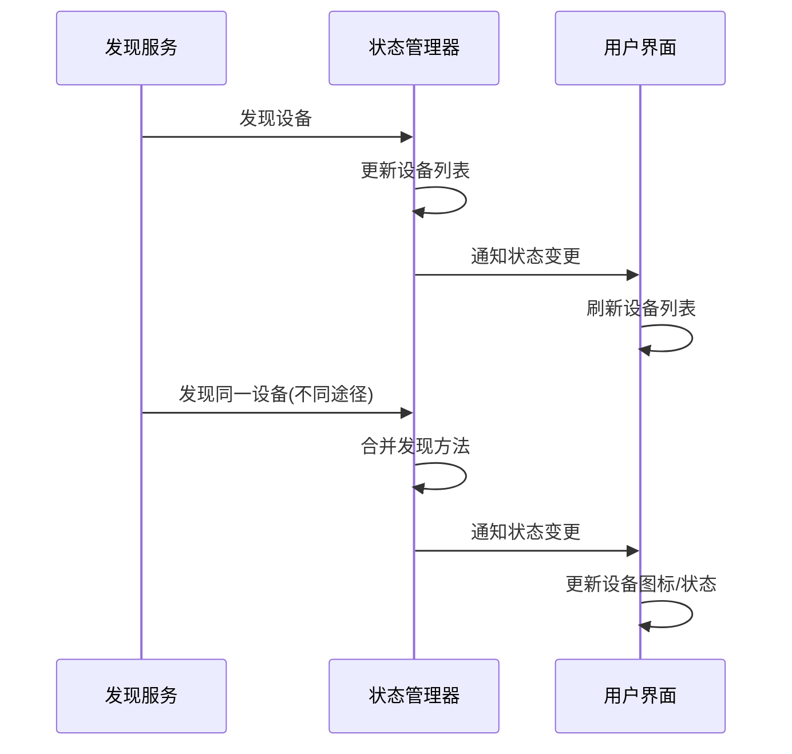
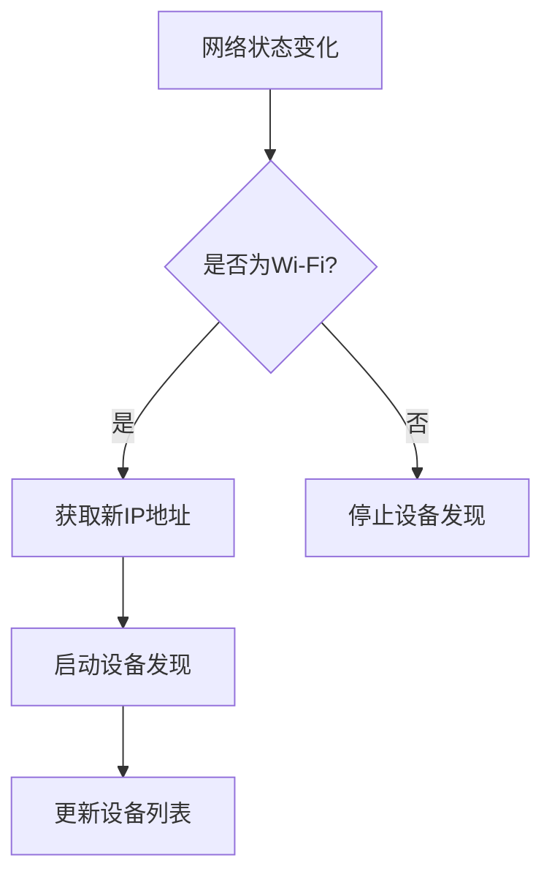
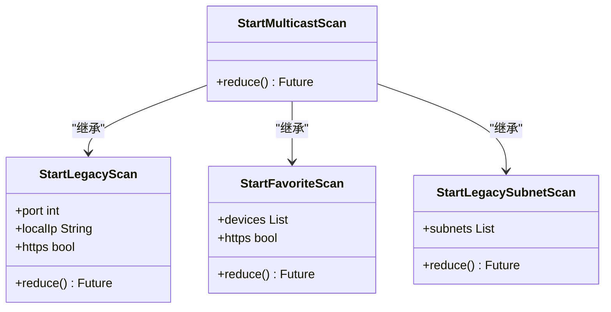
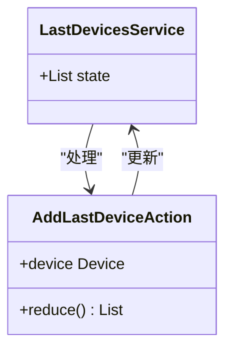
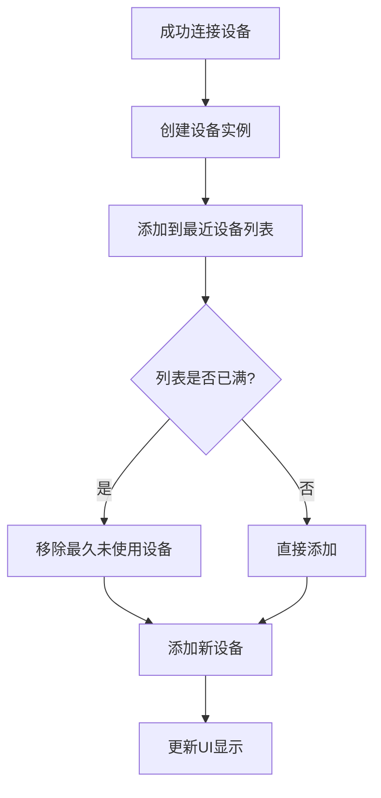
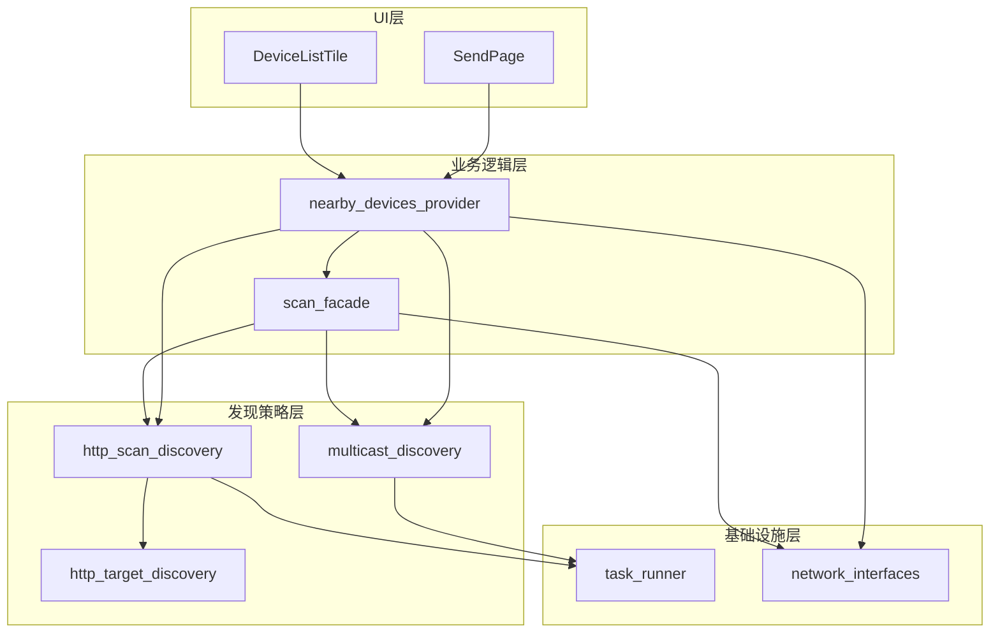

# 设备发现集成

<cite>
**本文档引用的文件**
- [nearby_devices_provider.dart](file://app/lib/provider/network/nearby_devices_provider.dart)
- [scan_facade.dart](file://app/lib/provider/network/scan_facade.dart)
- [http_scan_discovery.dart](file://common/lib/src/task/discovery/http_scan_discovery.dart)
- [http_target_discovery.dart](file://common/lib/src/task/discovery/http_target_discovery.dart)
- [multicast_discovery.dart](file://common/lib/src/task/discovery/multicast_discovery.dart)
- [local_ip_provider.dart](file://app/lib/provider/local_ip_provider.dart)
- [last_devices.provider.dart](file://app/lib/provider/last_devices.provider.dart)
- [nearby_devices_state.dart](file://app/lib/model/state/nearby_devices_state.dart)
</cite>

## 目录
1. [简介](#简介)
2. [发现策略协调机制](#发现策略协调机制)
3. [设备列表合并与去重](#设备列表合并与去重)
4. [设备状态实时更新](#设备状态实时更新)
5. [网络变化监听器](#网络变化监听器)
6. [发现任务管理](#发现任务管理)
7. [设备缓存机制](#设备缓存机制)
8. [架构概览](#架构概览)

## 简介
LocalSend应用通过集成多种设备发现策略，实现了高效可靠的局域网设备发现功能。本系统采用多播、HTTP扫描和HTTP目标发现等多种技术，确保在不同网络环境下都能快速发现可用设备。核心组件nearby_devices_provider负责协调这些发现策略，通过智能调度算法优化发现过程，同时维护设备状态的实时性和准确性。

## 发现策略协调机制
nearby_devices_provider通过协调多种发现策略来实现全面的设备发现。系统采用智能扫描门面(scan_facade)模式，优先使用高效的多播发现，同时并行执行收藏设备的HTTP发现。

**发现策略调度逻辑：**
1. 首先通过多播发现策略发送广播，利用UDP协议的高效性快速发现网络中的设备
2. 同时启动收藏设备扫描，对用户标记为收藏的设备进行直接HTTP探测
3. 如果在1秒内未发现设备，且用户仍在发送界面，则启动传统的子网扫描
4. 子网扫描采用HTTP/TCP协议，对本地IP段内的所有可能地址进行探测

**发现策略优先级：**
- 多播发现：最高优先级，响应最快
- 收藏设备发现：高优先级，针对已知设备
- 子网扫描：备用策略，覆盖范围最广

**Section sources**
- [nearby_devices_provider.dart](file://app/lib/provider/network/nearby_devices_provider.dart#L29-L241)
- [scan_facade.dart](file://app/lib/provider/network/scan_facade.dart#L29-L82)

## 设备列表合并与去重
系统通过精心设计的合并策略确保设备列表的准确性和一致性，避免重复设备条目。

**合并策略：**
1. 设备通过IP地址作为主要标识符进行存储和查找
2. 当发现新设备时，系统会检查是否存在具有相同IP的现有设备
3. 如果存在匹配设备，则合并发现方法(DiscoveryMethods)，保留所有发现途径
4. 对于通过信令服务器发现的设备，使用指纹(fingerprint)作为标识符

**去重机制：**
- 基于IP地址的去重：每个IP地址对应一个设备实例
- 基于发现方法的去重：使用Set数据结构存储发现方法，自动避免重复
- 设备合并算法：当发现同一设备通过不同途径时，合并其属性和发现方法

**Section sources**
- [nearby_devices_state.dart](file://app/lib/model/state/nearby_devices_state.dart#L0-L60)
- [nearby_devices_provider.dart](file://app/lib/provider/network/nearby_devices_provider.dart#L100-L144)

## 设备状态实时更新
系统通过响应式架构实现设备状态的实时更新，确保用户界面始终显示最新设备信息。

**更新机制：**
1. 当设备通过任何发现策略被发现时，立即触发RegisterDeviceAction
2. 状态管理器更新设备列表并通知所有监听器
3. UI组件自动刷新显示更新后的设备列表
4. 设备属性如别名(alias)会自动同步更新

**实时更新流程：**

**状态更新特点：**
- 原子性更新：确保设备状态的一致性
- 合并更新：保留设备的所有发现途径信息
- 异步处理：避免阻塞UI线程
- 日志记录：记录每次设备发现的详细信息

**Section sources**
- [nearby_devices_provider.dart](file://app/lib/provider/network/nearby_devices_provider.dart#L68-L144)
- [nearby_devices_state.dart](file://app/lib/model/state/nearby_devices_state.dart#L45-L59)

## 网络变化监听器
系统实现了网络变化监听器，能够检测Wi-Fi连接状态变化并自动触发设备发现。

**监听器实现：**
1. 使用Connectivity插件监听网络连接状态变化
2. 当检测到网络变化时，触发FetchLocalIpAction
3. 重新获取本地IP地址列表
4. 根据新的网络配置启动相应的设备发现流程

**网络变化处理流程：**
- 网络连接：立即启动智能扫描，重新发现网络中的设备
- 网络断开：停止所有发现任务，清理设备列表
- 网络切换：适应新的网络环境，重新配置发现策略

**Section sources**
- [local_ip_provider.dart](file://app/lib/provider/local_ip_provider.dart#L48-L100)
- [nearby_devices_provider.dart](file://app/lib/provider/network/nearby_devices_provider.dart#L29-L67)

## 发现任务管理
系统提供了完善的发现任务管理机制，支持任务的启动、停止和优先级管理。

**任务类型：**
- 多播扫描任务：通过UDP广播发现设备
- 传统扫描任务：通过HTTP/TCP协议扫描子网
- 收藏设备扫描：针对收藏设备的直接探测

**任务管理API：**

**任务调度策略：**
- 并行执行：多播发现和收藏设备扫描同时进行
- 延迟执行：传统扫描在1秒延迟后启动
- 条件执行：根据设备发现情况决定是否启动备用策略

**Section sources**
- [nearby_devices_provider.dart](file://app/lib/provider/network/nearby_devices_provider.dart#L68-L241)
- [scan_facade.dart](file://app/lib/provider/network/scan_facade.dart#L29-L82)

## 设备缓存机制
系统实现了设备缓存机制，包括最近使用设备列表的持久化存储和快速连接功能。

**缓存机制特点：**
1. 最近使用设备列表：存储最近连接的5个设备
2. LRU(最近最少使用)策略：当列表满时，移除最久未使用的设备
3. 快速访问：在地址输入对话框中显示最近使用的设备
4. 会话级别存储：缓存信息不跨应用会话持久化

**缓存更新流程：**

**缓存使用场景：**
- 地址输入对话框：显示最近使用的设备IP
- 快速连接：一键连接到最近使用的设备
- 输入建议：为用户提供连接历史建议

**Section sources**
- [last_devices.provider.dart](file://app/lib/provider/last_devices.provider.dart#L0-L29)
- [address_input_dialog.dart](file://app/lib/widget/dialogs/address_input_dialog.dart#L181-L213)

## 架构概览
整个设备发现系统采用分层架构设计，各组件职责明确，协同工作。

**架构特点：**
- 分层设计：清晰的层次结构，便于维护和扩展
- 关注点分离：各组件职责单一，降低耦合度
- 可扩展性：易于添加新的发现策略
- 响应式：基于状态管理的响应式更新机制

**Section sources**
- [nearby_devices_provider.dart](file://app/lib/provider/network/nearby_devices_provider.dart#L0-L241)
- [scan_facade.dart](file://app/lib/provider/network/scan_facade.dart#L0-L82)
- [http_scan_discovery.dart](file://common/lib/src/task/discovery/http_scan_discovery.dart#L0-L66)
- [http_target_discovery.dart](file://common/lib/src/task/discovery/http_target_discovery.dart#L0-L48)
- [multicast_discovery.dart](file://common/lib/src/task/discovery/multicast_discovery.dart#L0-L225)