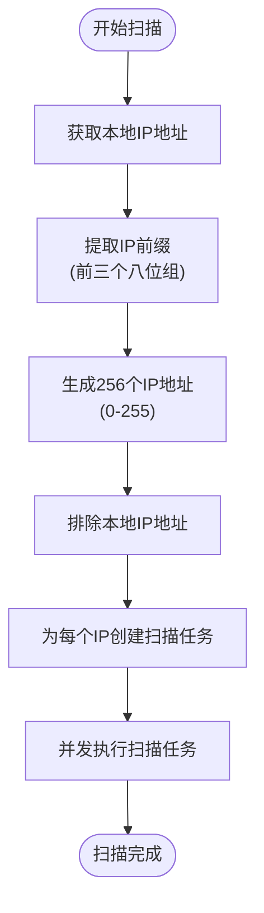
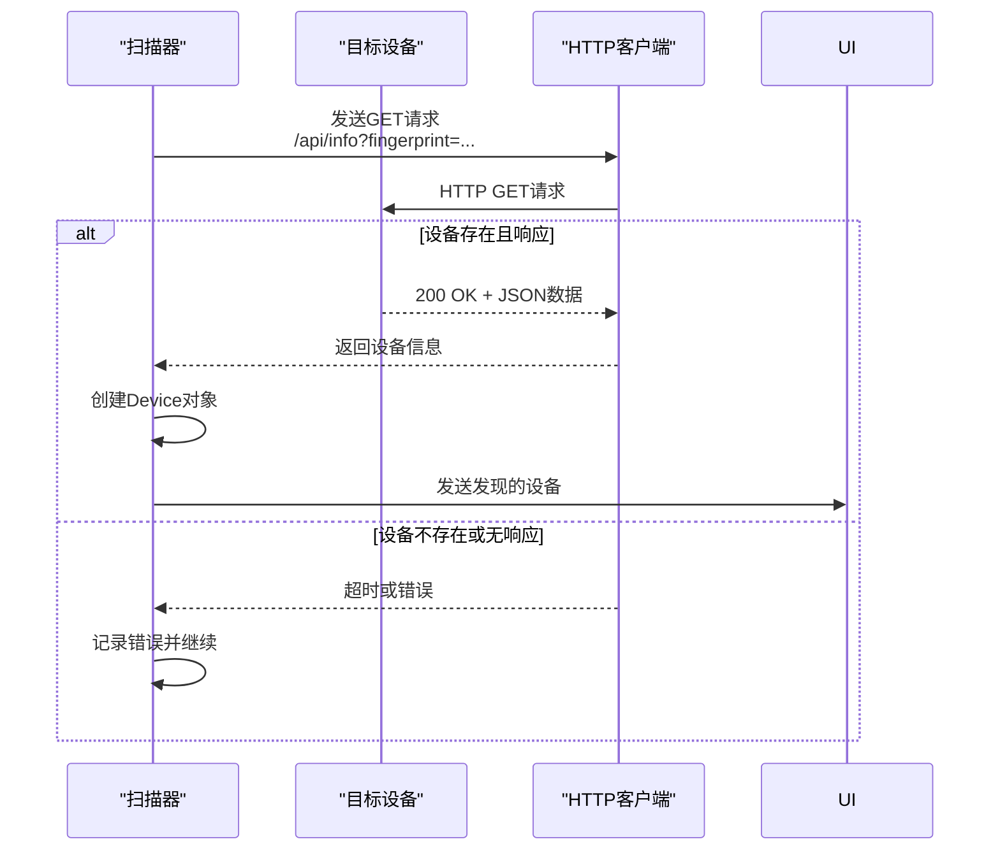
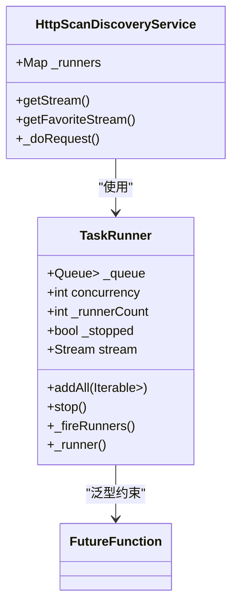
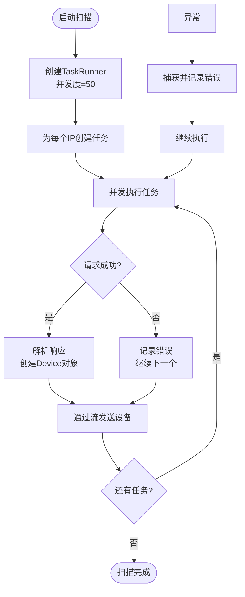
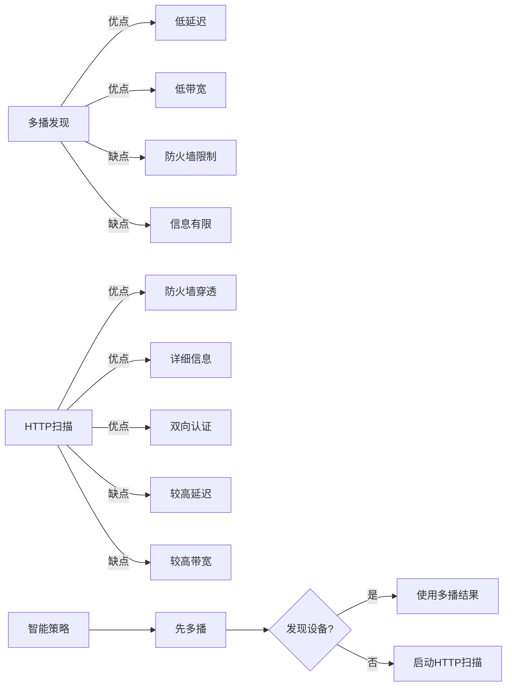
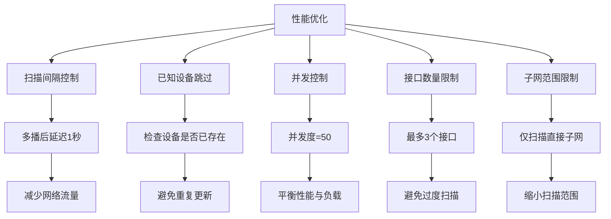

# HTTP扫描发现

<cite>
**本文档引用的文件**
- [http_scan_discovery.dart](file://common/lib/src/task/discovery/http_scan_discovery.dart)
- [http_target_discovery.dart](file://common/lib/src/task/discovery/http_target_discovery.dart)
- [http_scan_discovery_isolate.dart](file://common/lib/isolate/child/http_scan_discovery_isolate.dart)
- [scan_facade.dart](file://app/lib/provider/network/scan_facade.dart)
- [http_provider.dart](file://app/lib/provider/http_provider.dart)
- [settings_provider.dart](file://app/lib/provider/settings_provider.dart)
- [device.dart](file://common/lib/model/device.dart)
- [api_route_builder.dart](file://common/lib/api_route_builder.dart)
- [task_runner.dart](file://common/lib/util/task_runner.dart)
</cite>

## 目录
1. [简介](#简介)
2. [IP地址范围检测与遍历算法](#ip地址范围检测与遍历算法)
3. [HTTP探测机制](#http探测机制)
4. [超时设置与并发控制](#超时设置与并发控制)
5. [异步执行流程与错误处理](#异步执行流程与错误处理)
6. [HTTP扫描与多播发现的比较](#http扫描与多播发现的比较)
7. [性能优化措施](#性能优化措施)
8. [扫描结果合并机制](#扫描结果合并机制)
9. [结论](#结论)

## 简介
HTTP扫描发现功能是LocalSend应用中用于主动发现局域网内设备的核心机制之一。该功能通过向局域网内的IP地址范围发送HTTP GET请求来探测目标设备，与多播发现形成互补。当多播发现无法找到设备时，系统会自动启动HTTP扫描作为备用方案。本文档详细描述了HTTP扫描发现的实现机制，包括IP地址范围的自动检测与遍历算法、HTTP探测请求的发送与响应处理、超时设置和并发控制策略，以及如何将扫描结果与多播发现结果合并构建完整的附近设备列表。

**Section sources**
- [scan_facade.dart](file://app/lib/provider/network/scan_facade.dart#L12-L13)

## IP地址范围检测与遍历算法
HTTP扫描发现功能首先需要确定要扫描的IP地址范围。系统通过获取本地网络接口的IP地址，然后生成该子网内的所有可能IP地址来进行扫描。具体实现中，系统将本地IP地址的前三个八位组提取出来，然后遍历最后一个八位组的0-255范围，生成256个可能的IP地址。

在生成IP地址列表时，系统会排除本地IP地址本身，避免对自身进行不必要的探测。遍历算法采用并行处理方式，通过TaskRunner管理并发任务，确保扫描过程高效执行。对于每个网络接口，系统都会创建一个独立的TaskRunner实例来管理该子网的扫描任务。



**Diagram sources**
- [http_scan_discovery.dart](file://common/lib/src/task/discovery/http_scan_discovery.dart#L25-L35)

**Section sources**
- [http_scan_discovery.dart](file://common/lib/src/task/discovery/http_scan_discovery.dart#L25-L35)

## HTTP探测机制
HTTP扫描发现通过向目标设备发送HTTP GET请求来探测其是否存在。探测请求的目标URL为`/api/info`，这是LocalSend服务的API端点之一。系统使用`ApiRoute.info.targetRaw`方法构建完整的请求URL，包括协议（HTTP/HTTPS）、IP地址、端口和API路径。

在发送请求时，系统会附加一个查询参数`fingerprint`，该参数包含本地设备的安全证书哈希值。这是为了确保双向认证，只有配置了相同安全上下文的设备才会响应探测请求。目标设备收到请求后，会返回包含设备信息的JSON响应，包括别名、版本、设备型号、指纹、端口、协议类型等。

探测过程采用异步流式处理，每个IP地址的探测都被封装为一个独立的异步任务。当收到有效的响应时，系统会解析响应数据并创建Device对象，然后通过流将设备信息传递给上层组件。如果请求失败或超时，系统会记录错误信息并继续处理下一个IP地址。



**Diagram sources**
- [http_target_discovery.dart](file://common/lib/src/task/discovery/http_target_discovery.dart#L25-L40)
- [api_route_builder.dart](file://common/lib/api_route_builder.dart#L15-L25)

**Section sources**
- [http_target_discovery.dart](file://common/lib/src/task/discovery/http_target_discovery.dart#L25-L40)
- [api_route_builder.dart](file://common/lib/api_route_builder.dart#L15-L25)

## 超时设置与并发控制
HTTP扫描发现功能通过精心设计的超时设置和并发控制策略来平衡扫描效率和系统资源消耗。系统使用`settingsProvider`中的`discoveryTimeout`配置项来设置HTTP请求的超时时间，默认值为3秒。这个超时设置在`httpProvider`中配置，通过`createRhttpClient`方法创建具有指定超时时间的HTTP客户端。

并发控制通过`TaskRunner`类实现，该类管理一个任务队列并控制同时执行的任务数量。在HTTP扫描中，并发度设置为50，这意味着最多同时有50个HTTP请求在进行。这种并发控制策略既能充分利用网络带宽，又不会对系统造成过大负担。

当扫描任务被取消或完成时，TaskRunner会自动清理资源并关闭流。系统还实现了任务重用机制，对于同一个网络接口的连续扫描，会复用已有的TaskRunner实例，提高资源利用效率。



**Diagram sources**
- [http_scan_discovery.dart](file://common/lib/src/task/discovery/http_scan_discovery.dart#L37-L67)
- [task_runner.dart](file://common/lib/util/task_runner.dart#L10-L70)
- [http_provider.dart](file://app/lib/provider/http_provider.dart#L23-L25)

**Section sources**
- [http_scan_discovery.dart](file://common/lib/src/task/discovery/http_scan_discovery.dart#L37-L67)
- [task_runner.dart](file://common/lib/util/task_runner.dart#L10-L70)
- [http_provider.dart](file://app/lib/provider/http_provider.dart#L23-L25)
- [settings_provider.dart](file://app/lib/provider/settings_provider.dart#L170-L175)

## 异步执行流程与错误处理
HTTP扫描发现采用异步流式架构，确保扫描过程不会阻塞主线程。整个执行流程由`HttpScanDiscoveryService`类管理，该类提供`getStream`方法返回一个`Stream<Device>`，上层组件可以监听这个流来获取发现的设备。

异步执行流程从创建TaskRunner实例开始，将所有IP地址的探测任务添加到任务队列中。每个任务都是一个异步函数，调用`_doRequest`方法执行具体的HTTP请求。当任务完成时，无论成功或失败，结果都会通过流发送出去。错误处理机制在`HttpTargetDiscoveryService`类中实现，捕获所有HTTP请求异常并记录警告日志，但不会中断整个扫描过程。

系统还实现了隔离器（Isolate）机制，将扫描任务放在后台线程中执行，避免影响UI响应。`setupHttpScanDiscoveryIsolate`函数负责初始化隔离器环境，并处理来自主线程的任务调度。



**Diagram sources**
- [http_scan_discovery.dart](file://common/lib/src/task/discovery/http_scan_discovery.dart#L50-L67)
- [http_target_discovery.dart](file://common/lib/src/task/discovery/http_target_discovery.dart#L35-L45)
- [http_scan_discovery_isolate.dart](file://common/lib/isolate/child/http_scan_discovery_isolate.dart#L50-L67)

**Section sources**
- [http_scan_discovery.dart](file://common/lib/src/task/discovery/http_scan_discovery.dart#L50-L67)
- [http_target_discovery.dart](file://common/lib/src/task/discovery/http_target_discovery.dart#L35-L45)
- [http_scan_discovery_isolate.dart](file://common/lib/isolate/child/http_scan_discovery_isolate.dart#L50-L67)

## HTTP扫描与多播发现的比较
HTTP扫描发现与多播发现是LocalSend应用中两种互补的设备发现机制。多播发现基于UDP协议，通过向特定多播组发送广播消息来发现网络中的设备，具有低延迟和低带宽消耗的优点。而HTTP扫描发现基于TCP协议，通过向特定IP范围发送HTTP请求来主动探测设备，具有更好的防火墙穿透能力和更详细的设备信息获取能力。

在实际应用中，系统采用智能扫描策略：首先尝试多播发现，如果在1秒内没有发现设备，则启动HTTP扫描。这种分层发现策略既保证了快速发现的效率，又确保了在复杂网络环境下的可靠性。HTTP扫描能够穿透某些限制UDP流量的防火墙，因为大多数防火墙允许HTTP/HTTPS流量通过。

此外，HTTP扫描能够获取比多播发现更详细的设备信息，因为HTTP响应可以包含更丰富的JSON数据结构，而多播消息受限于UDP数据包大小。HTTP扫描还支持双向认证，通过fingerprint参数确保只有信任的设备才会响应，提高了安全性。



**Diagram sources**
- [scan_facade.dart](file://app/lib/provider/network/scan_facade.dart#L12-L35)

**Section sources**
- [scan_facade.dart](file://app/lib/provider/network/scan_facade.dart#L12-L35)

## 性能优化措施
HTTP扫描发现功能实施了多项性能优化措施，以确保在各种网络环境下都能高效运行。首先是扫描间隔控制，系统通过`sleepAsync(1000)`在多播发现和HTTP扫描之间引入1秒的延迟，避免不必要的重复扫描。这种延迟策略减少了网络流量，特别是在设备密集的网络环境中。

已知设备的快速跳过逻辑是另一项重要优化。系统维护一个已发现设备的集合，当通过HTTP扫描发现设备时，会检查该设备是否已经通过多播发现或其他方式被发现。如果设备已存在，则不会重复添加，避免了UI的频繁更新和用户界面的闪烁。

并发控制策略也是一项关键优化，通过限制同时进行的HTTP请求数量（50个），避免了对网络和目标设备造成过大压力。TaskRunner的队列机制确保了任务的有序执行，即使在高负载情况下也能保持稳定性能。

此外，系统实现了网络接口选择优化，限制最多扫描3个网络接口（`maxInterfaces = 3`），避免在多网卡设备上进行过度扫描。对于每个网络接口，系统只扫描其直接连接的子网，而不是整个局域网，进一步缩小了扫描范围。



**Diagram sources**
- [scan_facade.dart](file://app/lib/provider/network/scan_facade.dart#L10-L11)
- [http_scan_discovery.dart](file://common/lib/src/task/discovery/http_scan_discovery.dart#L37-L40)

**Section sources**
- [scan_facade.dart](file://app/lib/provider/network/scan_facade.dart#L10-L11)
- [http_scan_discovery.dart](file://common/lib/src/task/discovery/http_scan_discovery.dart#L37-L40)

## 扫描结果合并机制
扫描结果合并机制是HTTP扫描发现功能的关键组成部分，它负责将HTTP扫描发现的设备与多播发现、收藏设备等其他发现方式的结果整合成一个完整的附近设备列表。系统使用`Device`类的`discoveryMethods`属性来跟踪设备是通过何种方式发现的，这是一个包含`DiscoveryMethod`对象的集合。

当通过HTTP扫描发现设备时，系统会创建一个`HttpDiscovery`对象并将其添加到设备的`discoveryMethods`集合中。如果同一设备后来通过多播发现被找到，系统会将`MulticastDiscovery`对象也添加到该集合中，而不会创建重复的设备实例。这种去重机制基于设备的IP地址和指纹等唯一标识符。

在UI层面，系统通过`nearbyDevicesProvider`统一管理所有发现的设备，并提供实时更新。当新的设备被发现时，无论是通过HTTP扫描还是其他方式，都会触发UI更新，确保用户界面始终显示最新的设备列表。合并后的设备列表会根据设备的活跃状态和发现时间进行排序，优先显示最近活跃的设备。

```mermaid
erDiagram
DEVICE ||--o{ DISCOVERY_METHOD : "包含"
DISCOVERY_METHOD }|--|| HTTP_DISCOVERY : ""
DISCOVERY_METHOD }|--|| MULTICAST_DISCOVERY : ""
DISCOVERY_METHOD }|--|| SIGNALING_DISCOVERY : ""
class DEVICE {
+String? ip
+String fingerprint
+Set<DiscoveryMethod> discoveryMethods
+transmissionMethods
}
class DISCOVERY_METHOD {
<<abstract>>
}
class HTTP_DISCOVERY {
+String ip
}
class MULTICAST_DISCOVERY {
}
class SIGNALING_DISCOVERY {
+String signalingServer
}
```

**Diagram sources**
- [device.dart](file://common/lib/model/device.dart#L40-L118)
- [http_scan_discovery.dart](file://common/lib/src/task/discovery/http_scan_discovery.dart#L55-L58)

**Section sources**
- [device.dart](file://common/lib/model/device.dart#L40-L118)
- [http_scan_discovery.dart](file://common/lib/src/task/discovery/http_scan_discovery.dart#L55-L58)

## 结论
HTTP扫描发现功能是LocalSend应用中确保设备发现可靠性的关键机制。通过主动扫描局域网内的IP地址范围，该功能弥补了多播发现可能因防火墙或网络配置限制而失效的不足。系统采用高效的并发控制策略和超时设置，在保证扫描速度的同时避免了对网络资源的过度消耗。

该功能与多播发现形成互补的分层发现策略，首先尝试快速的多播发现，失败后才启动较慢但更可靠的HTTP扫描。这种智能策略优化了用户体验，既保证了常见场景下的快速响应，又确保了复杂网络环境下的发现成功率。

通过将扫描结果与其他发现方式的结果合并，系统构建了一个完整、准确的附近设备列表。设备去重机制和发现方法跟踪确保了数据的一致性和完整性，为用户提供了一个可靠、高效的文件传输环境。