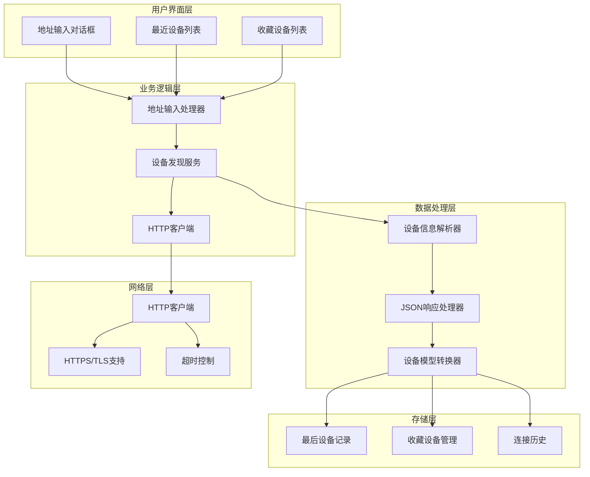
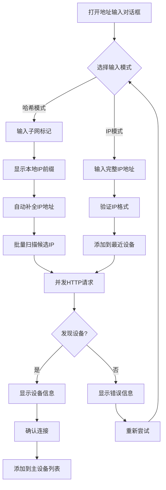
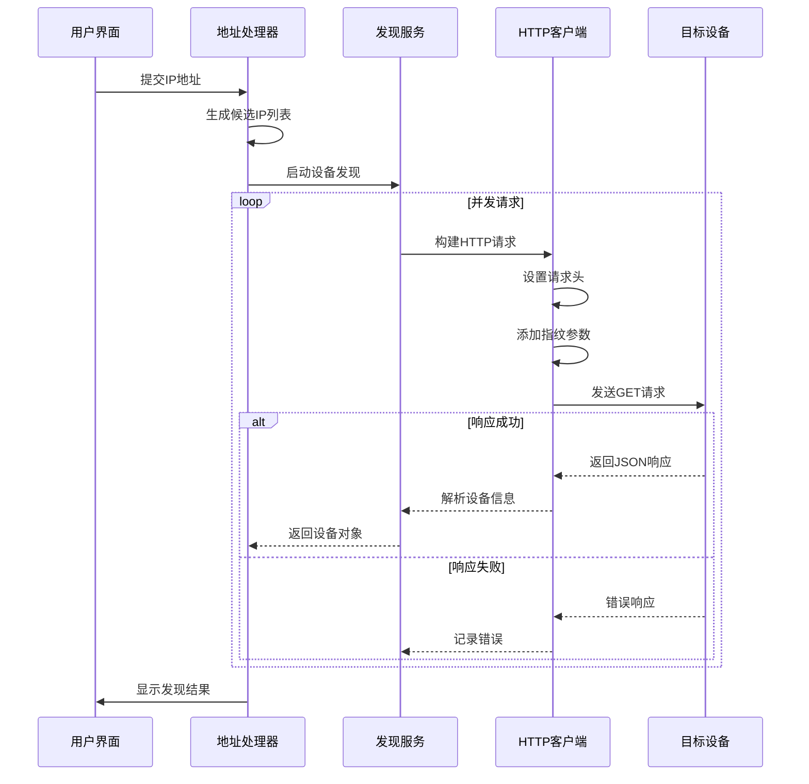
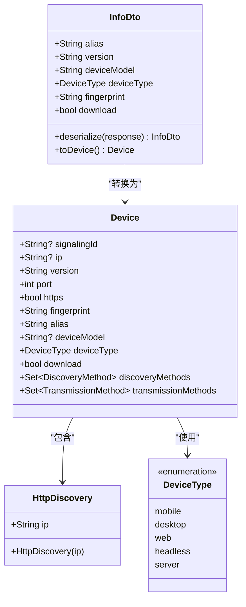
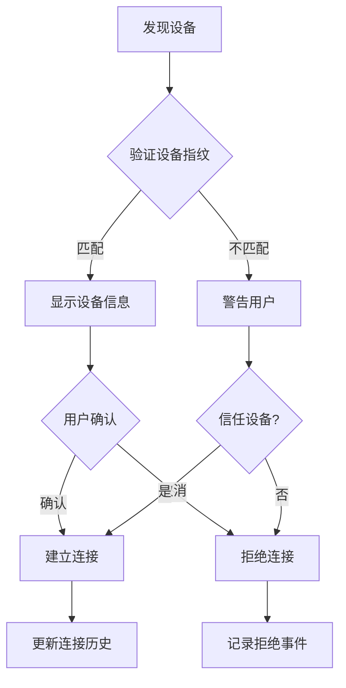
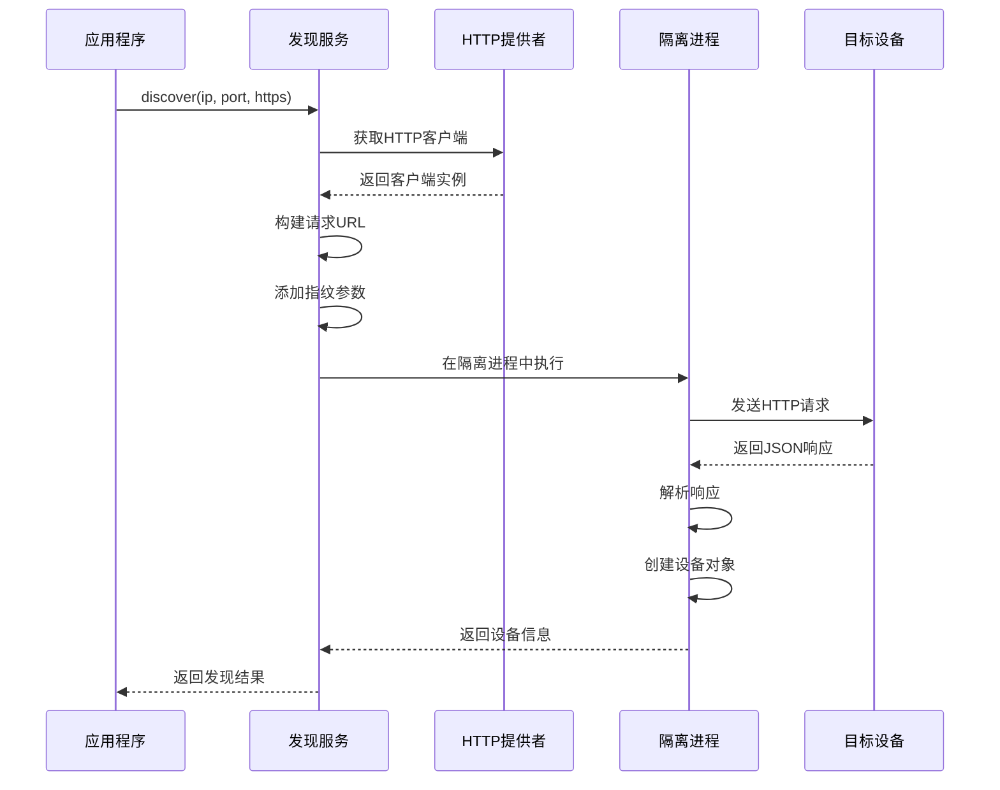
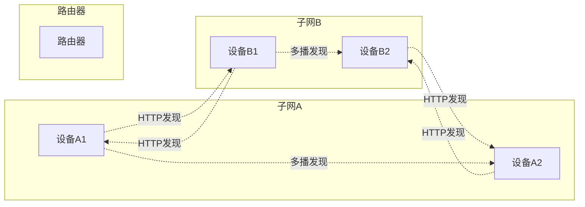
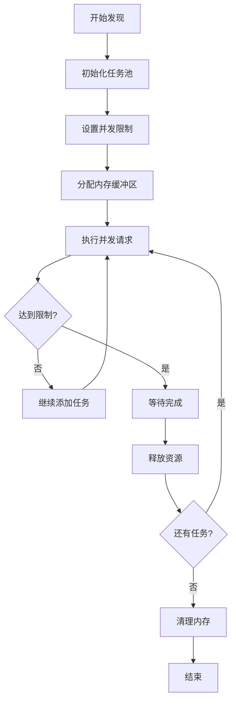
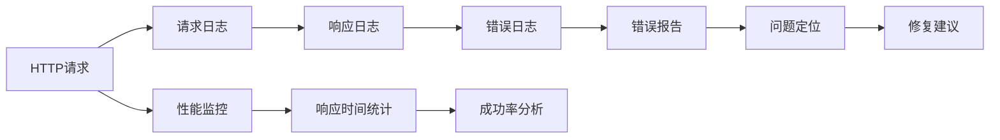

# HTTP目标发现功能详细文档

<cite>
**本文档中引用的文件**
- [address_input_dialog.dart](file://app/lib/widget/dialogs/address_input_dialog.dart)
- [http_target_discovery.dart](file://common/lib/src/task/discovery/http_target_discovery.dart)
- [http_target_discovery_isolate.dart](file://common/lib/src/isolate/child/http_target_discovery_isolate.dart)
- [http_scan_discovery.dart](file://common/lib/src/task/discovery/http_scan_discovery.dart)
- [http_scan_discovery_isolate.dart](file://common/lib/src/isolate/child/http_scan_discovery_isolate.dart)
- [send_provider.dart](file://app/lib/provider/network/send_provider.dart)
- [api_route_builder.dart](file://common/lib/api_route_builder.dart)
- [device.dart](file://common/lib/model/device.dart)
- [http_provider.dart](file://app/lib/provider/http_provider.dart)
- [settings_provider.dart](file://app/lib/provider/settings_provider.dart)
- [last_devices.provider.dart](file://app/lib/provider/last_devices.provider.dart)
- [favorites_provider.dart](file://app/lib/provider/favorites_provider.dart)
- [rhttp.dart](file://app/lib/util/rhttp.dart)
</cite>

## 目录
1. [简介](#简介)
2. [系统架构概览](#系统架构概览)
3. [用户交互界面](#用户交互界面)
4. [HTTP请求构建与执行](#http请求构建与执行)
5. [设备信息解析与处理](#设备信息解析与处理)
6. [安全机制与验证](#安全机制与验证)
7. [设备发现流程](#设备发现流程)
8. [应用场景与用例](#应用场景与用例)
9. [性能优化与错误处理](#性能优化与错误处理)
10. [故障排除指南](#故障排除指南)
11. [总结](#总结)

## 简介

LocalSend的HTTP目标发现功能是一个强大的设备发现机制，允许用户通过手动输入IP地址或从剪贴板提取地址来精确探测特定网络中的设备。该功能专为跨子网设备连接和静态IP设备的快速访问而设计，提供了比传统多播发现更可靠的方法。

该功能的核心特性包括：
- 支持手动输入IPv4地址或使用子网标记（#）
- 自动从剪贴板提取IP地址
- 智能的本地IP地址推断
- 强大的错误处理和重试机制
- 完整的安全验证和证书检查
- 设备信息的完整解析和存储

## 系统架构概览

HTTP目标发现功能采用分层架构设计，确保了高性能和可维护性：

**图表来源**
- [address_input_dialog.dart](file://app/lib/widget/dialogs/address_input_dialog.dart#L1-L255)
- [http_target_discovery.dart](file://common/lib/src/task/discovery/http_target_discovery.dart#L1-L49)
- [http_provider.dart](file://app/lib/provider/http_provider.dart#L1-L53)

## 用户交互界面

### 地址输入对话框设计

地址输入对话框是用户与HTTP目标发现功能交互的主要界面，提供了直观且灵活的IP地址输入方式：

**图表来源**
- [address_input_dialog.dart](file://app/lib/widget/dialogs/address_input_dialog.dart#L44-L96)

### 输入模式与验证

系统支持两种主要的输入模式：

1. **哈希模式 (#)**：允许用户输入子网标记，系统会自动生成所有可能的IP地址进行扫描
2. **IP模式**：直接输入完整的IPv4地址

输入验证机制包括：
- IP地址格式验证
- 子网标记语法检查
- 本地IP前缀自动补全
- 最近设备快速选择

**章节来源**
- [address_input_dialog.dart](file://app/lib/widget/dialogs/address_input_dialog.dart#L115-L255)

## HTTP请求构建与执行

### 请求头设置与配置

HTTP目标发现功能使用专门的HTTP客户端来构建和发送请求，确保了最佳的兼容性和可靠性：

**图表来源**
- [http_target_discovery.dart](file://common/lib/src/task/discovery/http_target_discovery.dart#L25-L47)
- [http_provider.dart](file://app/lib/provider/http_provider.dart#L15-L52)

### 超时处理与重试策略

系统实现了多层次的超时和重试机制：

| 组件 | 超时设置 | 重试策略 | 错误处理 |
|------|----------|----------|----------|
| 发现请求 | 可配置（默认） | 单次尝试 | 静默失败 |
| 长连接请求 | 30天 | 不重试 | 显式错误提示 |
| 网络超时 | 5秒 | 自动重试 | 连接失败 |
| TLS握手 | 10秒 | 单次尝试 | 证书错误 |

### 安全上下文集成

HTTP客户端集成了完整的安全上下文，包括：
- 证书指纹验证
- HTTPS协议支持
- 自定义TLS设置
- 证书链验证

**章节来源**
- [http_target_discovery.dart](file://common/lib/src/task/discovery/http_target_discovery.dart#L1-L49)
- [http_provider.dart](file://app/lib/provider/http_provider.dart#L1-L53)
- [rhttp.dart](file://app/lib/util/rhttp.dart#L1-L85)

## 设备信息解析与处理

### JSON响应解析

目标设备返回的JSON响应包含丰富的设备信息，系统通过专门的解析器进行处理：

**图表来源**
- [device.dart](file://common/lib/model/device.dart#L1-L119)
- [http_target_discovery.dart](file://common/lib/src/task/discovery/http_target_discovery.dart#L35-L47)

### 设备属性提取

系统从JSON响应中提取以下关键属性：

| 属性 | 类型 | 描述 | 用途 |
|------|------|------|------|
| alias | String | 设备别名 | 用户友好的设备标识 |
| version | String | 应用版本 | 兼容性检查 |
| deviceModel | String? | 设备型号 | 设备类型识别 |
| deviceType | DeviceType | 设备类型 | 功能适配 |
| fingerprint | String | 证书指纹 | 安全验证 |
| download | bool | 下载支持 | 功能检测 |

### 发现方法记录

系统自动记录设备的发现方法，用于后续的连接优化：

- **HTTP发现**：通过IP地址直接访问
- **信号发现**：通过信令服务器建立连接
- **多播发现**：通过局域网广播发现

**章节来源**
- [device.dart](file://common/lib/model/device.dart#L1-L119)
- [http_target_discovery.dart](file://common/lib/src/task/discovery/http_target_discovery.dart#L35-L47)

## 安全机制与验证

### 用户确认机制

HTTP目标发现功能实施了严格的安全措施，确保用户连接到正确的设备：

### 连接历史管理

系统维护详细的连接历史记录：

- **成功连接**：记录设备信息和连接时间
- **失败连接**：记录错误原因和时间戳
- **拒绝连接**：保存用户的拒绝决策
- **重复连接**：检测并标记可疑设备

### 证书验证

系统实施严格的证书验证机制：

1. **指纹验证**：比较设备证书指纹
2. **证书链验证**：验证证书的有效性
3. **过期检查**：检测证书过期情况
4. **撤销检查**：验证证书是否被撤销

**章节来源**
- [http_target_discovery.dart](file://common/lib/src/task/discovery/http_target_discovery.dart#L40-L47)
- [last_devices.provider.dart](file://app/lib/provider/last_devices.provider.dart#L1-L30)

## 设备发现流程

### 核心发现服务

HTTP目标发现服务是整个功能的核心组件：

**图表来源**
- [http_target_discovery.dart](file://common/lib/src/task/discovery/http_target_discovery.dart#L25-L47)
- [http_target_discovery_isolate.dart](file://common/lib/src/isolate/child/http_target_discovery_isolate.dart#L25-L54)

### 并发处理与性能优化

系统采用多种技术来优化发现性能：

1. **并发请求**：同时向多个候选IP发送请求
2. **隔离进程**：在独立进程中执行网络操作
3. **任务池管理**：动态调整并发数量
4. **资源限制**：防止过度消耗系统资源

### 错误处理与恢复

发现过程中可能遇到的错误类型及处理策略：

| 错误类型 | 处理策略 | 用户反馈 |
|----------|----------|----------|
| 网络超时 | 重试一次 | 显示超时警告 |
| 连接拒绝 | 记录并继续 | 静默失败 |
| 无效响应 | 解析失败 | 显示格式错误 |
| 证书错误 | 安全警告 | 要求用户确认 |

**章节来源**
- [http_target_discovery.dart](file://common/lib/src/task/discovery/http_target_discovery.dart#L1-L49)
- [http_target_discovery_isolate.dart](file://common/lib/src/isolate/child/http_target_discovery_isolate.dart#L1-L55)

## 应用场景与用例

### 跨子网设备连接

HTTP目标发现功能特别适用于跨子网的设备连接场景：

### 静态IP设备快速访问

对于使用静态IP地址的设备，HTTP发现提供了最可靠的连接方式：

1. **预知IP地址**：用户已知目标设备的IP地址
2. **固定端口**：设备监听固定的端口号
3. **HTTPS支持**：支持加密连接
4. **快速验证**：无需复杂的网络扫描

### 收藏设备管理

系统提供了完整的收藏设备管理功能：

- **收藏设备**：将常用设备添加到收藏夹
- **快速访问**：从收藏列表中快速选择设备
- **自动更新**：当设备信息发生变化时自动更新
- **批量操作**：支持对收藏设备的批量管理

**章节来源**
- [favorites_provider.dart](file://app/lib/provider/favorites_provider.dart#L1-L79)

## 性能优化与错误处理

### 内存管理与资源控制

系统实施了严格的资源管理策略：

### 缓存机制

为了提高性能，系统实现了多级缓存机制：

1. **设备信息缓存**：缓存已发现设备的基本信息
2. **连接状态缓存**：记录设备的连接状态
3. **错误信息缓存**：避免重复相同的错误请求
4. **指纹缓存**：缓存设备的证书指纹

### 网络优化

系统采用了多种网络优化技术：

- **连接复用**：重用HTTP连接以减少开销
- **压缩传输**：启用gzip压缩减少带宽使用
- **DNS缓存**：缓存域名解析结果
- **负载均衡**：在多个可用接口间分配请求

**章节来源**
- [http_scan_discovery.dart](file://common/lib/src/task/discovery/http_scan_discovery.dart#L1-L66)
- [send_provider.dart](file://app/lib/provider/network/send_provider.dart#L593-L634)

## 故障排除指南

### 常见问题诊断

以下是HTTP目标发现功能中常见的问题及其解决方案：

| 问题症状 | 可能原因 | 解决方案 |
|----------|----------|----------|
| 设备未发现 | 网络连接问题 | 检查网络连通性 |
| 连接超时 | 网络延迟过高 | 调整超时设置 |
| 证书错误 | 证书不匹配 | 手动确认设备 |
| 权限拒绝 | 防火墙阻止 | 检查防火墙设置 |
| 版本不兼容 | 协议版本差异 | 更新应用版本 |

### 调试工具与日志

系统提供了完整的调试和日志功能：

### 性能监控

系统内置了性能监控功能：

- **响应时间跟踪**：记录每个请求的响应时间
- **成功率统计**：计算发现成功率
- **错误率分析**：识别常见错误类型
- **资源使用监控**：跟踪内存和CPU使用情况

**章节来源**
- [send_provider.dart](file://app/lib/provider/network/send_provider.dart#L593-L634)

## 总结

LocalSend的HTTP目标发现功能是一个设计精良、功能完备的设备发现系统。它通过以下关键特性为用户提供了可靠的设备连接体验：

### 核心优势

1. **精确控制**：用户可以精确指定要连接的设备IP地址
2. **跨子网支持**：突破局域网限制，支持跨子网设备连接
3. **安全可靠**：实施多重安全验证机制
4. **高性能**：采用并发处理和资源优化技术
5. **易于使用**：提供直观的用户界面和智能的输入辅助

### 技术亮点

- **隔离进程设计**：确保网络操作不影响主线程稳定性
- **智能错误处理**：优雅地处理各种网络异常情况
- **完整的生命周期管理**：从发现到连接的全流程管理
- **灵活的配置选项**：支持多种网络环境和使用场景

### 应用价值

该功能特别适用于以下场景：
- 企业内部网络中的设备管理
- IoT设备的远程配置和管理
- 开发测试环境中的设备连接
- 需要高精度设备控制的应用场景

通过HTTP目标发现功能，LocalSend成功解决了传统设备发现方法的局限性，为用户提供了更加可靠和便捷的设备连接体验。