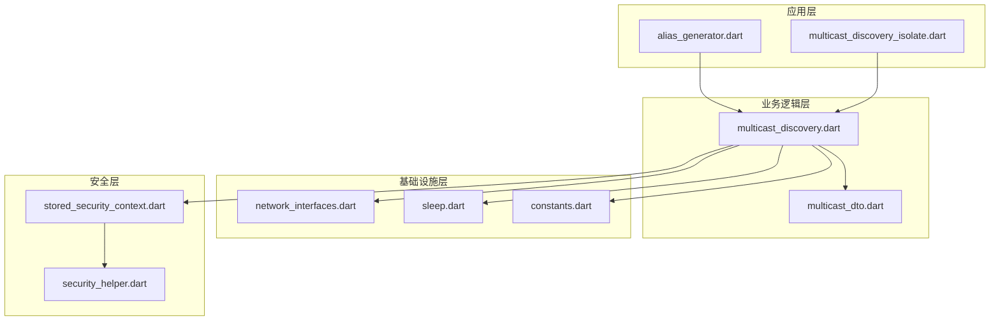
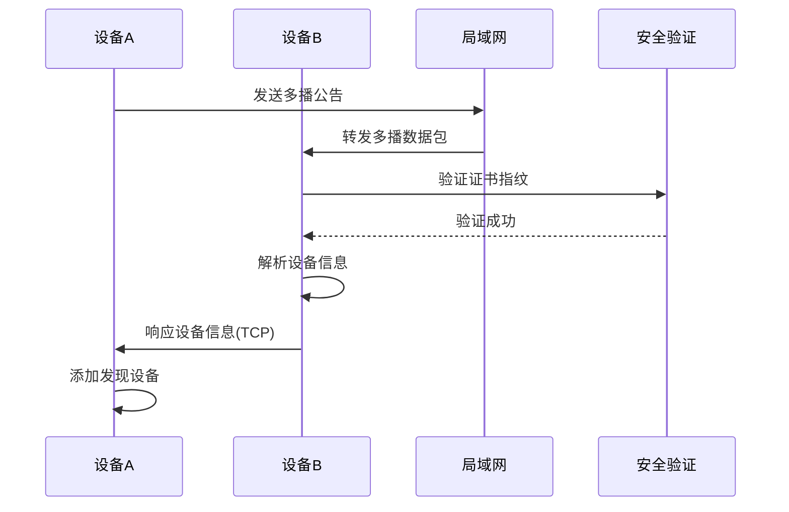
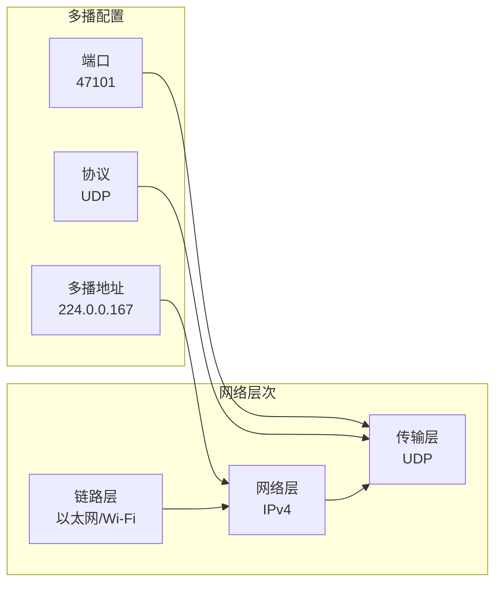
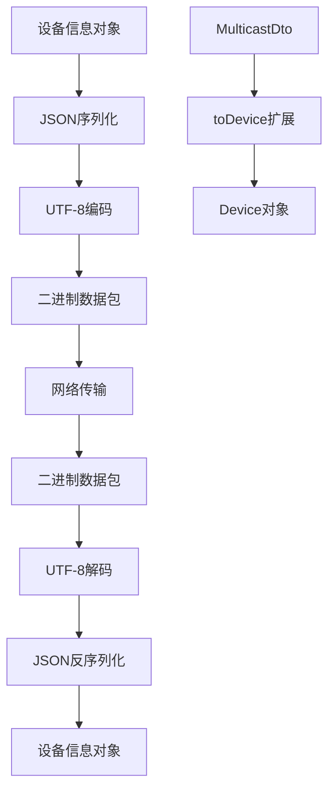
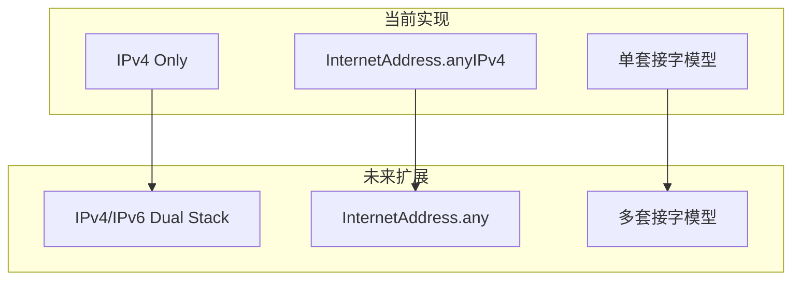
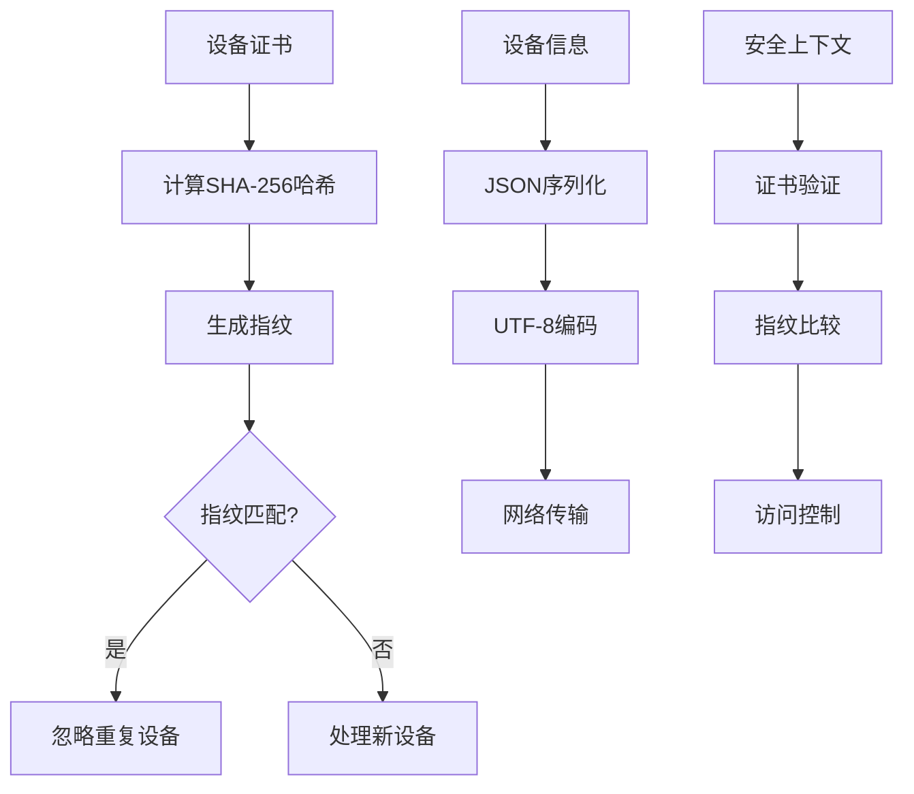
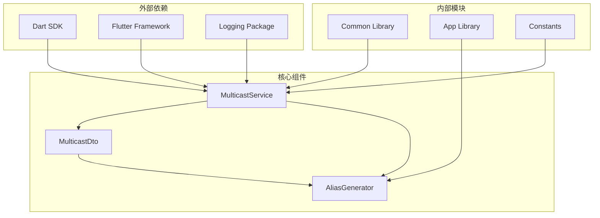

# 多播发现

<cite>
**本文档中引用的文件**
- [multicast_discovery.dart](file://common/lib/src/task/discovery/multicast_discovery.dart)
- [multicast_dto.dart](file://common/lib/model/dto/multicast_dto.dart)
- [alias_generator.dart](file://app/lib/util/alias_generator.dart)
- [multicast_discovery_isolate.dart](file://common/lib/src/isolate/child/multicast_discovery_isolate.dart)
- [constants.dart](file://common/lib/constants.dart)
- [network_interfaces.dart](file://common/lib/util/network_interfaces.dart)
- [sleep.dart](file://common/lib/util/sleep.dart)
- [stored_security_context.dart](file://common/lib/model/stored_security_context.dart)
- [security_helper.dart](file://app/lib/util/security_helper.dart)
</cite>

## 目录
1. [简介](#简介)
2. [项目结构](#项目结构)
3. [核心组件](#核心组件)
4. [架构概览](#架构概览)
5. [详细组件分析](#详细组件分析)
6. [依赖关系分析](#依赖关系分析)
7. [性能考虑](#性能考虑)
8. [故障排除指南](#故障排除指南)
9. [结论](#结论)

## 简介

LocalSend的多播发现功能是一个基于UDP多播协议的本地网络设备发现系统。该功能允许设备在局域网内自动发现其他LocalSend实例，无需手动输入IP地址或进行复杂的网络配置。通过使用标准的多播地址和端口组合，该系统能够在不同网络环境下提供可靠的设备发现服务。

多播发现功能的核心优势在于其自动化程度高、部署简单且对用户友好。它特别适用于家庭网络、办公室网络等小型到中型局域网环境，能够显著提升用户体验。

## 项目结构

LocalSend的多播发现功能分布在多个模块中，形成了清晰的分层架构：



**图表来源**
- [multicast_discovery.dart](file://common/lib/src/task/discovery/multicast_discovery.dart#L1-L226)
- [alias_generator.dart](file://app/lib/util/alias_generator.dart#L1-L16)
- [multicast_discovery_isolate.dart](file://common/lib/src/isolate/child/multicast_discovery_isolate.dart#L1-L56)

**章节来源**
- [multicast_discovery.dart](file://common/lib/src/task/discovery/multicast_discovery.dart#L1-L50)
- [constants.dart](file://common/lib/constants.dart#L1-L32)

## 核心组件

### 多播服务核心类

多播发现功能的核心是`MulticastService`类，它负责管理整个多播发现流程：

- **监听器启动**：通过`startListener()`方法启动多播监听服务
- **公告发送**：通过`sendAnnouncement()`方法定期发送设备公告
- **响应处理**：自动处理来自其他设备的发现请求
- **资源管理**：管理网络套接字的生命周期

### 数据传输对象

`MulticastDto`类定义了多播消息的数据结构：

- **设备标识**：包含设备别名、指纹、版本信息
- **网络信息**：端口、协议类型、下载权限等
- **兼容性字段**：支持向后兼容的v1和v2协议版本

### 设备别名生成器

设备别名生成器使用随机组合的方式创建友好的设备名称：

- **形容词库**：从本地化资源中获取形容词列表
- **水果名称**：从本地化资源中获取水果名称列表
- **随机组合**：确保每个设备都有独特的别名

**章节来源**
- [multicast_discovery.dart](file://common/lib/src/task/discovery/multicast_discovery.dart#L20-L100)
- [multicast_dto.dart](file://common/lib/model/dto/multicast_dto.dart#L10-L30)
- [alias_generator.dart](file://app/lib/util/alias_generator.dart#L5-L15)

## 架构概览

多播发现系统采用事件驱动的架构模式，通过异步流处理设备发现事件：



**图表来源**
- [multicast_discovery.dart](file://common/lib/src/task/discovery/multicast_discovery.dart#L30-L80)
- [multicast_discovery.dart](file://common/lib/src/task/discovery/multicast_discovery.dart#L129-L157)

系统的工作流程包括以下几个关键阶段：

1. **初始化阶段**：绑定多播端口并加入多播组
2. **监听阶段**：持续监听多播数据包
3. **处理阶段**：解析数据包并验证安全性
4. **响应阶段**：向发现的设备发送响应
5. **清理阶段**：释放网络资源

**章节来源**
- [multicast_discovery.dart](file://common/lib/src/task/discovery/multicast_discovery.dart#L30-L100)

## 详细组件分析

### 多播地址和端口选择

LocalSend选择了特定的多播地址和端口号来确保最佳的网络兼容性和可靠性：

#### 多播地址选择
- **默认地址**：`224.0.0.167`
- **选择理由**：根据Android设备的兼容性测试，该地址范围是唯一能够接收UDP多播消息的IP范围
- **RFC标准**：属于224.0.0.0/24网络，这是为本地管理目的保留的多播地址范围

#### 端口选择
- **默认端口**：`47101`
- **选择依据**：该端口未被IANA注册为常用服务端口，减少了与其他应用程序冲突的可能性
- **动态绑定**：支持端口0的动态分配，由操作系统自动选择可用端口



**图表来源**
- [constants.dart](file://common/lib/constants.dart#L25-L32)
- [multicast_discovery.dart](file://common/lib/src/task/discovery/multicast_discovery.dart#L192-L224)

### JSON消息体设计

多播消息采用JSON格式进行序列化，确保跨平台兼容性和可读性：

#### 消息结构
```json
{
  "alias": "FriendlyDevice",
  "version": "2.1",
  "deviceModel": "iPhone 14 Pro",
  "deviceType": "mobile",
  "fingerprint": "SHA256_HASH",
  "port": 53317,
  "protocol": "https",
  "download": true,
  "announcement": true,
  "announce": true
}
```

#### 字段说明
- **alias**：设备友好名称，用于用户识别
- **version**：协议版本号，支持向后兼容
- **deviceModel**：设备型号信息
- **deviceType**：设备类型（desktop、mobile、tablet等）
- **fingerprint**：证书指纹，用于安全验证
- **port**：HTTP服务器端口
- **protocol**：协议类型（http/https）
- **download**：是否允许下载文件
- **announcement**：v1协议的公告标志
- **announce**：v2协议的公告标志

### 序列化与反序列化机制

系统使用Dart的内置JSON序列化功能来处理消息的编码和解码：



**图表来源**
- [multicast_dto.dart](file://common/lib/model/dto/multicast_dto.dart#L40-L55)
- [multicast_discovery.dart](file://common/lib/src/task/discovery/multicast_discovery.dart#L170-L190)

### 发送频率控制

为了平衡网络负载和发现效率，系统采用了精心设计的发送频率策略：

#### 发送时间表
- **首次发送**：立即发送第一个公告
- **延迟发送**：等待100毫秒后发送第二个公告
- **稳定发送**：等待500毫秒后发送第三个公告
- **持续发送**：等待2000毫秒后继续发送后续公告

这种分阶段的发送策略有助于：
- 减少网络拥塞
- 提高发现成功率
- 允许网络设备稳定连接

### 超时处理策略

系统实现了多层次的超时处理机制：

#### 连接超时
- **默认超时**：500毫秒
- **用途**：等待设备响应发现请求
- **重试机制**：超时后自动重试

#### 资源清理超时
- **监听器重启**：500毫秒的资源释放等待
- **套接字关闭**：确保网络资源正确释放

**章节来源**
- [multicast_discovery.dart](file://common/lib/src/task/discovery/multicast_discovery.dart#L100-L120)
- [constants.dart](file://common/lib/constants.dart#L20-L25)
- [sleep.dart](file://common/lib/util/sleep.dart#L1-L3)

### IPv4/IPv6双栈支持

虽然当前实现主要针对IPv4，但系统架构已经为未来的IPv6支持做好准备：

#### 当前实现特点
- **IPv4专用**：使用`InternetAddress.anyIPv4`绑定
- **网络接口枚举**：自动检测所有可用的网络接口
- **白名单/黑名单**：支持精确的网络接口过滤

#### 双栈支持规划
- **地址族检测**：自动检测IPv4和IPv6支持
- **多套接字管理**：为每种地址族维护独立的套接字
- **协议无关处理**：保持上层逻辑与底层协议的解耦



**图表来源**
- [multicast_discovery.dart](file://common/lib/src/task/discovery/multicast_discovery.dart#L192-L224)
- [network_interfaces.dart](file://common/lib/util/network_interfaces.dart#L8-L28)

### 网络接口绑定

系统通过智能的网络接口管理确保多播消息能够到达正确的网络段：

#### 接口发现机制
- **自动枚举**：扫描所有可用的网络接口
- **过滤规则**：支持白名单和黑名单过滤
- **地址提取**：获取每个接口的所有IP地址

#### 绑定策略
- **逐接口绑定**：为每个网络接口单独创建套接字
- **多播加入**：为每个套接字加入多播组
- **错误处理**：优雅处理绑定失败的情况

**章节来源**
- [network_interfaces.dart](file://common/lib/util/network_interfaces.dart#L8-L28)
- [multicast_discovery.dart](file://common/lib/src/task/discovery/multicast_discovery.dart#L192-L224)

### 安全机制

多播发现系统实现了多层次的安全保护机制：

#### 设备指纹验证
- **证书哈希**：使用SHA-256算法计算证书指纹
- **重复检测**：避免向同一设备发送重复的发现请求
- **完整性验证**：确保消息来源的可信性

#### 信息最小化原则
- **必要信息**：只传输发现设备所需的最小信息集
- **隐私保护**：不包含敏感的个人身份信息
- **版本兼容**：支持不同协议版本的设备互操作



**图表来源**
- [multicast_discovery.dart](file://common/lib/src/task/discovery/multicast_discovery.dart#L50-L60)
- [stored_security_context.dart](file://common/lib/model/stored_security_context.dart#L1-L24)
- [security_helper.dart](file://app/lib/util/security_helper.dart#L10-L40)

### 设备别名的随机生成策略

系统使用随机化的设备别名生成策略来提升用户体验：

#### 生成算法
- **词汇库分离**：形容词和名词分别存储
- **本地化支持**：支持多种语言的词汇库
- **随机选择**：从词汇库中随机选择组合

#### 别名格式
- **结构**：`形容词 + 名词`
- **示例**：`HappyApple`, `BrightBanana`, `SmartOrange`
- **唯一性保证**：通过随机算法确保大多数情况下生成唯一的别名

**章节来源**
- [alias_generator.dart](file://app/lib/util/alias_generator.dart#L5-L15)
- [multicast_dto.dart](file://common/lib/model/dto/multicast_dto.dart#L15-L25)

## 依赖关系分析

多播发现功能的依赖关系体现了良好的模块化设计：



**图表来源**
- [multicast_discovery.dart](file://common/lib/src/task/discovery/multicast_discovery.dart#L1-L15)
- [constants.dart](file://common/lib/constants.dart#L1-L10)

### 主要依赖项

#### Dart标准库
- **dart:io**：提供RawDatagramSocket和网络接口API
- **dart:convert**：JSON序列化和UTF-8编码
- **dart:isolate**：多线程隔离支持

#### 第三方库
- **logging**：结构化日志记录
- **refena**：状态管理
- **dart_mappable**：自动序列化

#### 内部模块
- **common/model/device.dart**：设备数据模型
- **common/model/dto/**：数据传输对象
- **common/util/**：工具函数

**章节来源**
- [multicast_discovery.dart](file://common/lib/src/task/discovery/multicast_discovery.dart#L1-L15)
- [multicast_dto.dart](file://common/lib/model/dto/multicast_dto.dart#L1-L5)

## 性能考虑

### 网络性能优化

#### 多播效率
- **广播限制**：多播仅限于本地网络，避免跨路由器传播
- **带宽节省**：相比单播，多播显著减少网络流量
- **延迟优化**：快速的设备发现响应时间

#### 资源管理
- **套接字复用**：为每个网络接口创建独立套接字
- **内存优化**：及时释放不再使用的网络资源
- **CPU效率**：异步处理减少主线程阻塞

### 扩展性设计

#### 水平扩展
- **多接口支持**：支持同时使用多个网络接口
- **并发处理**：异步处理多个发现请求
- **负载均衡**：自动选择最优的网络路径

#### 垂直扩展
- **配置灵活性**：支持自定义多播地址和端口
- **协议升级**：向后兼容的版本控制系统
- **功能增强**：可扩展的安全和认证机制

## 故障排除指南

### 常见问题及解决方案

#### 设备无法发现

**症状**：设备在局域网内无法发现其他LocalSend实例

**可能原因**：
- 多播功能被防火墙阻止
- 网络设备配置限制
- 路由器设置问题

**解决方案**：
1. 检查防火墙设置，确保UDP端口47101开放
2. 验证设备是否在同一子网内
3. 检查路由器的AP隔离功能是否启用

#### 发现速度慢

**症状**：设备发现需要较长时间

**可能原因**：
- 网络接口过滤过于严格
- 多播组加入失败
- 网络拥塞

**解决方案**：
1. 检查网络接口白名单/黑名单配置
2. 重新启动多播监听器
3. 优化网络环境

#### 安全验证失败

**症状**：设备间通信建立失败

**可能原因**：
- 证书不匹配
- 时间同步问题
- 中间人攻击

**解决方案**：
1. 重新生成安全上下文
2. 同步系统时间
3. 检查网络安全性

### 网络环境限制

#### 跨路由器子网不可达
多播发现功能的主要限制之一是它只能在同一个局域网子网内工作。当设备位于不同的路由器或子网时，多播消息无法跨越路由器边界。

**解决策略**：
- 使用VPN或隧道技术连接不同子网
- 配置路由器的多播转发功能
- 在不同子网间部署代理服务器

#### 移动设备限制
移动设备（iOS、Android）可能受到操作系统级别的网络限制：

**iOS限制**：
- 后台网络访问限制
- 多播权限要求
- 网络切换处理

**Android限制**：
- 省电模式影响
- 网络权限管理
- 多播支持差异

**章节来源**
- [multicast_discovery.dart](file://common/lib/src/task/discovery/multicast_discovery.dart#L50-L70)
- [network_interfaces.dart](file://common/lib/util/network_interfaces.dart#L40-L68)

## 结论

LocalSend的多播发现功能是一个设计精良、功能完善的本地网络设备发现系统。它通过以下关键特性实现了优秀的用户体验：

### 技术优势
- **标准化协议**：基于UDP多播的RFC标准实现
- **跨平台兼容**：支持Windows、macOS、Linux、iOS、Android
- **安全可靠**：多重安全验证机制
- **易于部署**：零配置的自动发现

### 功能特性
- **智能过滤**：支持网络接口的白名单/黑名单管理
- **版本兼容**：向后兼容的协议设计
- **资源优化**：高效的网络资源管理和内存使用
- **错误恢复**：健壮的错误处理和自动恢复机制

### 应用场景
- **家庭网络**：快速分享文件和媒体内容
- **办公环境**：文档和数据交换
- **教育机构**：教学材料共享
- **临时网络**：会议和活动中的设备连接

该多播发现功能的成功实施展示了如何在保持系统简洁性的同时，实现复杂网络功能的自动化。其模块化的设计架构也为未来的功能扩展和性能优化提供了良好的基础。