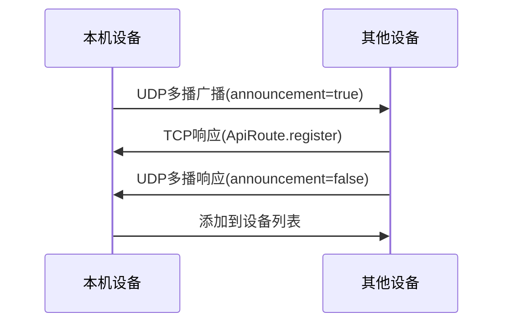
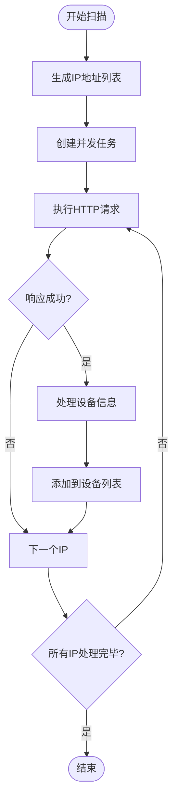
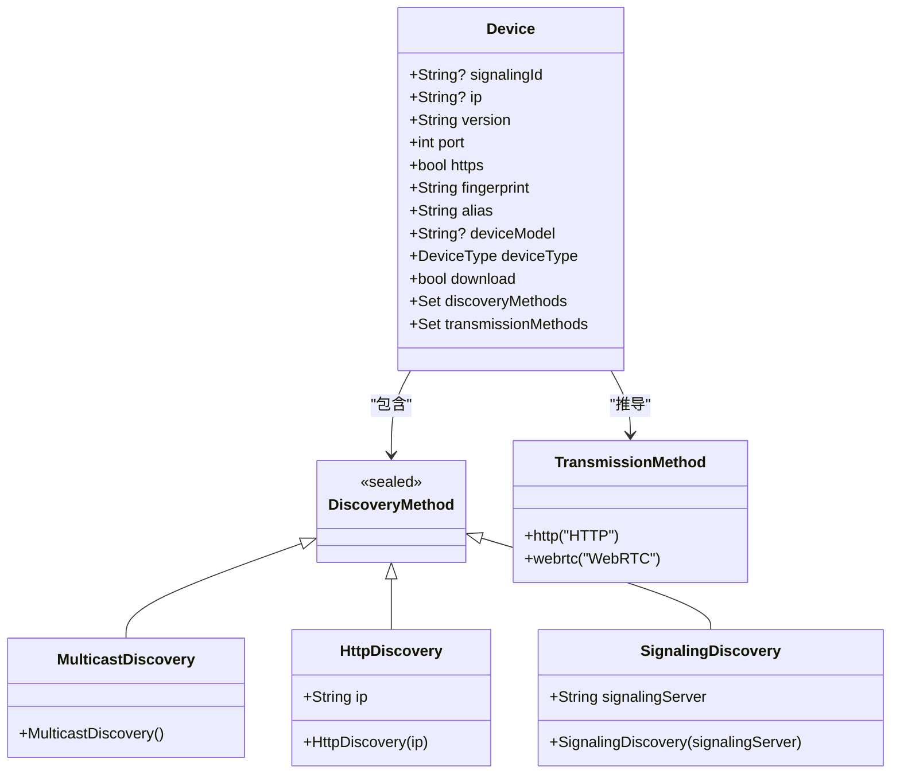
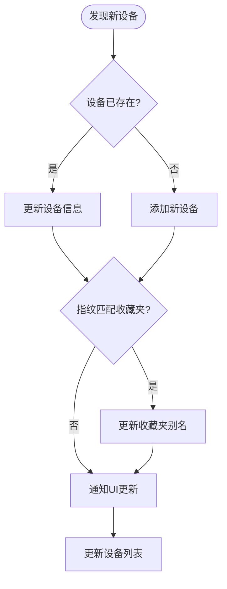
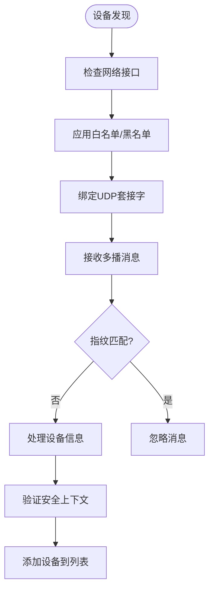

# 设备发现模块

<cite>
**本文档中引用的文件**
- [device.dart](file://common/lib/model/device.dart)
- [multicast_discovery.dart](file://common/lib/src/task/discovery/multicast_discovery.dart)
- [http_scan_discovery.dart](file://common/lib/src/task/discovery/http_scan_discovery.dart)
- [http_target_discovery.dart](file://common/lib/src/task/discovery/http_target_discovery.dart)
- [network_interfaces.dart](file://common/lib/util/network_interfaces.dart)
- [info_dto.dart](file://common/lib/model/dto/info_dto.dart)
- [multicast_dto.dart](file://common/lib/model/dto/multicast_dto.dart)
- [device_info_provider.dart](file://app/lib/provider/device_info_provider.dart)
- [nearby_devices_provider.dart](file://app/lib/provider/network/nearby_devices_provider.dart)
- [nearby_devices_state.dart](file://app/lib/model/state/nearby_devices_state.dart)
</cite>

## 目录
1. [多播发现机制](#多播发现机制)
2. [HTTP扫描与目标发现](#http扫描与目标发现)
3. 设备信息数据模型
4. 设备列表实时更新与状态同步
5. 网络兼容性与安全考虑
6. 文件传输目标设备支持

## 多播发现机制

多播发现是LocalSend设备发现的核心机制，通过UDP多播协议实现局域网内设备的自动发现。该机制基于`MulticastService`类实现，通过绑定UDP端口并监听多播组来接收和发送设备发现消息。

多播发现的工作流程如下：首先，系统通过`_getSockets`方法获取所有网络接口，并为每个接口创建一个`RawDatagramSocket`绑定到指定的多播组和端口。当接收到多播数据包时，系统会解析包含设备信息的`MulticastDto`对象，并通过`toDevice`扩展方法将其转换为`Device`对象。为了避免自发现，系统会检查接收到的设备指纹是否与本机相同，如果相同则忽略该消息。

**Diagram sources**
- [multicast_discovery.dart](file://common/lib/src/task/discovery/multicast_discovery.dart#L39-L60)
- [multicast_dto.dart](file://common/lib/model/dto/multicast_dto.dart#L50-L54)

**Section sources**
- [multicast_discovery.dart](file://common/lib/src/task/discovery/multicast_discovery.dart#L0-L225)
- [multicast_dto.dart](file://common/lib/model/dto/multicast_dto.dart#L0-L54)

## HTTP扫描与目标发现

HTTP扫描发现和HTTP目标发现是LocalSend的两种补充发现机制，用于在多播发现不可用或需要精确发现特定设备时使用。HTTP扫描发现通过`HttpScanDiscoveryService`实现，它会扫描指定网络接口的整个IP地址范围（256个地址），并发地向每个IP地址发送HTTP请求以发现设备。

HTTP扫描发现使用`TaskRunner`来管理并发任务，最大并发数设置为50，以平衡发现速度和网络负载。对于每个IP地址，系统会调用`_doRequest`方法，该方法通过`HttpTargetDiscoveryService`向目标设备的`/info`端点发送GET请求。目标发现机制则更加精确，它直接向指定的IP地址和端口发送请求，适用于已知设备位置的场景。

**Diagram sources**
- [http_scan_discovery.dart](file://common/lib/src/task/discovery/http_scan_discovery.dart#L25-L67)
- [http_target_discovery.dart](file://common/lib/src/task/discovery/http_target_discovery.dart#L25-L48)

**Section sources**
- [http_scan_discovery.dart](file://common/lib/src/task/discovery/http_scan_discovery.dart#L0-L67)
- [http_target_discovery.dart](file://common/lib/src/task/discovery/http_target_discovery.dart#L0-L48)

## 设备信息数据模型

设备信息数据模型由`Device`类定义，包含了设备发现和通信所需的所有关键属性。核心属性包括：`signalingId`（信令服务器提供的唯一ID）、`ip`（设备IP地址）、`port`（服务端口）、`https`（是否使用HTTPS）、`fingerprint`（设备指纹，用于身份验证）、`alias`（设备别名）、`deviceModel`（设备型号）、`deviceType`（设备类型，如移动设备、桌面设备等）以及`download`（是否支持下载）。

设备发现方法通过`discoveryMethods`集合管理，支持多种发现方式：`MulticastDiscovery`表示通过多播发现，`HttpDiscovery`表示通过HTTP发现，`SignalingDiscovery`表示通过信令服务器发现。设备的传输方法`transmissionMethods`根据发现方法自动推导，支持HTTP和WebRTC两种传输协议。设备模型的设计考虑了序列化需求，通过`dart_mappable`库实现了JSON序列化和反序列化功能。

**Diagram sources**
- [device.dart](file://common/lib/model/device.dart#L0-L118)
- [info_dto.dart](file://common/lib/model/dto/info_dto.dart#L0-L46)

**Section sources**
- [device.dart](file://common/lib/model/device.dart#L0-L118)
- [device.mapper.dart](file://common/lib/model/device.mapper.dart#L401-L559)

## 设备列表实时更新与状态同步

设备列表的实时更新和状态同步通过`nearbyDevicesProvider`实现，该提供者管理着一个包含所有发现设备的映射表。当新设备被发现时，系统会触发`RegisterDeviceAction`动作，将设备添加到`NearbyDevicesState`的状态中。如果设备已存在，则会更新其信息，同时保留原有的发现方法。

设备列表的更新机制考虑了设备别名的同步，当发现的设备指纹与收藏夹中的设备匹配时，系统会自动更新收藏夹中的别名。这种设计确保了用户界面中显示的设备信息始终保持最新。设备状态的同步通过`StreamController`实现，当设备信息发生变化时，会立即通知所有监听者，从而实现实时更新。

**Diagram sources**
- [nearby_devices_provider.dart](file://app/lib/provider/network/nearby_devices_provider.dart#L69-L100)
- [nearby_devices_state.dart](file://app/lib/model/state/nearby_devices_state.dart#L0-L59)

**Section sources**
- [nearby_devices_provider.dart](file://app/lib/provider/network/nearby_devices_provider.dart#L0-L100)
- [nearby_devices_state.dart](file://app/lib/model/state/nearby_devices_state.dart#L0-L59)

## 网络兼容性与安全考虑

设备发现模块在设计时充分考虑了网络兼容性和安全性。网络兼容性方面，系统通过`getNetworkInterfaces`方法获取所有网络接口，并支持通过白名单和黑名单过滤网络接口。IPv4/IPv6双栈支持通过`InternetAddress.anyIPv4`实现，确保在不同网络环境下都能正常工作。跨子网发现限制是多播协议的固有特性，系统通过HTTP扫描发现作为补充，可以在一定程度上突破这一限制。

安全性方面，系统通过设备指纹`fingerprint`进行身份验证，防止未经授权的设备探测。在多播发现中，系统会检查接收到的消息指纹是否与本机相同，避免自发现和潜在的安全风险。此外，系统支持通过网络接口白名单和黑名单进行访问控制，用户可以指定允许或禁止发现的网络范围。HTTPS加密传输确保了设备间通信的安全性，防止敏感信息被窃听。

**Diagram sources**
- [network_interfaces.dart](file://common/lib/util/network_interfaces.dart#L0-L68)
- [multicast_discovery.dart](file://common/lib/src/task/discovery/multicast_discovery.dart#L192-L224)

**Section sources**
- [network_interfaces.dart](file://common/lib/util/network_interfaces.dart#L0-L68)
- [multicast_discovery.dart](file://common/lib/src/task/discovery/multicast_discovery.dart#L0-L225)

## 文件传输目标设备支持

设备发现模块为文件传输功能提供了完整的目标设备列表支持。通过`deviceFullInfoProvider`，系统可以获取本机的完整设备信息，包括IP地址、端口、别名和指纹等，这些信息用于构建文件传输请求。发现的设备列表通过`nearbyDevicesProvider`提供给发送界面，用户可以从列表中选择目标设备进行文件传输。

在多设备发送模式下，系统支持同时向多个设备发送文件，每个设备的传输进度独立显示。收藏夹功能允许用户将常用设备添加到收藏列表，实现快速访问。当用户选择发送文件时，系统会根据目标设备的传输方法（HTTP或WebRTC）选择合适的传输协议。对于支持下载的设备，系统会显示相应的UI元素，提示用户可以接收文件。

**Section sources**
- [device_info_provider.dart](file://app/lib/provider/device_info_provider.dart#L28-L47)
- [send_tab_vm.dart](file://app/lib/pages/tabs/send_tab_vm.dart#L26-L59)