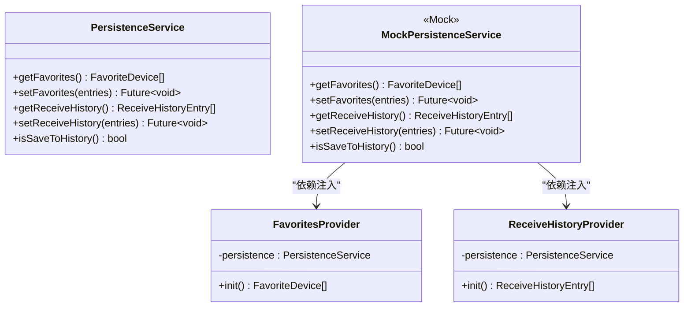
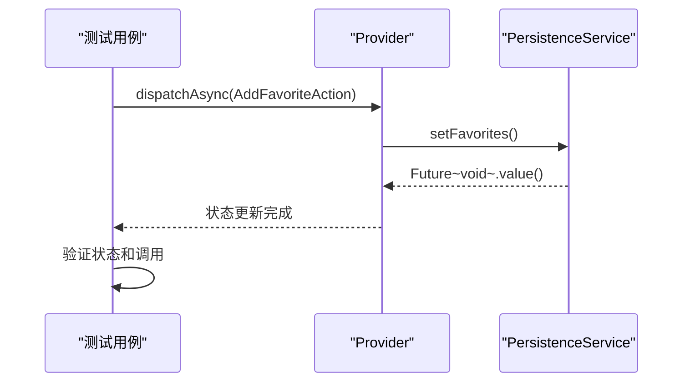

# 单元测试

<cite>
**本文档中引用的文件**  
- [favorites_provider_test.dart](file://app/test/unit/provider/favorites_provider_test.dart)
- [receive_history_provider_test.dart](file://app/test/unit/provider/receive_history_provider_test.dart)
- [network_info_provider_test.dart](file://app/test/unit/provider/network_info_provider_test.dart)
- [mocks.dart](file://app/test/mocks.dart)
- [mocks.mocks.dart](file://app/test/mocks.mocks.dart)
- [favorites_provider.dart](file://app/lib/provider/favorites_provider.dart)
- [receive_history_provider.dart](file://app/lib/provider/receive_history_provider.dart)
</cite>

## 目录
1. [简介](#简介)
2. [测试架构与依赖隔离](#测试架构与依赖隔离)
3. [核心业务逻辑组件测试](#核心业务逻辑组件测试)
4. [测试数据准备与异步操作处理](#测试数据准备与异步操作处理)
5. [状态变化验证](#状态变化验证)
6. [可维护性与可靠性最佳实践](#可维护性与可靠性最佳实践)
7. [结论](#结论)

## 简介
本单元测试文档详细介绍了在本地发送应用中对核心业务逻辑组件进行测试的实践方法。重点阐述了如何使用mockito库创建和配置mock对象来隔离依赖，特别是针对Provider、网络服务和Rust FFI接口的测试策略。文档通过具体示例展示了对FavoritesProvider、ReceiveHistoryProvider等关键服务的测试方法，并解释了测试数据的准备、异步操作的处理以及状态变化的验证过程。同时，提供了编写可维护、快速且可靠的单元测试的最佳实践，强调测试的独立性和可重复性，确保核心功能如设备发现、文件传输状态管理和用户设置持久化的正确性。

## 测试架构与依赖隔离

在本地发送应用的单元测试中，采用了mockito库来实现依赖隔离。通过生成mock对象，可以有效地模拟外部依赖的行为，从而专注于测试目标组件的逻辑。测试框架利用ReduxProvider模式管理状态，使得状态变更可以通过action进行追踪和验证。

测试中主要隔离的依赖包括PersistenceService和SharedPreferences，这些依赖通过mocks.dart文件中的@GenerateNiceMocks注解自动生成mock实现。这种做法确保了测试环境的纯净，避免了真实数据存储带来的副作用。

**Diagram sources**
- [mocks.dart](file://app/test/mocks.dart)
- [mocks.mocks.dart](file://app/test/mocks.mocks.dart)
- [favorites_provider.dart](file://app/lib/provider/favorites_provider.dart)
- [receive_history_provider.dart](file://app/lib/provider/receive_history_provider.dart)

**Section sources**
- [mocks.dart](file://app/test/mocks.dart)
- [mocks.mocks.dart](file://app/test/mocks.mocks.dart)

## 核心业务逻辑组件测试

### FavoritesProvider测试
FavoritesProvider负责管理用户收藏的设备列表。测试用例验证了添加、更新和删除收藏设备的功能。通过mock的PersistenceService，可以验证状态变更是否正确地持久化。

测试中使用ReduxNotifier.test来创建测试环境，初始化FavoritesService并注入mock的PersistenceService。每个测试用例都验证了状态变更的正确性以及对持久化服务的调用。

### ReceiveHistoryProvider测试
ReceiveHistoryProvider管理接收文件的历史记录。测试用例验证了添加、删除和清空历史记录的功能。特别地，测试了当历史记录达到最大限制（30条）时，新条目会替换最旧的条目。

测试还验证了当"保存到历史"功能被禁用时，不会添加新的历史记录条目。这通过配置mock的PersistenceService返回false来实现。

### NetworkInfoProvider测试
NetworkInfoProvider相关的测试主要集中在IP地址排序逻辑上。测试验证了rankIpAddresses函数的行为，包括：
- 当没有主IP地址时，仅对列表进行排序
- 当有主IP地址时，将其放在首位
- 处理重复IP地址的情况

这些测试确保了网络发现功能的正确性，特别是在多网卡环境下选择最佳IP地址的能力。

**Section sources**
- [favorites_provider_test.dart](file://app/test/unit/provider/favorites_provider_test.dart)
- [receive_history_provider_test.dart](file://app/test/unit/provider/receive_history_provider_test.dart)
- [network_info_provider_test.dart](file://app/test/unit/provider/network_info_provider_test.dart)

## 测试数据准备与异步操作处理

### 测试数据准备
测试数据通过辅助函数进行准备，如_createDevice和_createEntry，这些函数创建了符合业务逻辑的测试对象。这种方式确保了测试数据的一致性和可重用性。

对于复杂的对象，如安全上下文，测试使用了预定义的常量值来生成RSA密钥对和证书，确保测试的可重复性。

### 异步操作处理
由于应用中大量使用异步操作，测试框架需要正确处理Future和async/await。测试中使用await来等待异步操作完成，确保在验证状态变更之前操作已经完成。

ReduxNotifier的dispatchAsync方法被用来触发异步action，并等待其完成。这种模式确保了测试能够准确地验证异步状态变更的结果。

**Diagram sources**
- [favorites_provider_test.dart](file://app/test/unit/provider/favorites_provider_test.dart)
- [receive_history_provider_test.dart](file://app/test/unit/provider/receive_history_provider_test.dart)

**Section sources**
- [favorites_provider_test.dart](file://app/test/unit/provider/favorites_provider_test.dart)
- [receive_history_provider_test.dart](file://app/test/unit/provider/receive_history_provider_test.dart)

## 状态变化验证

状态变化的验证是单元测试的核心部分。测试通过检查ReduxNotifier的state属性来验证状态变更的正确性。每个测试用例都包含明确的期望断言，确保状态按照预期进行变更。

对于持久化调用的验证，使用mockito的verify和verifyNever断言来确保PersistenceService的方法被正确调用。例如，添加收藏设备时，verify(persistenceService.setFavorites([device]))确保了setFavorites方法被调用且参数正确。

测试还验证了边界情况，如尝试更新不存在的设备或删除不存在的历史记录条目，确保系统在这种情况下不会产生意外的状态变更或持久化调用。

**Section sources**
- [favorites_provider_test.dart](file://app/test/unit/provider/favorites_provider_test.dart)
- [receive_history_provider_test.dart](file://app/test/unit/provider/receive_history_provider_test.dart)

## 可维护性与可靠性最佳实践

### 测试独立性
每个测试用例都是独立的，通过setUp方法在每次测试前重新创建mock对象。这种做法确保了测试之间的隔离，避免了状态污染。

### 可读性
测试用例的命名遵循"Should [行为] when [条件]"的模式，如"Should add a favorite device"，使得测试意图清晰明了。

### 可维护性
通过提取公共的测试数据创建逻辑到辅助函数中，减少了代码重复，提高了可维护性。当业务逻辑变更时，只需修改辅助函数即可更新所有相关测试。

### 可靠性
测试避免了对时间、网络等外部因素的依赖，通过mock和stub确保了测试的稳定性和可重复性。对于与时间相关的逻辑，考虑使用clock库来控制时间流逝。

### 覆盖率
测试覆盖了正常路径、边界情况和错误处理，确保了核心功能的健壮性。通过验证mock的调用，确保了业务逻辑与持久化层的正确交互。

**Section sources**
- [favorites_provider_test.dart](file://app/test/unit/provider/favorites_provider_test.dart)
- [receive_history_provider_test.dart](file://app/test/unit/provider/receive_history_provider_test.dart)

## 结论
本单元测试文档展示了本地发送应用中核心业务逻辑组件的测试实践。通过使用mockito库进行依赖隔离，实现了对FavoritesProvider、ReceiveHistoryProvider等关键服务的全面测试。测试策略强调了测试的独立性、可维护性和可靠性，确保了核心功能的正确性。文档提供的最佳实践为编写高质量的单元测试提供了指导，有助于维护应用的稳定性和可扩展性。