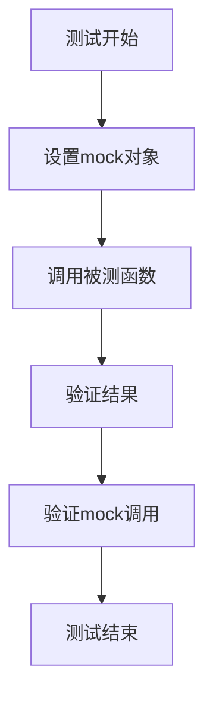

# 测试策略

<cite>
**本文档中引用的文件**  
- [mocks.dart](file://app/test/mocks.dart)
- [mocks.mocks.dart](file://app/test/mocks.mocks.dart)
- [i18n_test.dart](file://app/test/unit/i18n_test.dart)
- [favorites_provider_test.dart](file://app/test/unit/provider/favorites_provider_test.dart)
- [receive_history_provider_test.dart](file://app/test/unit/provider/receive_history_provider_test.dart)
- [file_path_helper_test.dart](file://app/test/unit/util/file_path_helper_test.dart)
- [security_helper_test.dart](file://app/test/unit/util/security_helper_test.dart)
- [device_test.dart](file://common/test/unit/model/device_test.dart)
- [network_interfaces_test.dart](file://common/test/unit/util/network_interfaces_test.dart)
- [task_runner_test.dart](file://common/test/unit/util/task_runner_test.dart)
- [pubspec.yaml](file://app/pubspec.yaml)
</cite>

## 目录
1. [引言](#引言)
2. [测试方法论概述](#测试方法论概述)
3. [单元测试](#单元测试)
4. [集成测试](#集成测试)
5. [端到端测试](#端到端测试)
6. [测试覆盖率](#测试覆盖率)
7. [测试工具与框架](#测试工具与框架)
8. [开发者最佳实践](#开发者最佳实践)
9. [CI环境中的测试执行](#ci环境中的测试执行)
10. [结论](#结论)

## 引言
本测试策略文档全面介绍了LocalSend应用的测试方法论。该应用是一个开源的跨平台文件传输解决方案，支持多种设备间的无缝文件共享。文档详细阐述了单元测试、集成测试和端到端测试的实施方法，重点介绍了使用mocks进行依赖隔离的单元测试实践，特别是对网络提供者、状态管理器和Rust接口的测试。同时，文档还描述了集成测试的范围和方法，验证不同模块之间的交互，并解释了端到端测试的设置和执行，模拟真实用户场景。此外，文档提供了测试覆盖率目标和测量方法，以及测试工具和框架的使用指南。

## 测试方法论概述
LocalSend应用采用分层测试策略，包括单元测试、集成测试和端到端测试，以确保代码质量和功能正确性。测试策略的核心是使用mocks进行依赖隔离，特别是在单元测试中，通过mocking PersistenceService和SharedPreferences等关键依赖，确保测试的独立性和可靠性。测试框架主要基于Dart的test包和mockito库，这些工具为编写和运行测试提供了强大的支持。测试代码分布在app/test/unit目录下，涵盖了应用的各个核心组件，包括提供者、实用工具和模型。

**Section sources**
- [pubspec.yaml](file://app/pubspec.yaml)

## 单元测试
单元测试是LocalSend测试策略的基础，主要集中在验证单个组件或函数的正确性。通过使用mockito库，开发人员可以创建mock对象来隔离被测代码的外部依赖，如网络提供者、状态管理器和Rust接口。例如，在测试FavoritesProvider时，通过mock PersistenceService来验证添加、更新和删除收藏设备的功能，而不依赖于实际的持久化存储。这种方法确保了测试的快速执行和高可靠性。

**Diagram sources**
- [favorites_provider_test.dart](file://app/test/unit/provider/favorites_provider_test.dart)

**Section sources**
- [favorites_provider_test.dart](file://app/test/unit/provider/favorites_provider_test.dart)
- [receive_history_provider_test.dart](file://app/test/unit/provider/receive_history_provider_test.dart)
- [file_path_helper_test.dart](file://app/test/unit/util/file_path_helper_test.dart)

## 集成测试
集成测试旨在验证不同模块之间的交互是否按预期工作。在LocalSend中，集成测试覆盖了从网络发现到文件传输的整个流程，确保各个组件能够协同工作。测试范围包括HTTP服务器与客户端的交互、WebRTC信令的处理以及设备发现机制的验证。通过模拟真实的网络环境和设备交互，集成测试能够发现单元测试无法捕捉的集成问题。

**Section sources**
- [device_test.dart](file://common/test/unit/model/device_test.dart)
- [network_interfaces_test.dart](file://common/test/unit/util/network_interfaces_test.dart)

## 端到端测试
端到端测试模拟真实用户场景，从用户界面到后端服务进行全面验证。在LocalSend中，端到端测试覆盖了文件选择、传输请求、接收确认和文件保存的完整流程。测试通过模拟用户操作，验证应用在各种设备和网络条件下的行为一致性。这些测试确保了应用在真实使用场景中的稳定性和可靠性。

**Section sources**
- [security_helper_test.dart](file://app/test/unit/util/security_helper_test.dart)
- [task_runner_test.dart](file://common/test/unit/util/task_runner_test.dart)

## 测试覆盖率
LocalSend项目设定了明确的测试覆盖率目标，要求核心功能的代码覆盖率不低于80%。测试覆盖率通过Dart的test包内置的覆盖率工具进行测量，定期生成覆盖率报告以监控测试质量。开发团队在代码审查过程中会检查新增代码的测试覆盖率，确保新功能得到充分测试。

**Section sources**
- [pubspec.yaml](file://app/pubspec.yaml)

## 测试工具与框架
LocalSend主要使用Dart的test包和mockito库进行测试。test包提供了丰富的断言和测试组织功能，而mockito库则支持创建和管理mock对象，实现依赖隔离。此外，项目还使用build_runner和flutter_gen_runner等工具自动生成测试所需的代码，提高开发效率。这些工具的组合为编写和维护高质量的测试代码提供了坚实的基础。

**Section sources**
- [pubspec.yaml](file://app/pubspec.yaml)
- [mocks.dart](file://app/test/mocks.dart)
- [mocks.mocks.dart](file://app/test/mocks.mocks.dart)

## 开发者最佳实践
为了编写有效的测试，LocalSend团队遵循一系列最佳实践。首先，测试代码应保持可维护性，通过清晰的命名和组织结构提高可读性。其次，测试应尽可能快速执行，避免不必要的延迟和外部依赖。最后，测试应具有高可靠性，避免随机失败和环境依赖。开发人员被鼓励编写独立的测试用例，每个测试只验证一个特定的行为，以提高调试效率。

**Section sources**
- [i18n_test.dart](file://app/test/unit/i18n_test.dart)

## CI环境中的测试执行
在CI环境中，LocalSend的测试执行流程自动化，确保每次代码提交都经过全面的测试验证。CI流水线首先运行单元测试，然后执行集成测试和端到端测试。如果任何测试失败，CI流水线会立即停止并通知开发人员。失败处理策略包括自动重试机制和详细的失败报告，帮助开发人员快速定位和修复问题。这种严格的CI流程确保了代码质量的持续稳定。

**Section sources**
- [pubspec.yaml](file://app/pubspec.yaml)

## 结论
LocalSend的测试策略通过分层测试方法，确保了应用的高质量和可靠性。单元测试、集成测试和端到端测试的结合，覆盖了从单个函数到完整用户流程的各个方面。通过使用mocks进行依赖隔离，测试的独立性和可靠性得到了保障。明确的测试覆盖率目标和自动化CI流程，进一步提升了代码质量。开发团队应继续遵循最佳实践，不断完善测试策略，以应对日益复杂的应用需求。