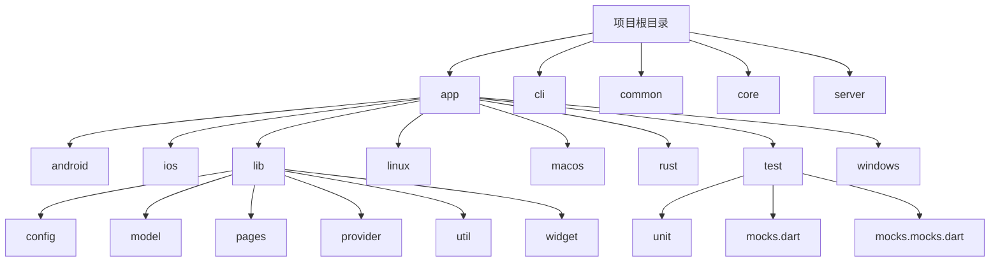
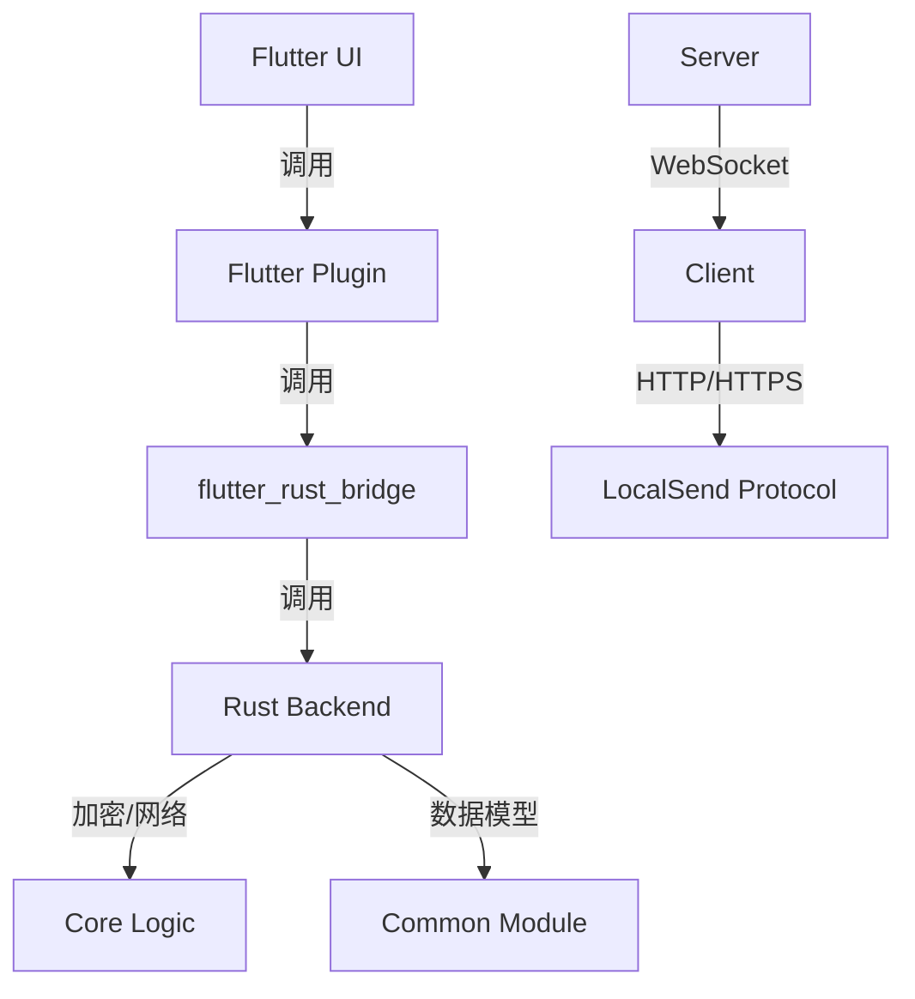
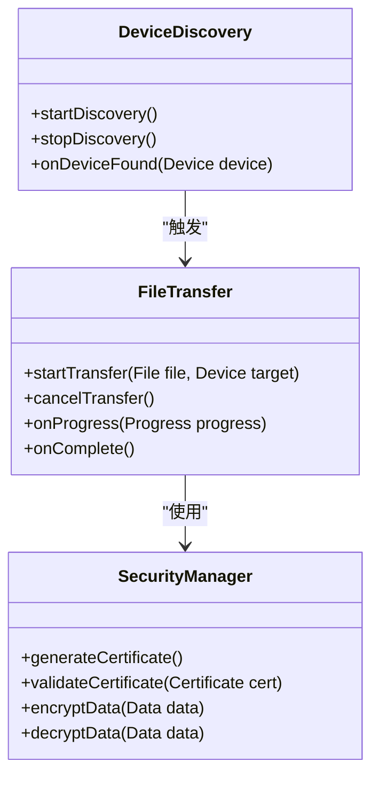
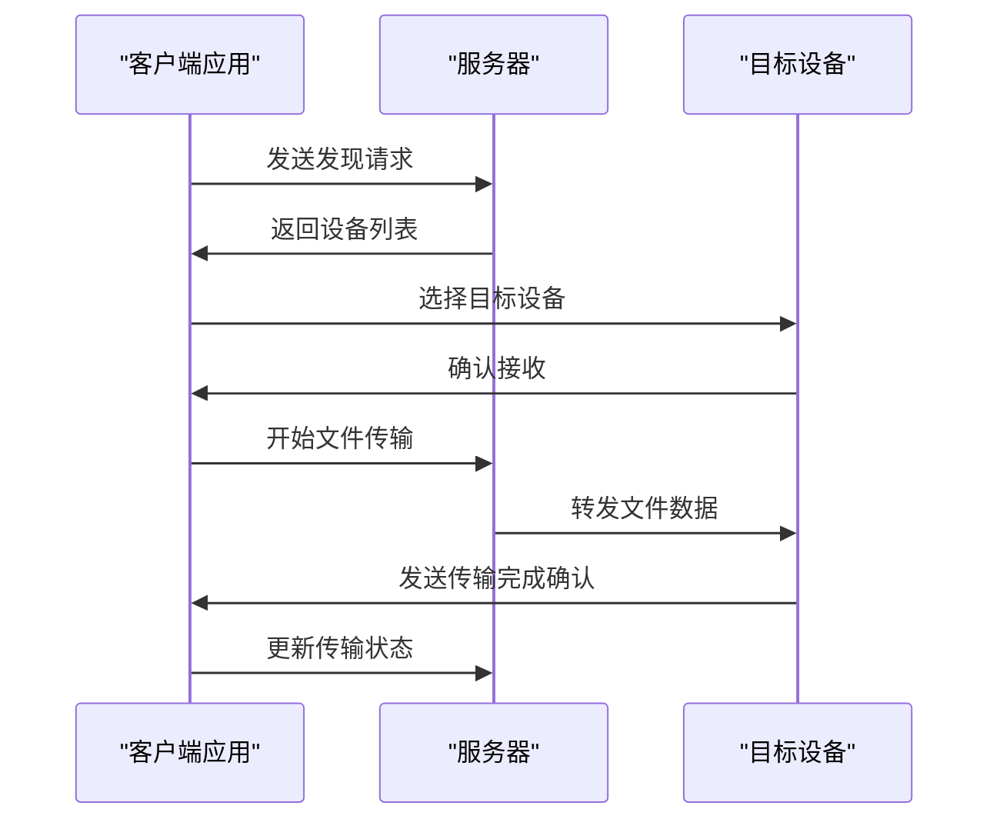
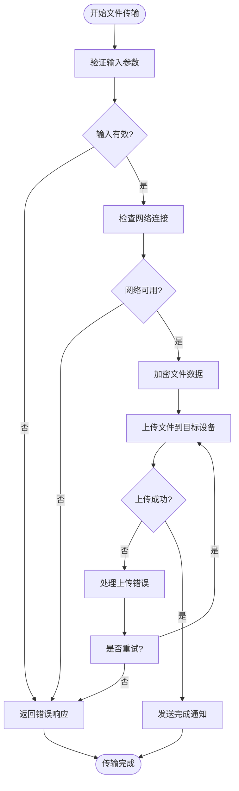
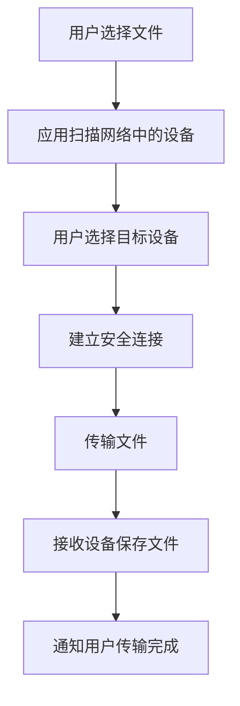
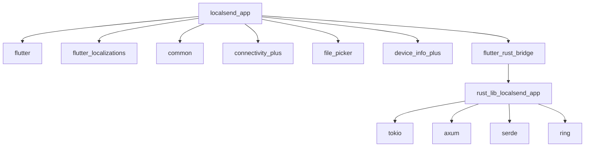

# 端到端测试

<cite>
**本文档中引用的文件**  
- [i18n_test.dart](file://app/test/unit/i18n_test.dart)
- [favorites_provider_test.dart](file://app/test/unit/provider/favorites_provider_test.dart)
- [last_devices_provider_test.dart](file://app/test/unit/provider/last_devices_provider_test.dart)
- [receive_history_provider_test.dart](file://app/test/unit/provider/receive_history_provider_test.dart)
- [api_route_builder_test.dart](file://app/test/unit/util/api_route_builder_test.dart)
- [file_path_helper_test.dart](file://app/test/unit/util/file_path_helper_test.dart)
- [file_speed_helper_test.dart](file://app/test/unit/util/file_speed_helper_test.dart)
- [security_helper_test.dart](file://app/test/unit/util/security_helper_test.dart)
- [mocks.dart](file://app/test/mocks.dart)
- [mocks.mocks.dart](file://app/test/mocks.mocks.dart)
- [pubspec.yaml](file://app/pubspec.yaml)
- [CONTRIBUTING.md](file://CONTRIBUTING.md)
- [README.md](file://README.md)
</cite>

## 目录
1. [简介](#简介)
2. [项目结构](#项目结构)
3. [核心组件](#核心组件)
4. [架构概述](#架构概述)
5. [详细组件分析](#详细组件分析)
6. [依赖分析](#依赖分析)
7. [性能考虑](#性能考虑)
8. [故障排除指南](#故障排除指南)
9. [结论](#结论)
10. [附录](#附录)（如有必要）

## 简介
LocalSend 是一个开源的跨平台应用程序，允许用户在本地网络中安全地共享文件和消息，无需互联网连接。本端到端测试文档旨在阐述如何模拟真实用户场景来验证整个应用程序的工作流程。文档将描述测试框架的设置，包括如何启动应用、模拟用户输入（如选择文件、选择设备、确认传输）并验证最终结果（如文件是否成功接收）。此外，还将解释如何测试跨设备交互，可能涉及多个应用实例或与服务器的通信。提供关于测试稳定性、执行速度和在CI/CD管道中运行的指导。说明如何使用端到端测试来验证核心用户旅程，如首次启动、文件发送和接收、以及设置更改，确保从用户角度的整体功能正确性。

## 项目结构
LocalSend 项目的结构遵循典型的 Flutter 应用程序布局，包含多个平台特定的目录（如 android、ios、linux、macos、windows）以及共享的 Dart 和 Rust 代码。核心应用程序逻辑位于 `app` 目录下，其中 `lib` 目录包含了主要的 Dart 代码，`rust` 目录包含了核心的 Rust 实现。测试代码主要位于 `app/test` 目录下，分为单元测试和集成测试。配置文件如 `pubspec.yaml` 和 `analysis_options.yaml` 位于项目根目录和 `app` 目录下。

**Diagram sources**
- [project_structure](file://project_structure)

**Section sources**
- [project_structure](file://project_structure)

## 核心组件
LocalSend 的核心组件包括用于用户界面的 Flutter 框架、用于跨平台功能的 Flutter 插件、以及用于高性能网络和加密操作的 Rust 后端。`app/lib` 目录下的 Dart 代码负责管理应用状态、处理用户交互和协调 UI 更新。`app/rust` 目录下的 Rust 代码通过 `flutter_rust_bridge` 与 Dart 代码集成，提供安全的文件传输协议实现。`common` 和 `core` 目录包含了共享的模型和核心逻辑，而 `server` 目录则包含了用于处理 WebSocket 连接和调度任务的服务器端代码。

**Section sources**
- [pubspec.yaml](file://app/pubspec.yaml)
- [project_structure](file://project_structure)

## 架构概述
LocalSend 的架构采用了分层设计，前端使用 Flutter 构建跨平台用户界面，后端使用 Rust 实现高性能和安全的网络通信。Dart 层通过 `flutter_rust_bridge` 与 Rust 层进行通信，Rust 层负责处理加密、文件传输和网络发现等核心功能。`common` 模块提供了跨平台共享的数据模型和工具函数。服务器组件（`server`）处理来自客户端的 WebSocket 请求，协调设备发现和文件传输过程。这种架构确保了应用的可维护性和可扩展性。

**Diagram sources**
- [pubspec.yaml](file://app/pubspec.yaml)
- [project_structure](file://project_structure)

## 详细组件分析
### 核心服务分析
LocalSend 的核心服务包括设备发现、文件传输和安全通信。设备发现通过多播 UDP 消息在本地网络中广播和接收设备信息。文件传输使用基于 HTTPS 的 REST API，确保数据在传输过程中的安全性。安全通信通过在每个设备上动态生成 TLS/SSL 证书来实现，避免了对中央证书颁发机构的依赖。

#### 对于对象导向的组件：

**Diagram sources**
- [core/src/model/discovery.rs](file://core/src/model/discovery.rs)
- [core/src/http/server/mod.rs](file://core/src/http/server/mod.rs)
- [core/src/crypto/mod.rs](file://core/src/crypto/mod.rs)

#### 对于 API/服务组件：

**Diagram sources**
- [server/src/controller/ws_controller.rs](file://server/src/controller/ws_controller.rs)
- [core/src/http/server/mod.rs](file://core/src/http/server/mod.rs)

#### 对于复杂逻辑组件：

**Diagram sources**
- [core/src/http/client/mod.rs](file://core/src/http/client/mod.rs)
- [app/lib/provider/http_provider.dart](file://app/lib/provider/http_provider.dart)

**Section sources**
- [core/src](file://core/src)
- [server/src](file://server/src)
- [app/lib](file://app/lib)

### 概念概述
LocalSend 的设计理念是提供一个简单、安全且无需互联网连接的文件共享解决方案。通过利用本地网络和现代加密技术，它能够在设备之间建立直接的安全连接。用户界面设计简洁直观，使用户能够轻松地选择文件、选择接收设备并开始传输。整个过程对用户透明，确保了良好的用户体验。

[无源，因为此图表显示的是概念工作流，而不是实际代码结构]

[无源，因为此部分不分析特定源文件]

## 依赖分析
LocalSend 项目依赖于多个外部库和框架来实现其功能。主要依赖包括 Flutter 框架及其相关插件（如 `file_picker`、`connectivity_plus`）、Rust 的 `tokio` 异步运行时、`axum` Web 框架以及各种加密库。这些依赖关系通过 `pubspec.yaml`（Dart）和 `Cargo.toml`（Rust）文件进行管理。项目还使用了 `flutter_rust_bridge` 来桥接 Dart 和 Rust 代码，确保了跨语言调用的高效性和安全性。

**Diagram sources**
- [app/pubspec.yaml](file://app/pubspec.yaml)
- [core/Cargo.toml](file://core/Cargo.toml)
- [server/Cargo.toml](file://server/Cargo.toml)

**Section sources**
- [app/pubspec.yaml](file://app/pubspec.yaml)
- [core/Cargo.toml](file://core/Cargo.toml)
- [server/Cargo.toml](file://server/Cargo.toml)

## 性能考虑
在设计和实现 LocalSend 时，性能是一个关键考虑因素。为了确保快速的文件传输，应用使用了高效的加密算法和优化的网络协议。Rust 后端的使用确保了核心操作的高性能。此外，应用还实现了流式文件传输，允许在文件完全加载到内存之前就开始传输，从而减少了内存使用和提高了响应速度。对于大型文件，应用还支持分块传输，进一步提高了稳定性和效率。

[无源，因为此部分提供一般指导]

## 故障排除指南
当端到端测试失败时，首先应检查网络配置，确保所有测试设备都在同一本地网络中，并且防火墙允许必要的端口通信。其次，验证应用的配置是否正确，特别是与设备发现和文件传输相关的设置。如果问题仍然存在，可以启用详细的日志记录来获取更多调试信息。此外，确保测试环境中的设备具有足够的存储空间和适当的权限来读取和写入文件。

**Section sources**
- [CONTRIBUTING.md](file://CONTRIBUTING.md)
- [README.md](file://README.md)

## 结论
LocalSend 的端到端测试框架旨在全面验证应用的核心功能和用户旅程。通过模拟真实用户场景，测试可以确保从文件选择到传输完成的整个工作流程的正确性和稳定性。测试框架利用了 Flutter 的测试工具和自定义的模拟服务，使得测试既高效又可靠。随着项目的不断发展，持续改进和扩展测试套件将是确保应用质量和用户体验的关键。

[无源，因为此部分总结而不分析特定源文件]