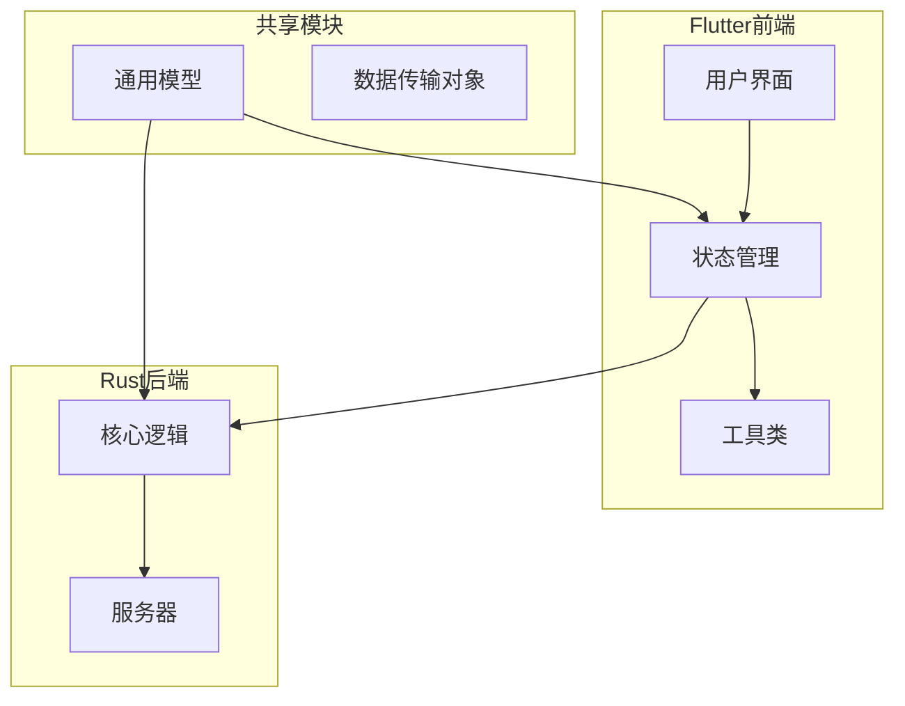
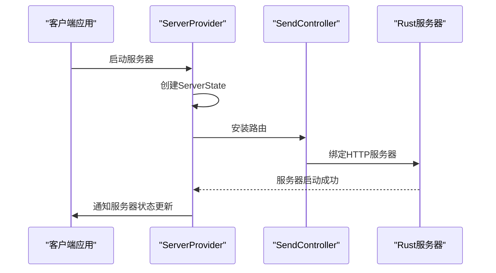
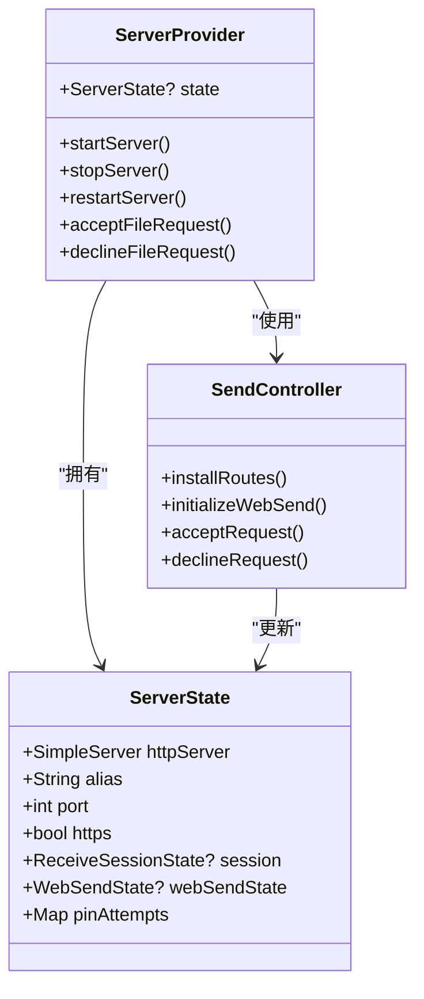
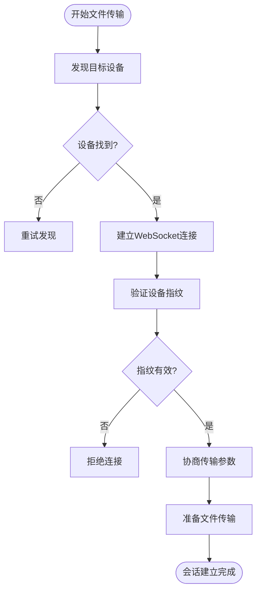
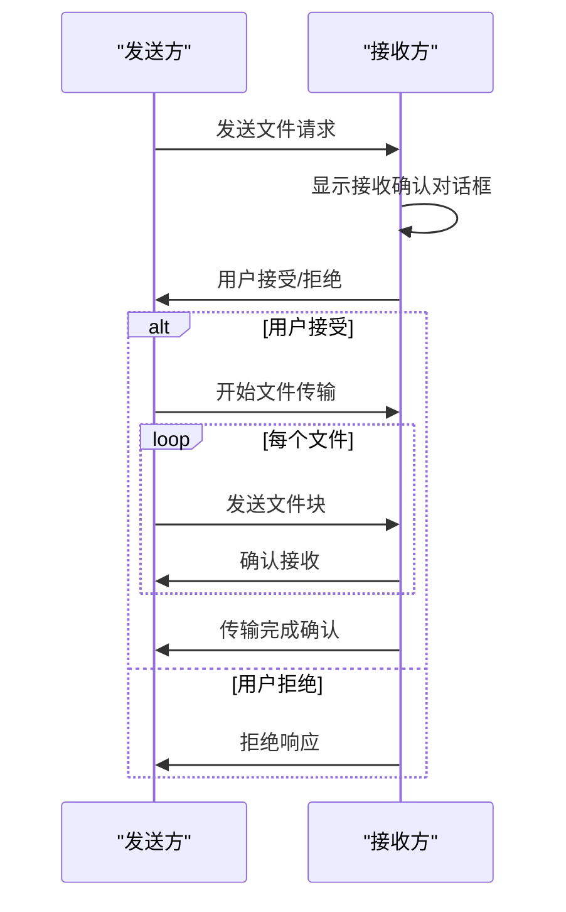
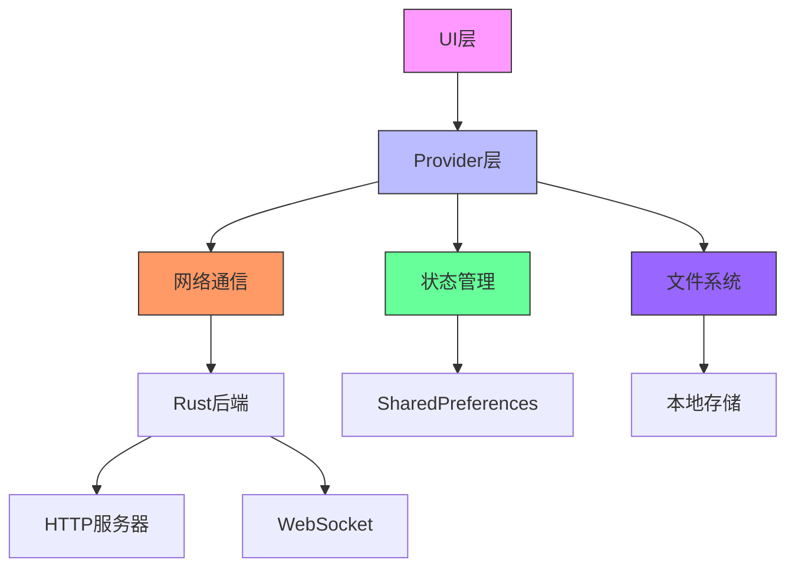

# 集成测试

<cite>
**本文档中引用的文件**  
- [server_provider.dart](file://app/lib/provider/network/server/server_provider.dart)
- [send_controller.dart](file://app/lib/provider/network/server/controller/send_controller.dart)
- [mocks.dart](file://app/test/mocks.dart)
- [mocks.mocks.dart](file://app/test/mocks.mocks.dart)
- [device.dart](file://common/lib/model/device.dart)
- [discovery.rs](file://core/src/model/discovery.rs)
- [transfer.rs](file://core/src/model/transfer.rs)
</cite>

## 目录
1. [简介](#简介)
2. [项目结构](#项目结构)
3. [核心组件](#核心组件)
4. [架构概述](#架构概述)
5. [详细组件分析](#详细组件分析)
6. [依赖分析](#依赖分析)
7. [性能考虑](#性能考虑)
8. [故障排除指南](#故障排除指南)
9. [结论](#结论)

## 简介
本文档详细描述了LocalSend应用的集成测试策略，重点在于验证UI层、业务逻辑层和数据层之间的交互。文档涵盖了设备发现、会话建立、文件传输和错误处理等关键场景的测试用例，并说明了如何使用真实或部分模拟的依赖来测试组件间的集成，同时保持测试的稳定性和速度。

## 项目结构
LocalSend项目采用分层架构，包含Flutter前端、Rust后端和共享的Dart核心模块。集成测试主要集中在验证这些层之间的交互。

**图源**  
- [server_provider.dart](file://app/lib/provider/network/server/server_provider.dart)
- [device.dart](file://common/lib/model/device.dart)

**本节来源**  
- [server_provider.dart](file://app/lib/provider/network/server/server_provider.dart)
- [device.dart](file://common/lib/model/device.dart)

## 核心组件
集成测试的核心是验证服务器提供者、发送控制器和接收控制器之间的交互。这些组件负责处理从设备发现到文件传输的完整流程。

**本节来源**  
- [server_provider.dart](file://app/lib/provider/network/server/server_provider.dart)
- [send_controller.dart](file://app/lib/provider/network/server/controller/send_controller.dart)

## 架构概述
系统采用客户端-服务器架构，通过HTTP和WebSocket协议进行通信。集成测试需要验证整个通信链路的正确性。

**图源**  
- [server_provider.dart](file://app/lib/provider/network/server/server_provider.dart)
- [send_controller.dart](file://app/lib/provider/network/server/controller/send_controller.dart)

## 详细组件分析

### 服务器提供者分析
服务器提供者是集成测试的关键组件，负责管理服务器状态和协调各个控制器。

**图源**  
- [server_provider.dart](file://app/lib/provider/network/server/server_provider.dart)
- [send_controller.dart](file://app/lib/provider/network/server/controller/send_controller.dart)

### 设备发现与会话建立
集成测试需要验证设备发现和会话建立的完整流程。

**图源**  
- [discovery.rs](file://core/src/model/discovery.rs)
- [device.dart](file://common/lib/model/device.dart)

### 文件传输流程
文件传输是集成测试的核心场景，需要验证从请求到完成的完整流程。

**图源**  
- [send_controller.dart](file://app/lib/provider/network/server/controller/send_controller.dart)
- [transfer.rs](file://core/src/model/transfer.rs)

**本节来源**  
- [send_controller.dart](file://app/lib/provider/network/server/controller/send_controller.dart)
- [transfer.rs](file://core/src/model/transfer.rs)

## 依赖分析
集成测试需要管理多个依赖关系，包括网络通信、状态管理和数据持久化。

**图源**  
- [server_provider.dart](file://app/lib/provider/network/server/server_provider.dart)
- [mocks.dart](file://app/test/mocks.dart)

**本节来源**  
- [server_provider.dart](file://app/lib/provider/network/server/server_provider.dart)
- [mocks.dart](file://app/test/mocks.dart)

## 性能考虑
集成测试需要考虑性能因素，确保测试既全面又高效。

- **测试隔离**: 每个测试用例应该独立运行，避免相互影响
- **资源清理**: 测试完成后及时释放网络端口和文件句柄
- **超时设置**: 为网络操作设置合理的超时时间
- **并发测试**: 避免同时运行多个占用相同端口的测试

## 故障排除指南
集成测试中常见的问题和解决方案。

**本节来源**  
- [server_provider.dart](file://app/lib/provider/network/server/server_provider.dart)
- [send_controller.dart](file://app/lib/provider/network/server/controller/send_controller.dart)

## 结论
集成测试在LocalSend项目中扮演着至关重要的角色，能够有效发现接口不匹配和集成缺陷。通过验证UI层、业务逻辑层和数据层的协同工作，确保了从设备发现到文件传输的完整流程的可靠性。建议持续完善集成测试套件，覆盖更多边界情况和错误处理场景。