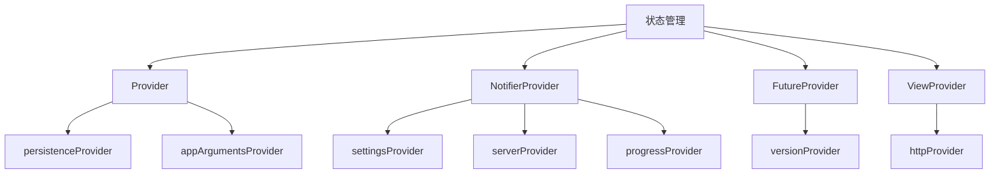
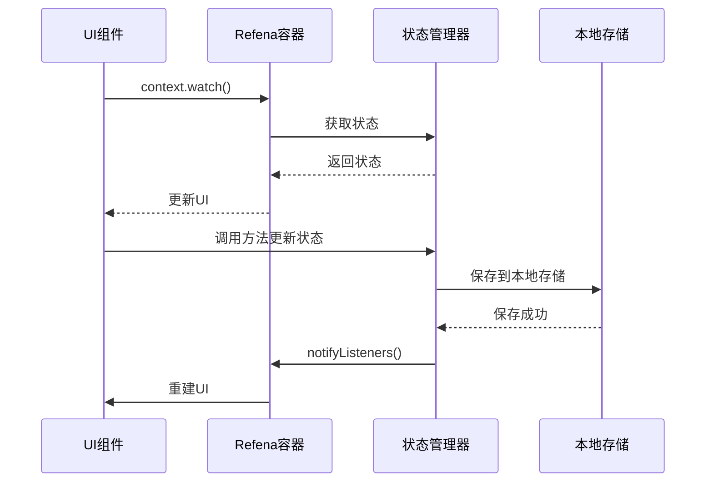
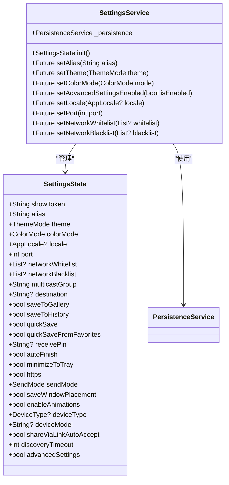
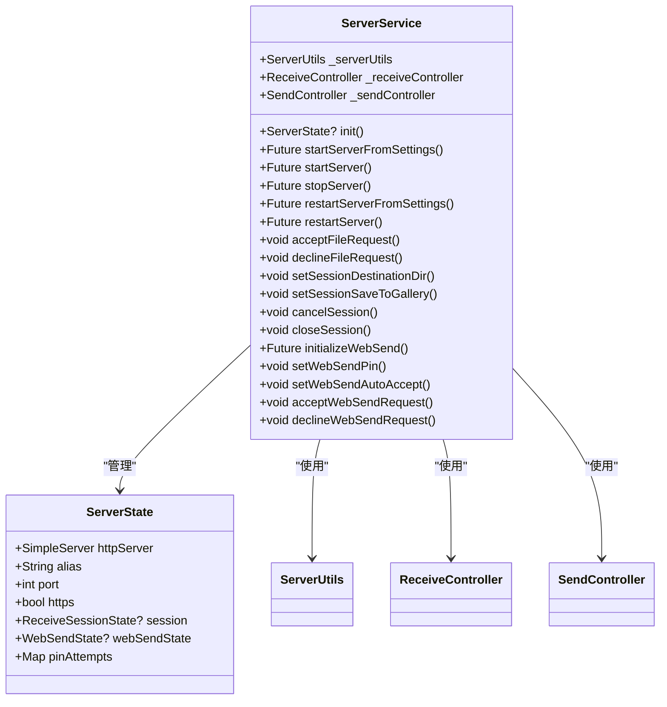
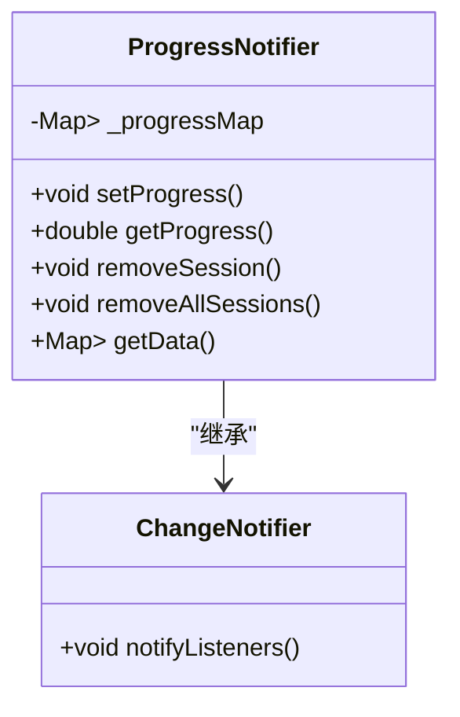
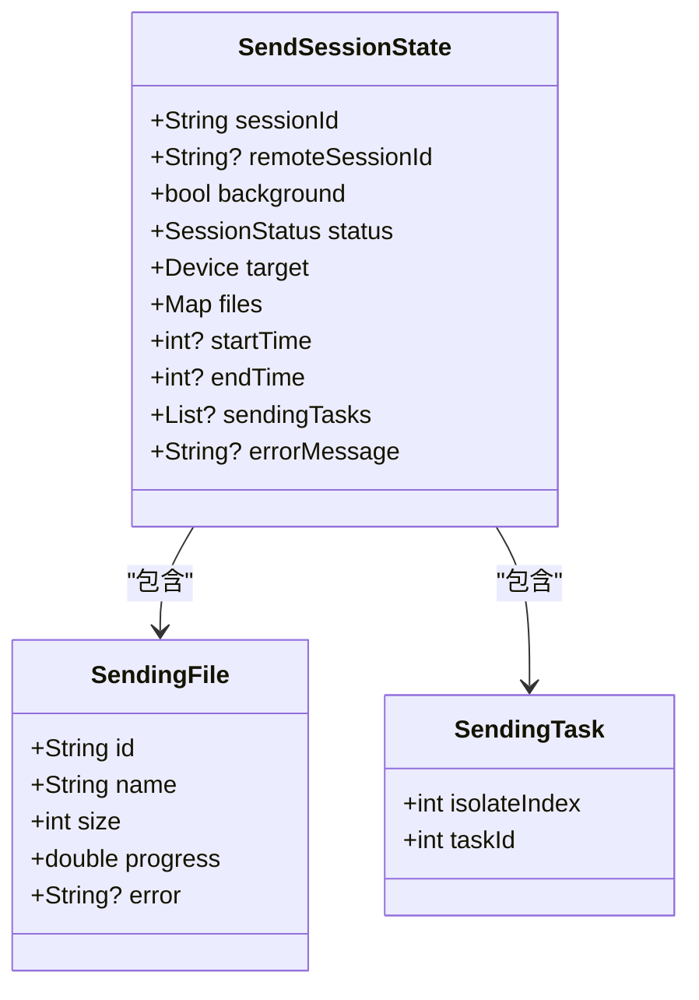
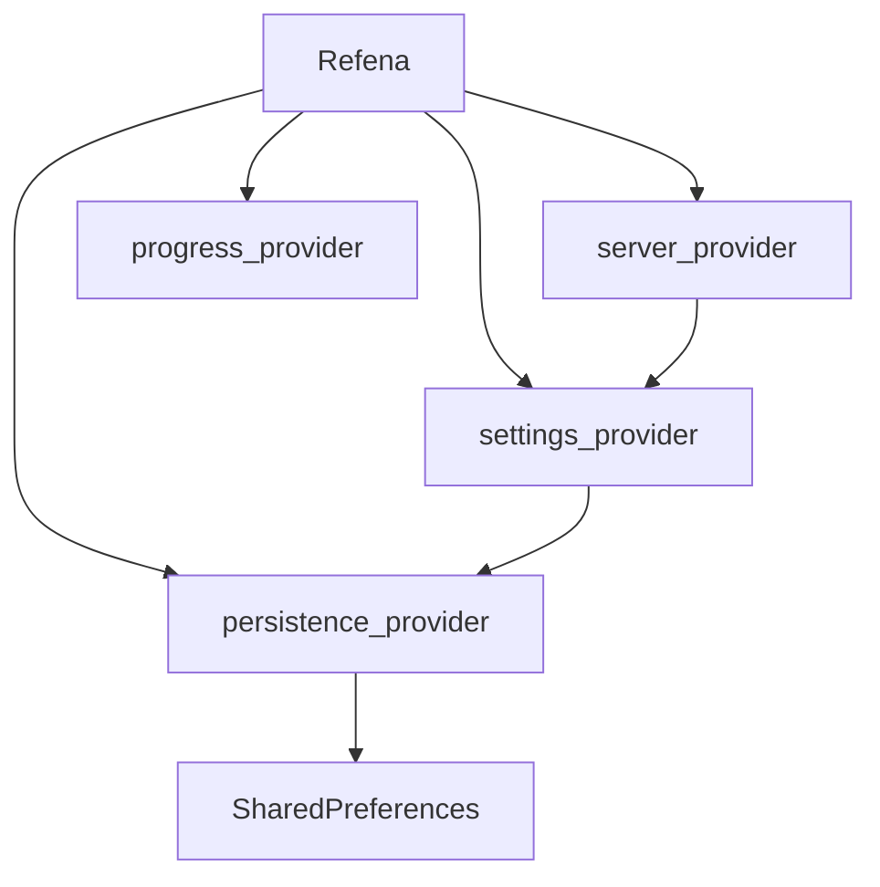

# 状态管理

<cite>
**本文档中引用的文件**  
- [settings_provider.dart](file://app/lib/provider/settings_provider.dart)
- [persistence_provider.dart](file://app/lib/provider/persistence_provider.dart)
- [server_provider.dart](file://app/lib/provider/network/server/server_provider.dart)
- [progress_provider.dart](file://app/lib/provider/progress_provider.dart)
- [refena.dart](file://app/lib/config/refena.dart)
- [init.dart](file://app/lib/config/init.dart)
- [server_state.dart](file://app/lib/model/state/server/server_state.dart)
- [settings_state.dart](file://app/lib/model/state/settings_state.dart)
- [send_session_state.dart](file://app/lib/model/state/send/send_session_state.dart)
- [home_page.dart](file://app/lib/pages/home_page.dart)
- [home_page_controller.dart](file://app/lib/pages/home_page_controller.dart)
</cite>

## 目录
1. [简介](#简介)
2. [项目结构](#项目结构)
3. [核心组件](#核心组件)
4. [架构概述](#架构概述)
5. [详细组件分析](#详细组件分析)
6. [依赖分析](#依赖分析)
7. [性能考虑](#性能考虑)
8. [故障排除指南](#故障排除指南)
9. [结论](#结论)

## 简介
Localsend 项目采用 Refena 库作为其核心状态管理解决方案，实现了高效、可维护的状态管理机制。Refena 是一个专为 Flutter 设计的状态管理库，它结合了 Provider 和 Redux 的优点，提供了灵活的状态管理方式。本项目通过 Refena 实现了设置状态、服务器状态、发送会话状态等多种状态管理器，确保了应用状态的一致性和可预测性。状态持久化通过 SharedPreferences 实现，将用户设置和偏好保存到本地存储中。UI 组件通过 context.watch() 方法消费状态，并通过 dispatch action 触发状态更新。这种架构使得状态管理与其他组件（如网络提供者和 UI 界面）的集成更加紧密和高效。

## 项目结构
Localsend 项目的状态管理主要集中在 `app/lib/provider` 目录下，该目录包含了各种状态管理器的实现。`persistence_provider.dart` 文件负责处理状态的持久化，将设置和偏好保存到本地存储中。`settings_provider.dart` 文件实现了设置状态管理器，管理用户的各项设置。`server_provider.dart` 文件实现了服务器状态管理器，负责服务器的启动、停止和状态更新。`progress_provider.dart` 文件实现了进度状态管理器，用于跟踪文件传输的进度。这些状态管理器通过 Refena 容器进行注册和管理，在 `init.dart` 文件中完成初始化。

**Diagram sources**
- [persistence_provider.dart](file://app/lib/provider/persistence_provider.dart)
- [settings_provider.dart](file://app/lib/provider/settings_provider.dart)
- [server_provider.dart](file://app/lib/provider/network/server/server_provider.dart)
- [progress_provider.dart](file://app/lib/provider/progress_provider.dart)
- [version_provider.dart](file://app/lib/provider/version_provider.dart)
- [http_provider.dart](file://common/lib/src/isolate/child/http_provider.dart)

**Section sources**
- [persistence_provider.dart](file://app/lib/provider/persistence_provider.dart)
- [settings_provider.dart](file://app/lib/provider/settings_provider.dart)
- [server_provider.dart](file://app/lib/provider/network/server/server_provider.dart)
- [progress_provider.dart](file://app/lib/provider/progress_provider.dart)

## 核心组件
Localsend 项目的核心状态管理组件包括设置状态管理器、服务器状态管理器和进度状态管理器。设置状态管理器通过 `settingsProvider` 实现，管理用户的各项设置，如主题、语言、端口等。服务器状态管理器通过 `serverProvider` 实现，负责服务器的启动、停止和状态更新。进度状态管理器通过 `progressProvider` 实现，用于跟踪文件传输的进度。这些状态管理器都继承自 Refena 的 Notifier 类，通过 state 属性管理状态，并通过方法更新状态。状态的持久化通过 `persistenceProvider` 实现，将设置和偏好保存到本地存储中。

**Section sources**
- [settings_provider.dart](file://app/lib/provider/settings_provider.dart)
- [server_provider.dart](file://app/lib/provider/network/server/server_provider.dart)
- [progress_provider.dart](file://app/lib/provider/progress_provider.dart)
- [persistence_provider.dart](file://app/lib/provider/persistence_provider.dart)

## 架构概述
Localsend 项目的状态管理架构基于 Refena 库，采用 Provider 模式进行状态管理。Refena 容器在应用启动时初始化，注册所有状态管理器。UI 组件通过 context.watch() 方法消费状态，当状态发生变化时，UI 组件会自动重建。状态更新通过调用状态管理器的方法实现，这些方法会更新 state 属性，并通知监听器。对于需要异步操作的状态更新，Refena 提供了 FutureProvider 和 StreamProvider。状态持久化通过 SharedPreferences 实现，`persistenceProvider` 负责将设置和偏好保存到本地存储中，并在应用启动时恢复状态。

**Diagram sources**
- [init.dart](file://app/lib/config/init.dart)
- [settings_provider.dart](file://app/lib/provider/settings_provider.dart)
- [persistence_provider.dart](file://app/lib/provider/persistence_provider.dart)

## 详细组件分析

### 设置状态管理器分析
设置状态管理器通过 `settingsProvider` 实现，管理用户的各项设置。它继承自 Refena 的 PureNotifier 类，通过 SettingsState 类型的 state 属性管理状态。SettingsState 类包含了所有用户设置，如 showToken、alias、theme、colorMode 等。状态更新通过一系列 set 方法实现，如 setAlias()、setTheme()、setColorMode() 等。这些方法会先调用 persistenceProvider 保存到本地存储，然后更新 state 属性。当 state 属性更新时，会触发 onChanged 回调，将设置同步到其他组件。

**Diagram sources**
- [settings_provider.dart](file://app/lib/provider/settings_provider.dart)
- [settings_state.dart](file://app/lib/model/state/settings_state.dart)
- [persistence_provider.dart](file://app/lib/provider/persistence_provider.dart)

### 服务器状态管理器分析
服务器状态管理器通过 `serverProvider` 实现，负责服务器的启动、停止和状态更新。它继承自 Refena 的 Notifier 类，通过 ServerState 类型的 state 属性管理状态。ServerState 类包含了服务器的所有状态信息，如 httpServer、alias、port、https、session 等。状态更新通过 startServer()、stopServer()、restartServer() 等方法实现。这些方法会更新 state 属性，并通知监听器。当服务器状态发生变化时，会触发 onChanged 回调，将状态同步到其他组件。

**Diagram sources**
- [server_provider.dart](file://app/lib/provider/network/server/server_provider.dart)
- [server_state.dart](file://app/lib/model/state/server/server_state.dart)
- [server_utils.dart](file://app/lib/provider/network/server/server_utils.dart)

### 进度状态管理器分析
进度状态管理器通过 `progressProvider` 实现，用于跟踪文件传输的进度。它继承自 Refena 的 ChangeNotifier 类，通过 _progressMap 私有属性管理进度信息。_progressMap 是一个嵌套的 Map，以 sessionId 为键，以 fileId 和 progress 的 Map 为值。状态更新通过 setProgress() 方法实现，该方法会更新 _progressMap，并调用 notifyListeners() 通知监听器。getProgress() 方法用于获取指定文件的进度，removeSession() 和 removeAllSessions() 方法用于清理进度信息。

**Diagram sources**
- [progress_provider.dart](file://app/lib/provider/progress_provider.dart)

### 发送会话状态分析
发送会话状态通过 SendSessionState 类实现，管理文件发送会话的所有信息。它实现了 SessionState 接口，包含了会话ID、目标设备、文件列表、状态等信息。SendingFile 类用于表示单个文件的发送状态，包含了文件ID、名称、大小、进度等信息。这些状态信息在文件发送过程中被更新，并通过 progressProvider 通知UI组件。

**Diagram sources**
- [send_session_state.dart](file://app/lib/model/state/send/send_session_state.dart)

**Section sources**
- [settings_provider.dart](file://app/lib/provider/settings_provider.dart)
- [server_provider.dart](file://app/lib/provider/network/server/server_provider.dart)
- [progress_provider.dart](file://app/lib/provider/progress_provider.dart)
- [persistence_provider.dart](file://app/lib/provider/persistence_provider.dart)
- [send_session_state.dart](file://app/lib/model/state/send/send_session_state.dart)

## 依赖分析
Localsend 项目的状态管理依赖于 Refena 库，该库提供了核心的状态管理功能。persistence_provider 依赖于 SharedPreferences 库，用于实现状态的持久化。settings_provider 依赖于 persistence_provider，通过它读取和保存用户设置。server_provider 依赖于 settings_provider，通过它获取服务器配置。progress_provider 是一个独立的组件，不依赖于其他状态管理器。这些依赖关系在 Refena 容器初始化时通过 overrides 参数建立，确保了依赖注入的正确性。

**Diagram sources**
- [init.dart](file://app/lib/config/init.dart)
- [persistence_provider.dart](file://app/lib/provider/persistence_provider.dart)
- [settings_provider.dart](file://app/lib/provider/settings_provider.dart)
- [server_provider.dart](file://app/lib/provider/network/server/server_provider.dart)
- [progress_provider.dart](file://app/lib/provider/progress_provider.dart)

**Section sources**
- [init.dart](file://app/lib/config/init.dart)
- [persistence_provider.dart](file://app/lib/provider/persistence_provider.dart)
- [settings_provider.dart](file://app/lib/provider/settings_provider.dart)
- [server_provider.dart](file://app/lib/provider/network/server/server_provider.dart)
- [progress_provider.dart](file://app/lib/provider/progress_provider.dart)

## 性能考虑
Localsend 项目在状态管理方面进行了多项性能优化。首先，使用 PureNotifier 而不是普通的 Notifier，避免了不必要的重建。其次，对于不需要重建的读取操作，使用 ref.read() 而不是 context.watch()，减少了监听器的数量。对于复杂的计算，使用 memoized getter 或缓存结果，避免重复计算。在进度管理器中，使用 ChangeNotifier 而不是 Notifier，因为进度更新非常频繁，ChangeNotifier 的性能更好。此外，通过 Refena 的 observer 机制，可以监控状态管理的性能，及时发现和解决性能问题。

## 故障排除指南
在使用 Localsend 的状态管理时，可能会遇到一些常见问题。如果状态更新后 UI 没有重建，检查是否正确使用了 context.watch() 方法。如果状态持久化失败，检查 SharedPreferences 是否正确初始化。如果出现内存泄漏，检查是否正确处理了监听器的生命周期。对于调试，可以启用 Refena 的 debug observer，查看状态变化的详细日志。在开发过程中，可以使用 Refena Inspector 工具，实时查看和修改应用状态。

**Section sources**
- [refena.dart](file://app/lib/config/refena.dart)
- [init.dart](file://app/lib/config/init.dart)

## 结论
Localsend 项目通过 Refena 库实现了高效、可维护的状态管理。通过将状态管理分为多个独立的管理器，每个管理器负责特定领域的状态，提高了代码的可读性和可维护性。状态持久化通过 SharedPreferences 实现，确保了用户设置的持久性。UI 组件通过 context.watch() 方法消费状态，实现了响应式更新。这种架构使得状态管理与其他组件的集成更加紧密和高效，为应用的稳定运行提供了保障。