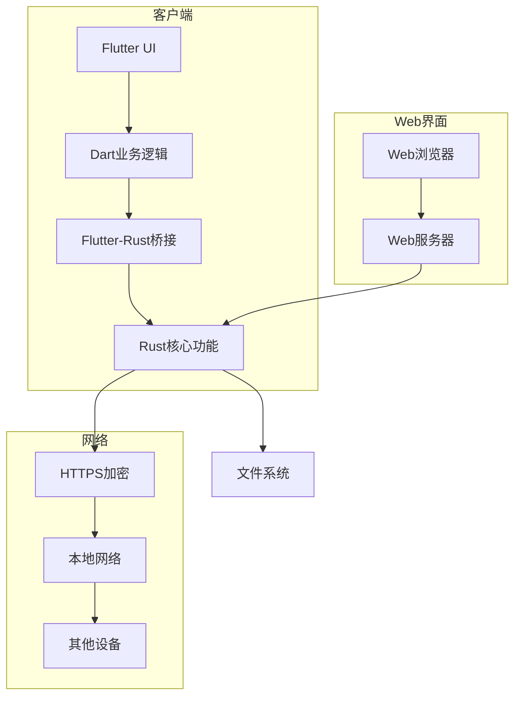
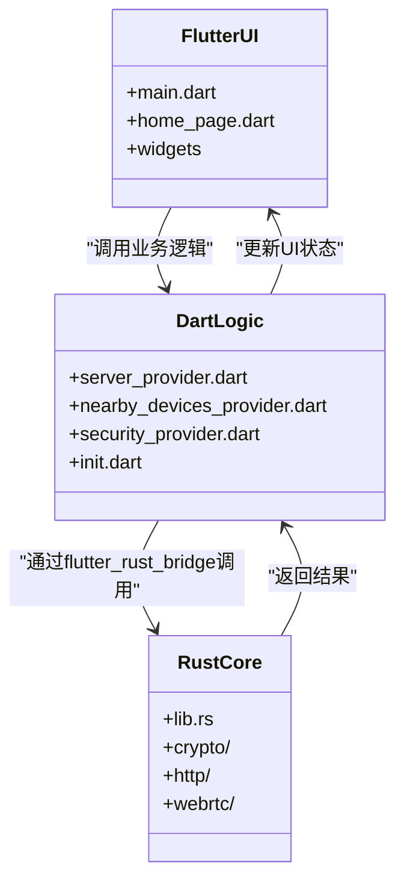
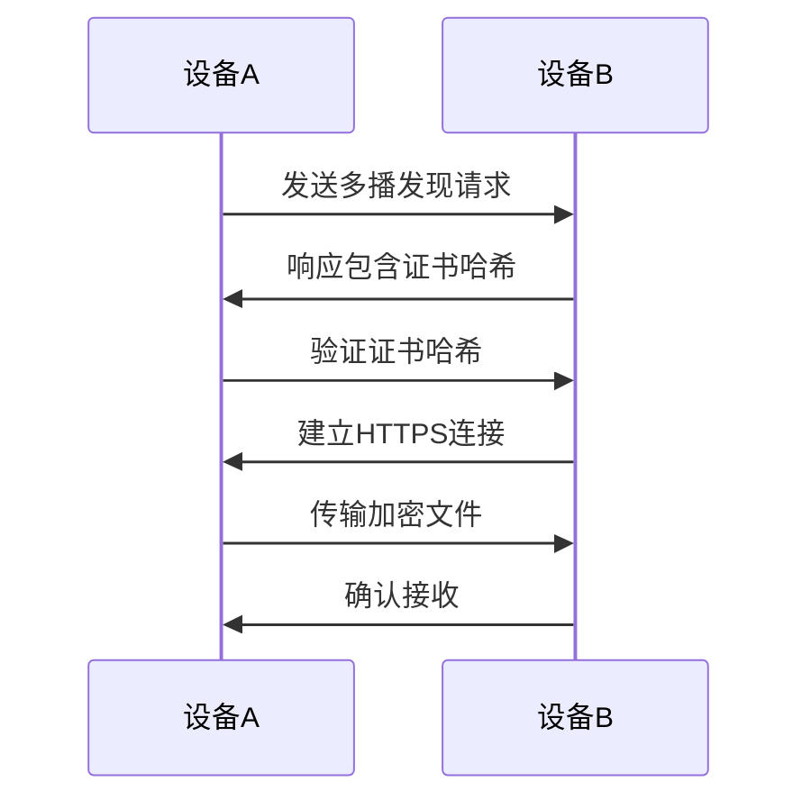

# 项目概述

<cite>
**本文档中引用的文件**  
- [README.md](file://README.md)
- [app/pubspec.yaml](file://app/pubspec.yaml)
- [app/lib/main.dart](file://app/lib/main.dart)
- [core/Cargo.toml](file://core/Cargo.toml)
- [server/Cargo.toml](file://server/Cargo.toml)
- [app/lib/config/init.dart](file://app/lib/config/init.dart)
- [app/lib/provider/network/server/server_provider.dart](file://app/lib/provider/network/server/server_provider.dart)
- [app/lib/provider/network/nearby_devices_provider.dart](file://app/lib/provider/network/nearby_devices_provider.dart)
- [app/lib/pages/home_page.dart](file://app/lib/pages/home_page.dart)
- [app/lib/provider/security_provider.dart](file://app/lib/provider/security_provider.dart)
- [app/lib/rust/frb_generated.dart](file://app/lib/rust/frb_generated.dart)
</cite>

## 目录
1. [简介](#简介)
2. [项目结构](#项目结构)
3. [核心功能](#核心功能)
4. [技术栈](#技术栈)
5. [架构设计](#架构设计)
6. [组件交互](#组件交互)
7. [安全性设计](#安全性设计)
8. [跨平台兼容性](#跨平台兼容性)
9. [多语言支持](#多语言支持)
10. [使用场景示例](#使用场景示例)
11. [结论](#结论)

## 简介

LocalSend 是一个免费、开源的应用程序，允许用户在本地网络中安全地与附近设备共享文件和消息，而无需互联网连接。该项目旨在提供一个跨平台的AirDrop替代方案，通过REST API和HTTPS加密实现设备间的通信。与依赖外部服务器的其他消息应用不同，LocalSend不需要互联网连接或第三方服务器，使其成为本地通信的快速可靠解决方案。

**Section sources**
- [README.md](file://README.md)

## 项目结构

LocalSend项目采用模块化设计，主要由以下几个核心目录组成：
- **app**: Flutter应用程序主目录，包含UI层和Dart业务逻辑
- **common**: 共享的Dart模型和工具
- **core**: 核心Rust库，包含加密、HTTP和WebRTC功能
- **server**: 基于Axum的Rust服务器实现
- **rust**: Rust核心功能的实现
- **cli**: 命令行工具
- **fastlane**: 应用元数据
- **msix**: Windows MSIX打包配置
- **readme_i18n**: 多语言README文件
- **scripts**: 构建和打包脚本

这种结构清晰地分离了不同层次的功能，使得项目易于维护和扩展。

**Section sources**
- [README.md](file://README.md)

## 核心功能

LocalSend的核心功能包括：
- **本地文件传输**: 在同一局域网内的设备间安全传输文件
- **消息发送**: 发送文本消息给附近设备
- **Web集成**: 通过Web界面共享文件
- **跨平台兼容**: 支持Android、iOS、macOS、Windows和Linux
- **无需互联网**: 所有通信都在本地网络中完成
- **安全性**: 使用HTTPS加密和自动生成的TLS/SSL证书

应用通过REST API实现设备发现和文件传输，所有数据都通过HTTPS安全传输。每个设备都会动态生成TLS/SSL证书，确保通信的最大安全性。

**Section sources**
- [README.md](file://README.md)

## 技术栈

LocalSend项目采用了现代化的技术栈，结合了Flutter和Rust的优势：

### Flutter框架
作为UI层的主要技术，Flutter提供了跨平台的用户界面开发能力。项目使用了多个Flutter插件来增强功能：
- `flutter_localizations`: 国际化支持
- `file_picker`: 文件选择
- `connectivity_plus`: 网络连接检测
- `permission_handler`: 权限管理
- `flutter_rust_bridge`: Dart与Rust的桥接

### Rust核心库
Rust作为后端核心，提供了高性能和内存安全的保障。核心功能包括：
- 加密算法实现
- HTTP服务器和客户端
- WebRTC信令
- 文件传输协议

### Flutter-Rust桥接技术
项目使用`flutter_rust_bridge`库实现Dart与Rust之间的高效通信。这种架构允许UI层使用Flutter的丰富组件，同时利用Rust处理性能敏感的底层操作。

**Section sources**
- [app/pubspec.yaml](file://app/pubspec.yaml)
- [core/Cargo.toml](file://core/Cargo.toml)
- [server/Cargo.toml](file://server/Cargo.toml)

## 架构设计

LocalSend采用分层架构设计，将UI、业务逻辑和核心功能清晰分离。系统通过REST API和HTTPS加密实现设备间的通信，所有数据传输都在本地网络中完成。

**Diagram sources**
- [app/lib/main.dart](file://app/lib/main.dart)
- [core/Cargo.toml](file://core/Cargo.toml)
- [server/Cargo.toml](file://server/Cargo.toml)

## 组件交互

LocalSend的架构由三个主要组件层组成：Flutter UI层、Dart业务逻辑层和Rust核心功能层。这些组件通过清晰的接口进行交互，确保了系统的模块化和可维护性。

### Flutter UI层
UI层负责用户界面的展示和用户交互。`main.dart`文件是应用程序的入口点，初始化了Refena状态管理容器和国际化支持。`HomePage`组件管理主要的用户界面，包括接收、发送和设置选项卡。

### Dart业务逻辑层
这一层处理应用程序的业务逻辑，包括：
- 网络发现
- 服务器管理
- 安全性管理
- 用户设置

`server_provider.dart`文件中的`serverProvider`管理服务器状态，处理文件接收和发送的逻辑。`nearby_devices_provider.dart`负责扫描网络中的其他LocalSend实例并跟踪发现的设备。

### Rust核心功能层
Rust层提供高性能的核心功能，包括：
- 加密和安全通信
- HTTP服务器和客户端实现
- WebRTC信令协议
- 文件传输协议

通过`flutter_rust_bridge`，Dart代码可以调用Rust函数，实现高效的跨语言通信。这种设计使得UI层可以保持响应性，而计算密集型任务由Rust后端处理。

**Diagram sources**
- [app/lib/main.dart](file://app/lib/main.dart)
- [app/lib/config/init.dart](file://app/lib/config/init.dart)
- [app/lib/provider/network/server/server_provider.dart](file://app/lib/provider/network/server/server_provider.dart)
- [app/lib/provider/network/nearby_devices_provider.dart](file://app/lib/provider/network/nearby_devices_provider.dart)
- [app/lib/pages/home_page.dart](file://app/lib/pages/home_page.dart)
- [app/lib/provider/security_provider.dart](file://app/lib/provider/security_provider.dart)

**Section sources**
- [app/lib/main.dart](file://app/lib/main.dart)
- [app/lib/config/init.dart](file://app/lib/config/init.dart)
- [app/lib/provider/network/server/server_provider.dart](file://app/lib/provider/network/server/server_provider.dart)
- [app/lib/provider/network/nearby_devices_provider.dart](file://app/lib/provider/network/nearby_devices_provider.dart)
- [app/lib/pages/home_page.dart](file://app/lib/pages/home_page.dart)
- [app/lib/provider/security_provider.dart](file://app/lib/provider/security_provider.dart)

## 安全性设计

LocalSend在安全性方面采用了多层次的设计，确保用户数据在传输过程中的安全：

### HTTPS加密
所有通信都通过HTTPS加密进行，每个设备都会动态生成TLS/SSL证书。`security_provider.dart`中的`SecurityService`管理存储的安全上下文，包含私钥、公钥和证书。

### 证书管理
系统使用自签名证书进行加密通信。`generateSecurityContext`函数生成RSA密钥对，并创建相应的X.509证书。证书的哈希值用于验证设备身份。

### 设备发现安全
通过多播UDP和TCP发现机制，设备可以在本地网络中相互发现。系统支持AP隔离检测，确保在受限制的网络环境中也能正常工作。

### 会话管理
每个文件传输会话都有独立的安全上下文，防止跨会话攻击。系统还实现了PIN码验证机制，用于Web界面的文件共享。

**Diagram sources**
- [app/lib/provider/security_provider.dart](file://app/lib/provider/security_provider.dart)
- [app/lib/provider/network/nearby_devices_provider.dart](file://app/lib/provider/network/nearby_devices_provider.dart)
- [app/lib/provider/network/server/server_provider.dart](file://app/lib/provider/network/server/server_provider.dart)

**Section sources**
- [app/lib/provider/security_provider.dart](file://app/lib/provider/security_provider.dart)
- [app/lib/util/security_helper.dart](file://app/lib/util/security_helper.dart)

## 跨平台兼容性

LocalSend设计为真正的跨平台应用，支持多种操作系统：

### 支持的平台
- **Android**: 5.0及以上版本
- **iOS**: 12.0及以上版本
- **macOS**: 11 Big Sur及以上版本
- **Windows**: Windows 10及以上版本
- **Linux**: 支持主流发行版

### 平台特定实现
项目通过条件编译和平台检测实现跨平台兼容性：
- 使用`kIsWeb`、`defaultTargetPlatform`等常量检测运行环境
- 为不同平台提供特定的UI组件和行为
- 处理各平台的权限模型差异

### 构建和分发
项目提供了多种构建和分发方式：
- Android: APK、App Bundle和F-Droid
- iOS: App Store
- Windows: EXE、MSIX和Scoop
- macOS: DMG和Homebrew
- Linux: AppImage、Snap和AUR

这种多样化的分发策略确保了用户可以在各种环境中轻松安装和使用LocalSend。

**Section sources**
- [README.md](file://README.md)

## 多语言支持

LocalSend具有完善的多语言支持系统，目前已经支持超过50种语言：

### 国际化实现
- 使用`flutter_localizations`和`slang`库实现国际化
- 语言文件存储在`app/assets/i18n`目录中
- 支持JSON格式的翻译文件
- 提供Weblate平台供社区贡献翻译

### 语言文件结构
项目包含完整的语言资源：
- `_missing_translations_*.json`: 记录缺失的翻译
- `strings_*.json`: 实际的翻译文件
- 支持地区变体（如`zh-CN`、`zh-TW`）

### 翻译流程
社区可以通过Weblate平台参与翻译工作，确保应用能够服务全球用户。项目维护者定期合并社区贡献的翻译，保持多语言支持的更新。

**Section sources**
- [README.md](file://README.md)
- [app/assets/i18n](file://app/assets/i18n)

## 使用场景示例

### 跨设备文件传输
用户可以在手机和电脑之间快速传输文件：
1. 在两台设备上打开LocalSend应用
2. 选择"发送"选项卡
3. 选择要发送的文件
4. 选择目标设备
5. 等待接收方确认
6. 文件开始传输

### Web集成共享
通过Web界面共享文件：
1. 在电脑上打开LocalSend
2. 进入Web发送页面
3. 生成二维码
4. 在手机上扫描二维码
5. 选择要发送的文件
6. 文件传输到电脑

### 团队协作
在办公室环境中，团队成员可以：
- 快速分享文档和图片
- 无需云存储即可传输大文件
- 在会议中即时分享演示文稿
- 安全地传输敏感信息

这些场景展示了LocalSend在日常使用中的便利性和实用性。

**Section sources**
- [README.md](file://README.md)

## 结论

LocalSend是一个功能强大、安全可靠的本地文件传输解决方案。通过结合Flutter的跨平台UI能力和Rust的高性能后端，项目实现了优雅的架构设计。分层的组件结构使得系统既易于使用又便于维护。

项目的核心优势在于：
- 完全离线操作，无需互联网连接
- 端到端加密确保数据安全
- 支持多种平台和设备
- 开源透明，可审计
- 用户友好的界面设计

对于初学者，LocalSend提供了简单直观的文件传输体验；对于经验丰富的开发者，其模块化的架构和清晰的代码结构为二次开发和贡献提供了良好的基础。无论是个人使用还是团队协作，LocalSend都是一个值得信赖的本地通信工具。